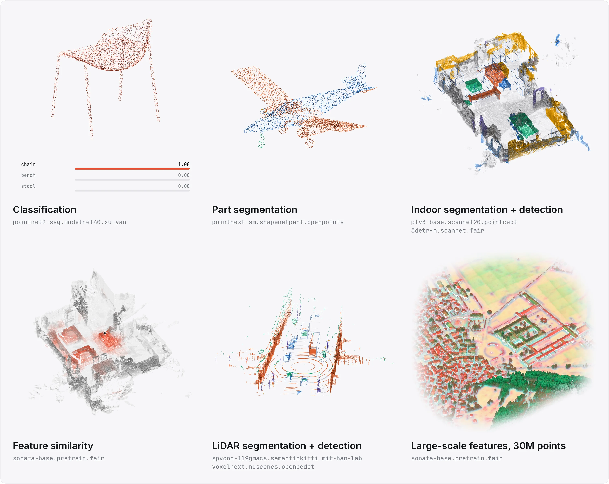

<div align="center">
  <a href="https://pytorch-pointcloud.org/" rel="noopener"></a>
  <p>
    <b>Deep learning on point clouds, with PyTorch.</b><br>
    Models, pretrained weights, datasets, transforms and inferers, in the style of
    <a href="https://github.com/huggingface/pytorch-image-models">timm</a> and
    <a href="https://pytorch-geometric.readthedocs.io/">PyG</a>.
  </p>
  <p>
    <a href="https://pypi.org/project/torch-pointcloud/"></a>
    <a href="https://pypi.org/project/torch-pointcloud/"></a>
    <a href="https://pytorch.org/"></a>
    <a href="https://github.com/arthurdjn/pytorch-pointcloud/actions/workflows/test.yml"></a>
    <a href="https://github.com/arthurdjn/pytorch-pointcloud/blob/main/LICENSE"></a>
  </p>
  <p>
    <a href="https://pytorch-pointcloud.org/">Documentation</a>
    &nbsp;·&nbsp;
    <a href="https://pytorch-pointcloud.org/latest/models/overview/">Model zoo</a>
    &nbsp;·&nbsp;
    <a href="https://pytorch-pointcloud.org/latest/examples/">Tutorials</a>
    &nbsp;·&nbsp;
    <a href="https://github.com/arthurdjn/pytorch-pointcloud/blob/main/CHANGELOG.md">Changelog</a>
  </p>
</div>

<a href="https://pytorch-pointcloud.org/">
  <picture>
    <source media="(prefers-color-scheme: dark)" srcset="https://raw.githubusercontent.com/arthurdjn/pytorch-pointcloud/main/docs/assets/brand/hero-dark.webp">
    
  </picture>
</a>

> [!WARNING]
> `torch-pointcloud` is in alpha and active development. Expect breaking changes.

## Installation

```bash
pip install torch-pointcloud
```

Most models also need `pyg-lib`, and some a CUDA extension (`spconv`, `flash-attn`, ...), built for your torch and
CUDA versions. Read the [installation](https://pytorch-pointcloud.org/latest/installation/) documentation for further details.

## Quickstart

```python
import torch
import torch_pointcloud as tp

# Requires pyg-lib
model = tp.create_model(
    "pointnext-sm.scanobjectnn-hardest.openpoints",
    task="classification",
    pretrained=True,
).eval()

pos = torch.randn(2048, 3)  # (N, 3) coordinates
x = torch.cat([pos, pos[:, 1:2] - pos[:, 1].min()], dim=1)  # (N, 4) features: xyz + height
batch = torch.zeros(2048, dtype=torch.long)  # (N,) batch index

with torch.no_grad():
    logits = model(x, pos, batch)  # (1, 15)
```

Each checkpoint ships information about the model, such as the transform used to preprocess the input, metrics, license and more.

```python
import torch_pointcloud as tp

# Requires spconv and flash-attn
model, info = tp.create_model("ptv3-base.scannet20.pointcept", task="semantic-segmentation", pretrained=True, return_info=True)
info["transform"]  # the preprocessing pipeline of that checkpoint
info["weights"]["metrics"]  # {"mIoU": 77.40, "OA": 92.01}

tp.list_models("pointnext*")  # every registered PointNeXt config
tp.list_models(task="detection", pretrained=True)  # all detection checkpoints
```

See the [examples](https://github.com/arthurdjn/pytorch-pointcloud/tree/main/examples) directory for benchmarks and training recipes.

## Why torch-pointcloud?

`torch-pointcloud` is a library of pretrained models that makes common layers and backbones easy to reuse. It does
not replace research-first codebases such as
[Pointcept](https://github.com/Pointcept/Pointcept), [OpenPCDet](https://github.com/open-mmlab/OpenPCDet) and
[MMDetection3D](https://github.com/open-mmlab/mmdetection3d) or [OpenPoints](https://github.com/guochengqian/openpoints)
but it complements them with a common interface that makes benchmarking and interoperability across architectures easier.

## Contributing

Contributions are welcome. See [CONTRIBUTING.md](https://github.com/arthurdjn/pytorch-pointcloud/blob/main/CONTRIBUTING.md) for the development setup and the pull request checks.

## Citation

If you find this project useful, please consider citing:

```bibtex
@software{dujardin2026pytorchpointcloud,
  author = {Dujardin, Arthur},
  title = {PyTorch PointCloud},
  year = {2026},
  url = {https://github.com/arthurdjn/pytorch-pointcloud},
  doi = {10.5281/zenodo.22159632},
  license = {Apache-2.0}
}
```

## License

Apache 2.0. See [LICENSE](https://github.com/arthurdjn/pytorch-pointcloud/blob/main/LICENSE).

Pretrained weights and adapted code keep the license of their source, and some checkpoints are restricted to
non-commercial use. Most were trained on research-only datasets, whose terms also apply to the weights.
See [THIRD_PARTY_NOTICES.md](https://github.com/arthurdjn/pytorch-pointcloud/blob/main/THIRD_PARTY_NOTICES.md).
