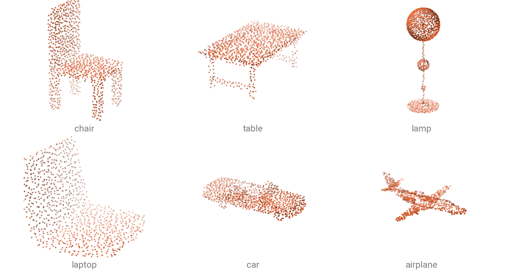

# Classification Datasets

Classification datasets hold one object per sample: a few thousand points and one class. Every loader returns a single-sample `dict` and caches a processed copy on disk, so later runs read the cache.



The six objects above ship with the docs, so a model can be run without downloading a dataset.

| Dataset                                                  | Classes  | Test samples | Download  |
| -------------------------------------------------------- | -------- | ------------ | --------- |
| [`ModelNet10`](../api/datasets/modelnet.md)              | 10       | 908          | automatic |
| [`ModelNet40`](../api/datasets/modelnet.md)              | 40       | 2 468        | automatic |
| [`ModelNet40Hdf5`](../api/datasets/modelnet.md)          | 40       | 2 468        | automatic |
| [`ModelNetNormalResampled`](../api/datasets/modelnet.md) | 10 or 40 | 2 468        | automatic |
| [`ScanObjectNN`](../api/datasets/scanobjectnn.md)        | 15       | 581          | automatic |

## Load a dataset

```{.python notest}
from torch_pointcloud.datasets import ModelNet40

dataset = ModelNet40(root="data", train=False, download=True)
print(f"Samples: {len(dataset)}")
print({k: tuple(v.shape) for k, v in dataset[0].items()})
```

```text
Samples: 2468
{'pos': (11634, 3), 'face': (14640, 3), 'label': ()}
```

The first call downloads into `data/ModelNet40/raw/` and writes a cache into `data/ModelNet40/processed/`; later calls read the cache. Pass `force_download=True` or `force_process=True` to redo either step, and `num_workers` to parallelize the processing.

## Pick a ModelNet variant

The four ModelNet loaders differ in their preprocessing. The original release ships triangle meshes, so the points are sampled from the faces, and that step depends on the random seed. A published score is then hard to reproduce *exactly*. The preprocessed releases used in the literature are here too.

| Loader                      | Sample                                | When to use                                        |
| --------------------------- | ------------------------------------- | -------------------------------------------------- |
| `ModelNet10` / `ModelNet40` | `pos`, `face`, `label`                | you want the raw meshes and sample points yourself |
| `ModelNet40Hdf5`            | `pos`, `normal`, `label`              | you want the PointNet-era 2048-point HDF5 release  |
| `ModelNetNormalResampled`   | `pos` $(10000, 3)$, `normal`, `label` | you want to benchmark your model                   |

!!! tip "In Practice"
    In practice, you can use the original `ModelNet10` or `ModelNet40` dataset and sample the points yourself. You will have more flexibility in the preprocessing steps, sampling methods, number of points, etc.  
    The `ModelNetNormalResampled` is mostly used for benchmarking purposes as many published papers used this already preprocessed dataset.

`ModelNet10` and `ModelNet40` ship **triangle meshes**, so sample a point cloud from the faces first:

```{.python notest}
import torch_pointcloud.transforms as T
from torch_pointcloud.datasets import ModelNet40

transform = T.Compose([
    T.RandomSampleFaceVertices(
        keys="pos", 
        face_key="face", 
        normal_key="normal", 
        num_samples=1024,
    ),
    T.Rescale(keys="pos", method="centroid"),
])

dataset = ModelNet40(
    root="data", 
    train=False, 
    download=True, 
    transform=transform,
)
```

`ModelNetNormalResampled` is the 10 000-point resampled release most published checkpoints were evaluated on. Pair it with `info["transform"]`, which subsamples to the point budget the checkpoint expects:

```{.python notest}
import torch_pointcloud as tp
from torch_pointcloud.datasets import ModelNetNormalResampled

# Load the pretrained model
model, info = tp.create_model(
    "pointnet2-ssg.modelnet40.xu-yan",
    task="classification",
    pretrained=True,
    return_info=True,
)

# Pass the associated transform to the dataset
dataset = ModelNetNormalResampled(
    root="data", 
    variant="40", 
    train=False, 
    transform=info["transform"],
)
```

See [Classification](../models/classification.md) for the loop that scores it.

## Real scans with ScanObjectNN

`ScanObjectNN` crops its objects out of indoor reconstructions, with clutter and missing surfaces, which makes it harder than ModelNet. The release ships several difficulty settings, selected with constructor arguments rather than by dataset name.

```{.python notest}
from torch_pointcloud.datasets import ScanObjectNN

scanobjectnn_easy = ScanObjectNN(root="data", train=False, download=True)

scanobjectnn_hardest = ScanObjectNN(
    root="data", 
    train=False, 
    background=True, 
    variant="augmentedrot_scale75",
)
```

!!! note "Match the variant to the checkpoint"
    Checkpoint names spell out which setting they were trained on: `point-mae-base.scanobjectnn-objbg.yatian-pang`, `point-mamba-base.scanobjectnn-augmentedrot-scale75.dingkang-liang`. Load the dataset with the same variant, or the score you get back will not be the published one.

## Batch the samples

Batching uses the packed format. `PointCloudDataLoader` is a `DataLoader` whose `collate_fn` defaults to the packed `collate`: per-point tensors are concatenated into one tensor, and a `batch` index is built alongside them.

```{.python notest}
from torch_pointcloud.utils.data import PointCloudDataLoader

dataset = ScanObjectNN(
    root="data", 
    train=False, 
    download=True,
)

dataloader = PointCloudDataLoader(
    dataset, 
    batch_size=32, 
    shuffle=True, 
    num_workers=6,
)

data = next(iter(dataloader))

print(f"Batch keys: {data.keys()}")
print(f"  pos.shape: {tuple(data['pos'].shape)}")
print(f"  batch.shape: {tuple(data['batch'].shape)}")
print(f"  label.shape: {tuple(data['label'].shape)}")
```

```text
Batch keys: dict_keys(['pos', 'label', 'batch'])
  pos.shape: (65536, 3)
  batch.shape: (65536,)
  label.shape: (32,)
```

The per-point `pos` is concatenated into one packed tensor with a new `batch` index, while the object-level `label` is stacked to $(B,)$. To build the loader yourself, pass `collate` as the `collate_fn` of a plain `torch.utils.data.DataLoader`.

## Class names

A dataset carries its class names in `dataset.classes`, and `dataset.class_to_idx` maps a name back to its index. A pretrained checkpoint carries its own head order in `info["weights"]["classes"]`. Read that one to decode its predictions.
