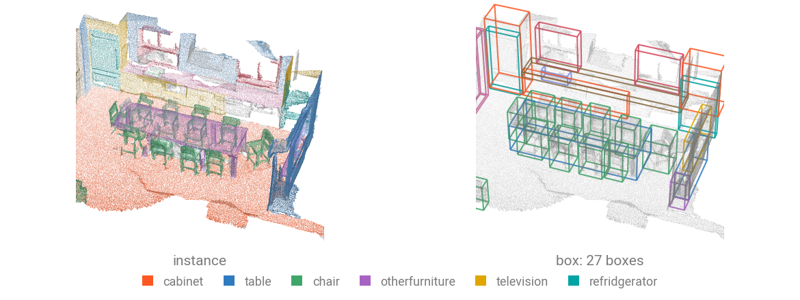
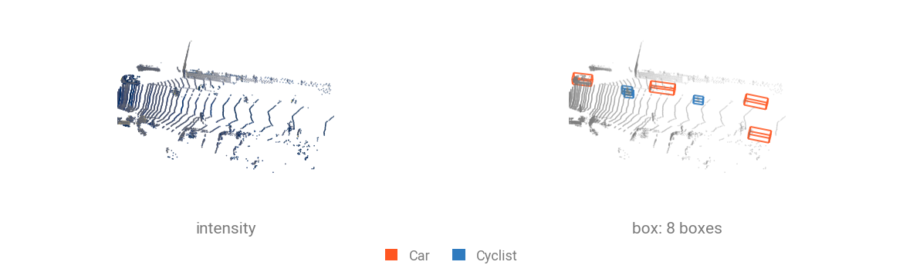

# Detection Datasets

Detection datasets pair a scene with **its boxes**: a ragged $(K, 7)$ tensor and one class per box, however many objects that scene happens to hold. Indoor loaders that ship per-point instances rather than boxes can derive them.



One sample is a scene plus a ragged set of boxes. The room above ships instances rather than boxes, so its boxes are derived, one per instance once the walls and floor are mapped out.

| Dataset                                       | Scenes                  | Classes | Boxes          | Download  |
| --------------------------------------------- | ----------------------- | ------- | -------------- | --------- |
| [`SunRGBD`](../api/datasets/sunrgbd.md)       | 5 285 train / 5 050 val | 10      | oriented       | automatic |
| [`KITTI`](../api/datasets/kitti.md)           | 7 481 frames            | 8       | oriented       | manual    |
| [`NuScenesMini`](../api/datasets/nuscenes.md) | 404 keyframes           | 10      | oriented       | manual    |
| [`ScanNet`](../api/datasets/scannet.md)       | 1 201 train / 312 val   | 18      | from instances | automatic |

## Load a dataset

```{.python notest}
from torch_pointcloud.datasets import SunRGBD

dataset = SunRGBD(root="data", train=False, download=True)
print(f"Scenes: {len(dataset)}")
print({k: tuple(v.shape) for k, v in dataset[0].items()})
```

```text
Scenes: 5050
{'pos': (236777, 3), 'color': (236777, 3), 'box': (2, 7), 'label': (2,)}
```

## What a sample holds

| Key         | Shape    | Description                                                    |
| ----------- | -------- | -------------------------------------------------------------- |
| `pos`       | $(N, 3)$ | Points, unprojected from depth (indoor) or LiDAR (driving)     |
| `color`     | $(N, 3)$ | RGB, indoor only                                               |
| `intensity` | $(N, 1)$ | LiDAR return, driving only                                     |
| `box`       | $(K, 7)$ | $(c_x, c_y, c_z, d_x, d_y, d_z, \theta)$, $K$ varies per scene |
| `label`     | $(K,)$   | Class of each box                                              |

KITTI adds `truncation`, `occlusion`, `bbox_height` and `frame`, because its evaluation protocol needs them to build its difficulty tiers. nuScenes adds `velocity`, `attribute`, `num_points` and `timestamp`.

## Batch the ragged boxes

Boxes cannot concatenate like points without losing which scene they came from. Pass them as `cat_keys` and collate emits a matching `batch_box` index.

```{.python notest}
from torch_pointcloud.utils.data import DataKeys, PointCloudDataLoader

dataloader = PointCloudDataLoader(
    dataset,
    batch_size=8,
    cat_keys=[DataKeys.BOX, DataKeys.LABEL],
)

data = next(iter(dataloader))
print(f"Box shape: {tuple(data['box'].shape)}")
print(f"Batch box shape: {tuple(data['batch_box'].shape)}")
print(f"Pos shape: {tuple(data['pos'].shape)}")
```

```text
Box shape: (10, 7)
Batch box shape: (10,)
Pos shape: (1714990, 3)
```

`batch_box[i]` names the scene of box `i`, exactly as `batch[j]` names the scene of point `j`. Losses and metrics read both.

## Driving datasets



Outdoor frames carry `intensity` instead of color and their boxes are genuinely oriented, since a car on a road faces whichever way the road goes. The frame above is the one the committed [`sample_driving.ply`](../assets/data/sample_driving.ply) was cut from, with the five cars and three cyclists KITTI annotates it with.

`KITTI` and `NuScenesMini` need a manual download, since both require accepting terms first. The loader raises with the page to visit and the directory to extract into.

`KITTI` reads `<root>/KITTI/raw/training/` with `velodyne/`, `label_2/`, `calib/` and `image_2/`. Two flags matter:

| Argument            | Effect                                                                                                       |
| ------------------- | ------------------------------------------------------------------------------------------------------------ |
| `fov=True`          | Keep only points inside the front-camera frustum, which is what the benchmark scores. Baked into the cache.  |
| `return_calib=True` | Also emit the composed $(3, 4)$ LiDAR-to-image matrix, needed to project boxes back for the official metric. |

`NuScenesMini` is the 10-scene mini release (`v1.0-mini`), useful as a smoke test for the nuScenes checkpoints. `max_sweeps` sets how many prior LiDAR sweeps are aggregated into a keyframe.

## Boxes from instance labels

`ScanNet` ships per-point `instance` and `segment` rather than boxes. `InstanceToBox` turns them into detection targets: one axis-aligned box per instance, classed by its majority semantic label.

```{.python notest}
import numpy as np
import torch
from plyfile import PlyData

import torch_pointcloud.transforms as T

# Load the sample scene
ply = PlyData.read("sample_scene_labeled.ply")["vertex"]
pos = np.stack([ply["x"], ply["y"], ply["z"]], 1).astype("float32")
segment = np.asarray(ply["segment"]).astype("int64")
instance = np.asarray(ply["instance"]).astype("int64")

scene = {
    "pos": torch.from_numpy(pos),
    "segment": torch.from_numpy(segment),
    "instance": torch.from_numpy(instance),
}

# Derive one box per annotated instance
scene = T.InstanceToBox()(scene)
print(f"Box shape: {tuple(scene['box'].shape)}")
print(f"Label shape: {tuple(scene['label'].shape)}")
```

```text
Box shape: (33, 7)
Label shape: (33,)
```

Every instance becomes a box here, walls and floor included. Map the stuff classes to the `ignore_index` with a `Relabel` first and their instances drop out of the box set, which is how the 18-class ScanNet detection targets are built:

```{.python notest}
from torch_pointcloud.datasets.scannet import SCANNET_DETECTION_LABELS

transform = T.Compose([
    T.Relabel(keys="segment", labels=SCANNET_DETECTION_LABELS, default=-1),
    T.InstanceToBox(),
])
```
