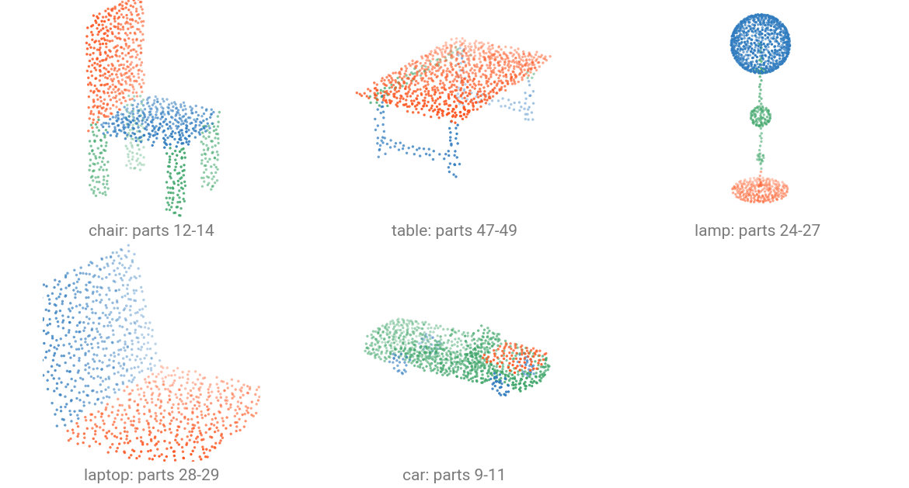

# Part Segmentation Datasets

[`ShapeNetPart`](../api/datasets/shapenetpart.md) labels the parts of a single object: a chair's legs, back and seat. It is the standard benchmark for the task, with 16 categories, 50 part ids and roughly 16 900 shapes.



Part ids are global across the 16 categories: a chair owns 12-14 and a table 47-49, so one 50-way head covers every category. The colors above are each object's own `segment` field.

| Split   | Samples |
| ------- | ------- |
| `train` | 12 137  |
| `val`   | 1 870   |
| `test`  | 2 874   |

## Get the data

ShapeNetPart requires registration, so there is no automatic download. Fetch `shapenetcore_partanno_segmentation_benchmark_v0_normal` from [shapenet.org](https://shapenet.org/) and extract it under `data/ShapeNetPart/raw/`.

## Load a dataset

```{.python notest}
from torch_pointcloud.datasets import ShapeNetPart

dataset = ShapeNetPart(root="data", split="test")
print(f"Samples: {len(dataset)}")
print({k: tuple(v.shape) for k, v in dataset[0].items()})
```

```text
Samples: 2874
{'pos': (2704, 3), 'normal': (2704, 3), 'segment': (2704,), 'category': ()}
```

Point counts vary per shape, which is what the packed batch format handles. The first run writes a cache under `data/ShapeNetPart/processed/`.

## What a sample holds

| Key        | Shape    | Description                                         |
| ---------- | -------- | --------------------------------------------------- |
| `pos`      | $(N, 3)$ | Coordinates, already unit-normalized by the release |
| `normal`   | $(N, 3)$ | Surface normals                                     |
| `segment`  | $(N,)$   | Part id in $[0, 50)$, global across categories      |
| `category` | scalar   | Object category index in $[0, 16)$                  |

`category` is a plain integer here. Part-segmentation checkpoints read it one-hot, which their registered transform handles.

## Categories and their parts

```python
from torch_pointcloud.datasets import ShapeNetPart

print(list(ShapeNetPart.category_ids)[:5])
print(ShapeNetPart.seg_ids["Airplane"], ShapeNetPart.seg_ids["Mug"])
```

```text
['Airplane', 'Bag', 'Cap', 'Car', 'Chair']
[0, 1, 2, 3] [36, 37]
```

Restrict the dataset to a subset of categories with `categories=`:

```{.python notest}
chairs = ShapeNetPart(root="data", split="train", categories=["Chair"])
```

## Use it with a checkpoint

The registered transform carries the checkpoint's whole preprocessing: it samples the point budget the checkpoint expects, subsamples `normal` and `segment` with the same indices, and one-hots `category`.

```{.python notest}
import torch_pointcloud as tp
from torch_pointcloud.datasets import ShapeNetPart
from torch_pointcloud.utils.data import PointCloudDataLoader

# Load the pretrained model
model, info = tp.create_model(
    "pointnext-sm.shapenetpart.openpoints",
    task="segmentation",
    pretrained=True,
    return_info=True,
)

# Pass the associated transform to the dataset
dataset = ShapeNetPart(root="data", split="test", transform=info["transform"])
dataloader = PointCloudDataLoader(dataset, batch_size=16, num_workers=6)

data = next(iter(dataloader))
print(f"Pos shape: {tuple(data['pos'].shape)}")
print(f"X shape: {tuple(data['x'].shape)}")
print(f"Category shape: {tuple(data['category'].shape)}")
```

```text
Pos shape: (32768, 3)
X shape: (32768, 7)
Category shape: (16, 16)
```

`category` stacks to $(B, 16)$ because it is per object, while the per-point keys concatenate. See [Part segmentation](../models/part-segmentation.md) for the loop that scores it.
