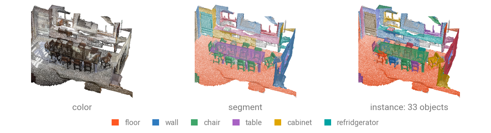
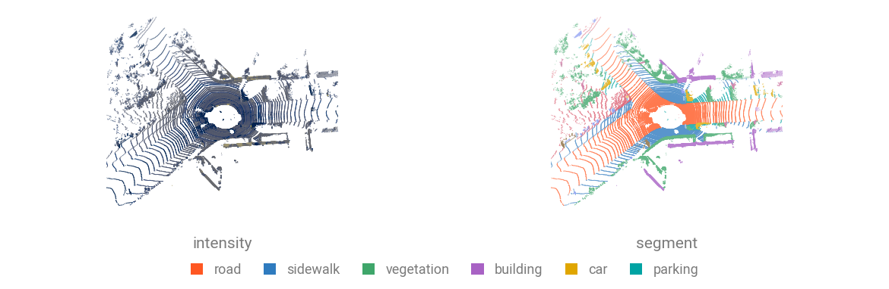

# Segmentation Datasets

Segmentation datasets hold **one whole scene per sample**: a room or a LiDAR scan, with a label on every point. A single sample runs to hundreds of thousands of points, so a training pipeline crops, voxelizes or tiles it before batching.



An indoor sample carries color, a semantic label and an instance id on every point. Outdoor scans carry `intensity` in place of color.

## Indoor

| Dataset | Scenes | Classes | Download |
| --- | --- | --- | --- |
| [`S3DIS`](../api/datasets/s3dis.md) | 272 rooms in 6 areas | 13 | automatic |
| [`S3DISHdf5`](../api/datasets/s3dis.md) | 23 585 tiles of 4 096 points | 13 | automatic |
| [`ScanNet20`](../api/datasets/scannet.md) | 1 201 train / 312 val | 20 | automatic |
| [`ScanNet200`](../api/datasets/scannet.md) | same scenes | 200 | automatic |

## Outdoor

| Dataset | Frames or scenes | Classes | Download |
| --- | --- | --- | --- |
| [`SemanticKITTI`](../api/datasets/semantickitti.md) | 19 130 train / 4 071 val | 19 | manual |
| [`Semantic3D`](../api/datasets/semantic3d.md) | 15 train scenes | 9 | manual |
| [`Toronto3D`](../api/datasets/toronto3d.md) | 4 tiles | 9 | manual |
| [`ParisLille3D`](../api/datasets/parislille3d.md) | 3 scenes | 10 | manual |

A loader that cannot download for you raises a `RuntimeError` naming the source page and the exact directory to extract into, so the error message tells you what to do next.

## Load a dataset

```{.python notest}
from torch_pointcloud.datasets import S3DIS

rooms = S3DIS(root="data", areas=["Area_5"], download=True)
print(f"Rooms: {len(rooms)}")
print({k: tuple(v.shape) for k, v in rooms[0].items()})
```

```text
Rooms: 68
{'pos': (719348, 3), 'color': (719348, 3), 'segment': (719348,), 'instance': (719348,)}
```

ScanNet is loaded the same way, and adds estimated normals and the scene name:

```{.python notest}
from torch_pointcloud.datasets import ScanNet20

scenes = ScanNet20(root="data", split="val", download=True)
print(f"Scenes: {len(scenes)}")
print(sorted(scenes[0]))
```

```text
Scenes: 312
['color', 'instance', 'normal', 'pos', 'scene', 'segment']
```



Outdoor scans carry `intensity` $(N, 1)$ instead of color (`reflectance` on ParisLille3D), plus the `sequence` and `frame` identifiers on SemanticKITTI. Their labels are the raw SemanticKITTI ids, which the checkpoints remap themselves.

## Choose a split

| Dataset | Argument | Values |
| --- | --- | --- |
| `S3DIS` | `areas=` | `"all"` or a list of `Area_1` ... `Area_6`; the usual protocol trains on five and tests on `Area_5` |
| `ScanNet20` / `ScanNet200` | `split=` | `train`, `val`, `test` |
| `SemanticKITTI` | `split=` or `sequences=` | `train`, `val`, `trainval`, `test`, or explicit sequence ids |
| `Semantic3D`, `Toronto3D`, `ParisLille3D` | `split=` or `files=` | released splits, or an explicit file list |

Segmentation checkpoints name the fold they were trained on, so match the loader to the name: `pointnext-xl.s3dis-area5.openpoints` was trained on the other five areas and is meant to be evaluated on Area 5.

## Tile a large room

`S3DIS` and `ScanNet` can pre-split their scenes into ground-plane blocks at construction time, which reproduces the block-based training protocols:

```{.python notest}
blocks = S3DIS(
    root="data",
    areas=["Area_1"],
    block_size=1.0,
    block_stride=0.5,
    num_nodes=4096,
)
```

`S3DISHdf5` is the same data already cut into 4096-point tiles, released that way.

At test time, prefer an [inferer](../inferers/overview.md) over pre-blocking: it runs the model over the full room and stitches one prediction per original point.

## Conventions worth knowing

!!! warning "Color range differs per loader"
    `color` is uint8 in $[0, 255]$ for `S3DIS`, `ScanNet`, `Toronto3D` and `Semantic3D`, and float32 in $[0, 1]$ for `S3DISHdf5`. Checkpoint transforms divide by 255 where needed, so mixing the two silently halves or doubles the input scale.

!!! warning "Ignore index differs per dataset"
    Unlabeled points are 0 in ScanNet (`<unk>`) and the outdoor sets, and $-1$ after the class-subset remaps. A checkpoint's `Relabel` transform sends everything outside its class list to its own default, and the matching loss and metric take `ignore_index=-1`.

## Use it with a checkpoint

The registered transform carries the checkpoint's whole preprocessing: centering, color scaling, the 2 cm voxel grid, and the NYU40-to-20 label remap.

```{.python notest}
import torch_pointcloud as tp
from torch_pointcloud.datasets import ScanNet20
from torch_pointcloud.utils.data import PointCloudDataLoader

# Load the pretrained model
model, info = tp.create_model(
    "spunet-v1m1.scannet20.pointcept",
    task="segmentation",
    pretrained=True,
    return_info=True,
)

# Pass the associated transform to the dataset
dataset = ScanNet20(root="data", split="val", transform=info["transform"])
dataloader = PointCloudDataLoader(dataset, batch_size=1, num_workers=6)
```

Anything the transform records on the way through (`inverse`, `origin_segment`) comes back out of collate, which is what lets you score at full resolution. See [Semantic segmentation](../models/segmentation.md) for the loop that does it.

## Class names

```python
from torch_pointcloud.datasets.semantickitti import SEMANTIC_KITTI_CLASSES
from torch_pointcloud.datasets.parislille3d import PARISLILLE3D_CLASSES

print(len(SEMANTIC_KITTI_CLASSES), len(PARISLILLE3D_CLASSES))
```

```text
19 10
```

`S3DIS` and `ScanNet20` expose theirs the same way, and a pretrained checkpoint carries its own head order in `info["weights"]["classes"]`.
