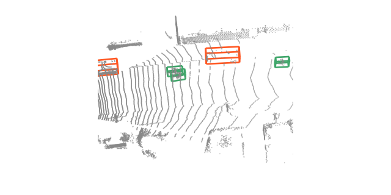

# Tutorials

Runnable notebooks covering the library end to end. Open them in Colab from the badge at the top of each page.

## Beginner

The scene tutorial reads a ScanNet scan, which requires accepting the ScanNet terms of use.

-   :material-rocket-launch: __[Quickstart: classify a point cloud](01-quickstart.md)__

    

    Load a pretrained model, build a transform pipeline, and classify an object in a few lines.

-   :material-domain: __[Segment a scene](02-segmentation-inference.md)__

    

    Run per-point semantic segmentation on a full indoor scene with a tiling inferer.

-   :material-tune: __[Preprocessing pipelines](03-transforms.md)__

    

    Compose dict transforms for sampling, normalization, and augmentation, and inspect each step.

## Intermediate

Your own data and a plain PyTorch training loop.

-   :material-database-plus: __[Use your own data](04-custom-dataset.md)__

    

    Wrap your own point cloud files in a dataset with disk caching and packed-batch collation.

-   :material-school: __[Train a model](05-training.md)__

    

    Train a classification model from scratch: dataloaders, optimizer, and the evaluation loop.

-   :material-magnify-scan: __[Features and similarity search](06-feature-search.md)__

    

    Read a frozen encoder's features, query one point, and retrieve whole shapes by descriptor.

## Advanced

3D object detection on driving LiDAR.

-   :material-car: __[Detect objects in driving LiDAR](07-driving-detection.md)__

    

    Turn one sweep into oriented 3D boxes: voxel encoding, decoding, non-maximum suppression.

