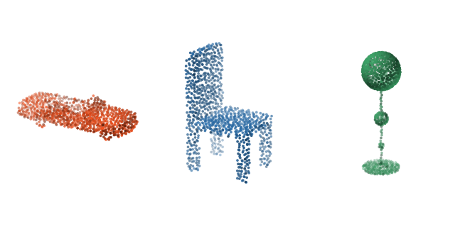
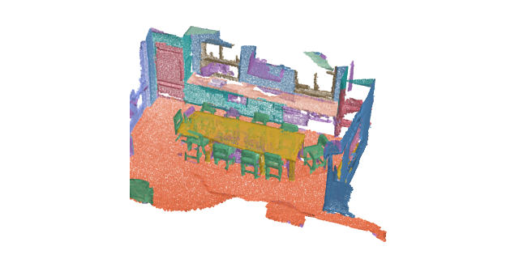
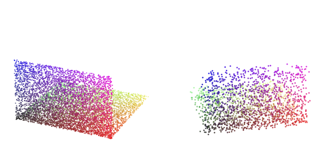
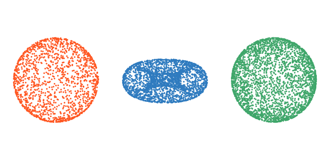
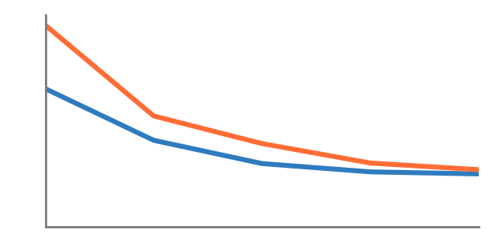
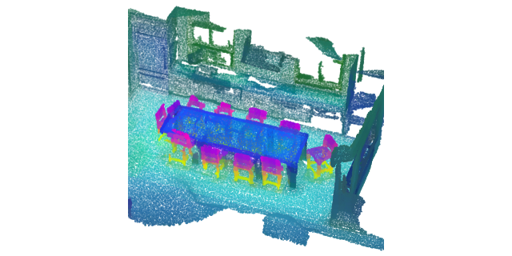

# Tutorials

Guided, runnable notebooks covering the library end to end. Each page is rendered from a Jupyter
notebook committed under `docs/examples/`; open it in Colab or download it from the badges at the
top of every tutorial.

The three tiers build on each other. **Beginner** gets a pretrained model running and explains the
conventions everything else assumes. **Intermediate** puts your own data and your own training loop
in the middle. **Advanced** takes the library to the shapes real projects ship in: survey tiles too
large for one forward pass, driving sweeps, and whole rooms read by several models at once.

## Beginner

Start here if you have not run a point cloud model before. Everything in this tier runs from
committed sample data, with no dataset download.

-   :material-rocket-launch: __[Quickstart: classify a point cloud](01-quickstart.md)__

    

    Load a pretrained model, build a transform pipeline, and classify an object in a few lines.

-   :material-domain: __[Segment a scene](02-segmentation-inference.md)__

    

    Run per-point semantic segmentation on a full indoor scene with a tiling inferer.

-   :material-tune: __[Preprocessing pipelines](03-transforms.md)__

    

    Compose dict transforms for sampling, normalization, and augmentation, and inspect each step.

## Intermediate

Your data, your training loop, and the representation a trained model leaves behind.

-   :material-database-plus: __[Use your own data](04-custom-dataset.md)__

    

    Wrap your own point cloud files in a dataset with disk caching and packed-batch collation.

-   :material-school: __[Train a model](05-training.md)__

    

    Train a classification model from scratch: dataloaders, optimizer, and the evaluation loop.

-   :material-magnify-scan: __[Features and similarity search](06-feature-search.md)__

    

    Read a frozen encoder's features, query one point, and retrieve whole shapes by descriptor.

## Advanced

Production-shaped problems: clouds too large for one forward pass, oriented boxes in traffic, and
several models combined into a single answer.

-   :material-car: __[Detect objects in driving LiDAR](07-driving-detection.md)__

    

    Turn one sweep into oriented 3D boxes: voxel encoding, decoding, non-maximum suppression.

