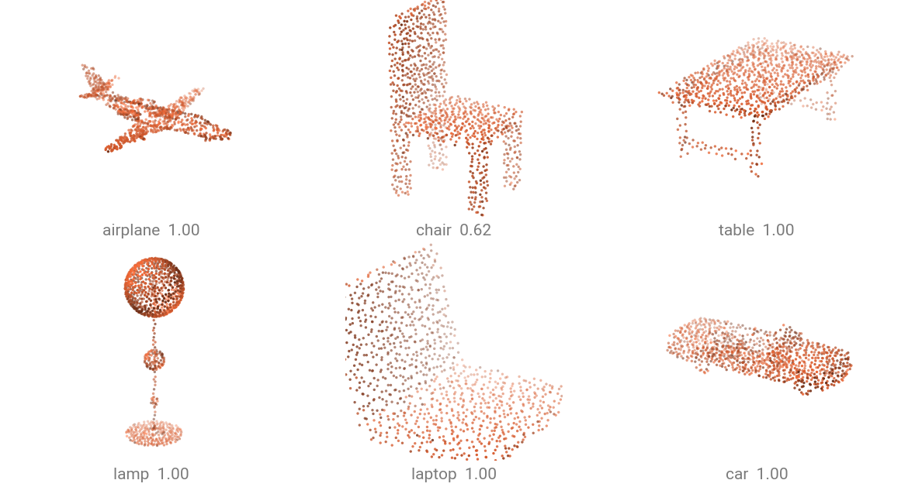
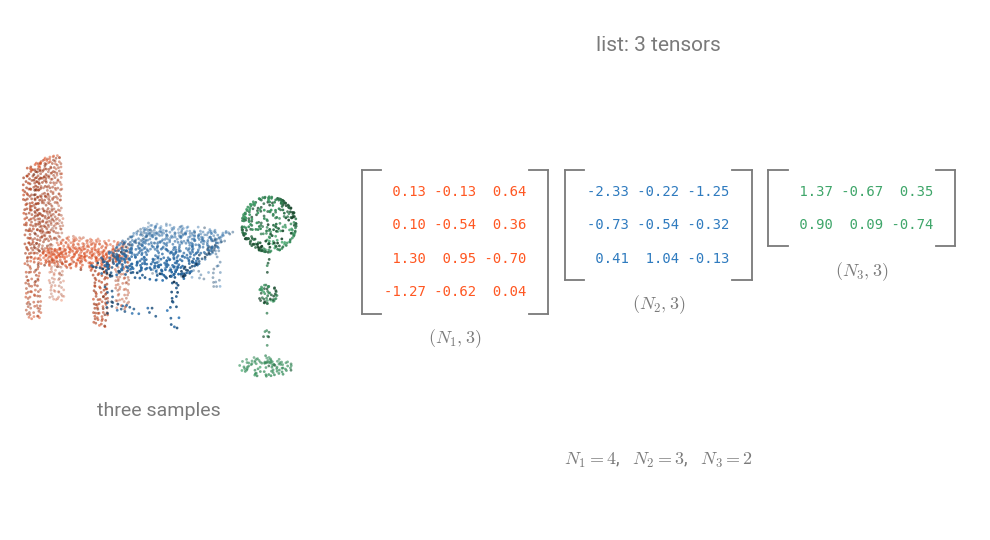

# Quick Start

This page takes you from zero to running a pretrained model on a point cloud in about fifteen lines.

## Run a pretrained model

Download the [`sample.ply`](../assets/data/sample.ply) point cloud from the ModelNet40 dataset:

```bash
curl -LO https://github.com/arthurdjn/pytorch-pointcloud/raw/main/docs/assets/data/sample.ply
```

```{.python notest}
import numpy as np
import torch
from plyfile import PlyData

import torch_pointcloud as tp
from torch_pointcloud.utils.data import collate

# Instantiate the model and return associated info.
model, info = tp.create_model(
    "pointnet2-ssg.modelnet40.xu-yan",
    task="classification",
    pretrained=True,
    return_info=True,
)
model = model.eval()

# Get associated transform for inference.
transform = info["transform"]

# Load input data. This checkpoint samples points and normals together.
ply = PlyData.read("sample.ply")["vertex"]
pos = np.stack([ply["x"], ply["y"], ply["z"]], 1).astype("float32")  # (N, 3)
normal = np.stack([ply["nx"], ply["ny"], ply["nz"]], 1).astype("float32")  # (N, 3)

# Apply the transform to the sample.
sample = {"pos": torch.from_numpy(pos), "normal": torch.from_numpy(normal)}
sample = transform(sample)

# Pack into a batch. The provided `collate` function
# handles the packed-batch convention, but you can use your own.
batch = collate([sample])

# Forward pass. Models take packed batches, never padded (B, N, ...) tensors.
with torch.no_grad():
    logits = model(batch.get("x"), batch["pos"], batch["batch"])

classes = info["weights"]["classes"]
top = logits.softmax(dim=-1).topk(3, dim=-1)
for index, score in zip(top.indices[0].tolist(), top.values[0].tolist()):
    print(f"{classes[index]:>12}  {score:.2f}")
```

```text
    airplane  1.00
       plant  0.00
      stairs  0.00
```



The packed-batch convention comes from :pyg: PyTorch Geometric: instead of zero-padding clouds to a common size, we concatenate them and tag each point with its sample index. See [Data conventions](#data-conventions) below.

## Using a real dataset

The same model, over a whole dataset. `ModelNetNormalResampled` is what this checkpoint was trained on: each shape
ships as 10,000 surface points with their normals, which is why the snippet above builds a `normal` key.
It downloads on first use.

```{.python notest}
import torch
import torch_pointcloud.transforms as T
from torch_pointcloud.datasets import ModelNetNormalResampled
from torch_pointcloud.utils.data import PointCloudDataLoader


dataset = ModelNetNormalResampled(
    root="data", 
    variant="40", 
    train=False, 
    download=True, 
    transform=info["transform"],
)

dataloader = PointCloudDataLoader(dataset, batch_size=32)

with torch.no_grad():
    for data in dataloader:
        logits = model(data.get("x"), data["pos"], data["batch"])
        preds = logits.argmax(dim=-1)  # (32,) one class per cloud
        break
```

`PointCloudDataLoader` is a `DataLoader` with the packed-batch `collate` wired in: per-point tensors are
concatenated along the batch axis and a `batch` index is built for you, while scene-level tensors (`label`)
are stacked.

## Data conventions

All point clouds use a **packed (flat-batch) format** (a.k.a. **ragged tensors**). This is what :pyg: PyTorch Geometric uses.
For a batch of $B$ samples with $N_i$ points each ($N = N_1 + N_2 + \ldots + N_B$):



| Tensor            | Shape    | Description                              |
| ----------------- | -------- | ---------------------------------------- |
| `pos`             | $(N, 3)$ | 3D coordinates, all points concatenated  |
| `x`               | $(N, C)$ | Per-point features                       |
| `batch`           | $(N,)$   | Per-point batch index $(0, \ldots, B-1)$ |
| `normal`, `color` | $(N, 3)$ | Per-point attributes                     |
| `segment`         | $(N,)$   | Per-point semantic label                 |
| `label`           | $(B,)$   | Scene / object-level label               |
