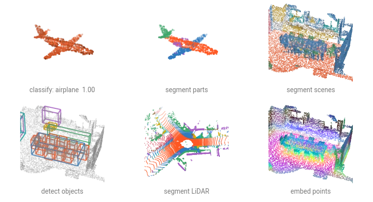

# PyTorch PointCloud


A PyTorch library for deep learning on point clouds. Production-ready models for classification, segmentation, and detection, with a `create_model` factory, pretrained-weight registry, and composable transforms in the style of :pytorch: [`timm`](https://github.com/huggingface/pytorch-image-models) and :pyg: [`torch_geometric`](https://pytorch-geometric.readthedocs.io/).



## In a few lines

```{.python notest}
import numpy as np
import torch
from plyfile import PlyData

import torch_pointcloud as tp
from torch_pointcloud.utils.data import collate

# Load pretrained checkpoint and sample cloud.
model, info = tp.create_model(
    "pointnet2-ssg.modelnet40.xu-yan",
    task="classification",
    pretrained=True,
    return_info=True,
)
model = model.eval()

# Get associated transform pipeline.
transform = info["transform"]

# Preprocess the input.
ply = PlyData.read("sample.ply")["vertex"]
pos = np.stack([ply["x"], ply["y"], ply["z"]], 1).astype("float32")
sample = {"pos": torch.from_numpy(pos)}
sample = transform(sample)

# Preprocess, pack into a batch, predict.
batch = collate([sample])
with torch.no_grad():
    logits = model(None, batch["pos"], batch["batch"])

print(f"Prediction: {logits.argmax().item()}")
# Prediction: 0
```

## What's inside

<div class="grid cards" markdown>

-   :material-rocket-launch: __[Get Started](get-started.md)__

    Install, run your first model, and learn the library's conventions in fifteen lines.

-   :material-cube-outline: __[Models](models/overview.md)__

    PointNet, PointNet++, RandLA-Net, KPConv, PointNeXt, OctFormer, Point Transformer, SPVCNN, and more.

-   :material-database: __[Datasets](datasets/overview.md)__

    ModelNet, ScanNet, S3DIS, ShapeNetPart, ScanObjectNN, SemanticKITTI, Semantic3D, and more.

-   :material-tune: __[Transforms](transforms/overview.md)__

    Composable, non-mutating dict transforms inspired by :monai: [MONAI](https://docs.monai.io/).

-   :material-school: __[Tutorials](examples/index.md)__

    Ready to use notebooks, from a first classification to survey-scale inference.

-   :material-book-open-page-variant: __[API Reference](api/index.md)__

    Auto-generated reference for every public class and function.

-   :material-github: __[Source](https://github.com/arthurdjn/pytorch-pointcloud)__

    Browse the source, file issues, or contribute.

</div>

## License

Apache 2.0. See [`LICENSE`](https://github.com/arthurdjn/pytorch-pointcloud/blob/main/LICENSE).
