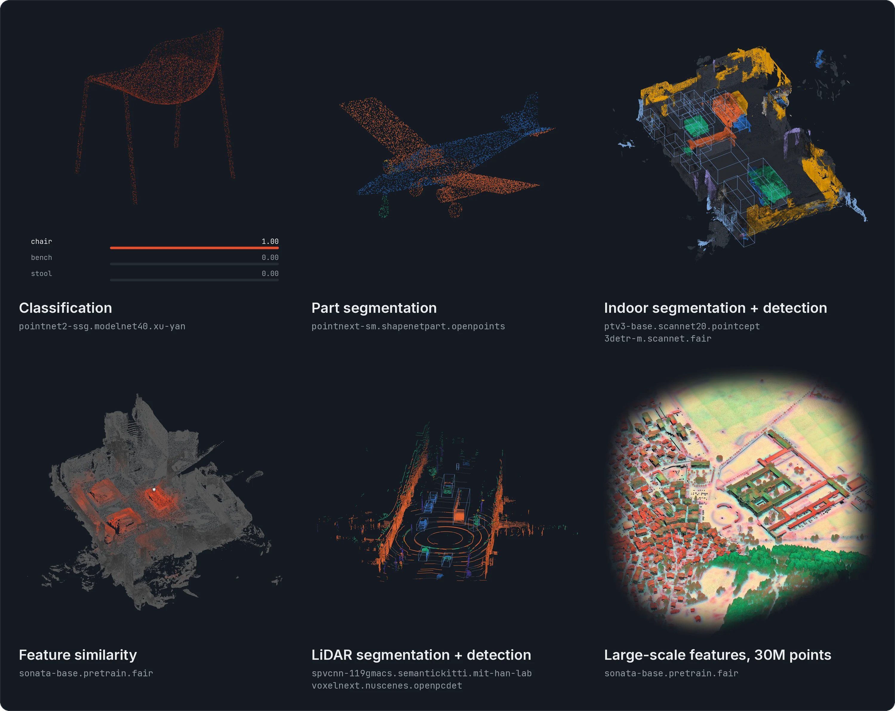

<section class="tp-hero">
  <h1 class="tp-visually-hidden">PyTorch PointCloud</h1>
  <a class="tp-hero__banner" href="https://github.com/arthurdjn/pytorch-pointcloud"></a>
  <p class="tp-hero__eyebrow"><span class="tp-pill">Alpha</span> Apache-2.0 · Not affiliated with the PyTorch project</p>
  <p class="tp-hero__lead">
    <strong>Deep learning on point clouds, with PyTorch.</strong>
    Models, pretrained weights, datasets, transforms and inferers, in the style of
    <a href="https://github.com/huggingface/pytorch-image-models">timm</a> and
    <a href="https://pytorch-geometric.readthedocs.io/">PyG</a>.
  </p>
  <p class="tp-hero__actions">
    <a class="tp-button tp-button--primary" href="get-started/">Get started</a>
    <a class="tp-button" href="models/overview/">Browse the models</a>
    <code class="tp-hero__install">pip install torch-pointcloud</code>
  </p>
</section>

<figure class="tp-sheet">
  
  
</figure>

<div class="tp-section" markdown>

## In a few lines

Every checkpoint is one `create_model` call away, and ships the transform that turns a raw point cloud into what the
network expects:

```{.python notest}
import torch_pointcloud as tp

model, info = tp.create_model(
    "ptv3-base.scannet20.pointcept",
    task="semantic-segmentation",
    pretrained=True,
    return_info=True,
)
info["transform"]  # the preprocessing pipeline of that checkpoint
info["weights"]["metrics"]  # {"mIoU": 77.40, "OA": 92.01}

tp.list_models(task="detection", pretrained=True)  # all detection checkpoints
```

## Why torch-pointcloud?

`torch-pointcloud` is a library of pretrained models that makes common layers and backbones easy to reuse. It does
not replace research-first codebases such as :github: [Pointcept](https://github.com/Pointcept/Pointcept), :github: [OpenPCDet](https://github.com/open-mmlab/OpenPCDet) and
:github: [MMDetection3D](https://github.com/open-mmlab/mmdetection3d); it complements them with a common interface that makes benchmarking and
interoperability across architectures easier.

## What's inside

<div class="grid cards" markdown>

-   :material-rocket-launch: __[Get Started](get-started.md)__

    Install, run your first model, and learn the library's conventions.

-   :material-cube-outline: __[Models](models/overview.md)__

    PointNet, PointNet++, RandLA-Net, KPConv, PointNeXt, OctFormer, Point Transformer, SPVCNN, and more.

-   :material-database: __[Datasets](datasets/overview.md)__

    ModelNet, ScanNet, S3DIS, ShapeNetPart, ScanObjectNN, SemanticKITTI, Semantic3D, and more.

-   :material-tune: __[Transforms](transforms/overview.md)__

    Composable, non-mutating dict transforms inspired by :monai: [MONAI](https://docs.monai.io/).

-   :material-school: __[Tutorials](examples/index.md)__

    Ready-to-use notebooks, from a first classification to survey-scale inference.

-   :material-book-open-page-variant: __[API Reference](api/index.md)__

    Auto-generated reference for every public class and function.

</div>

## License

Apache 2.0, see [`LICENSE`](https://github.com/arthurdjn/pytorch-pointcloud/blob/main/LICENSE). Pretrained weights keep the
license of their source, see [`THIRD_PARTY_NOTICES.md`](https://github.com/arthurdjn/pytorch-pointcloud/blob/main/THIRD_PARTY_NOTICES.md).

</div>
