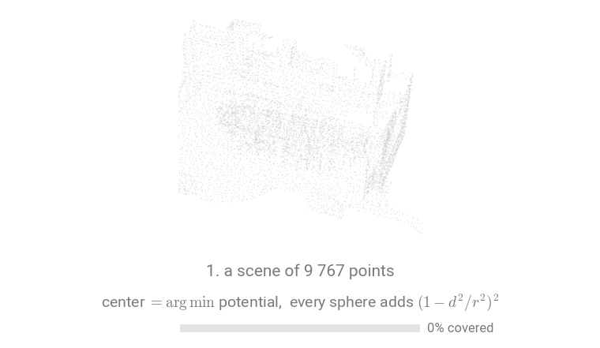

# PotentialSphereInferer

`PotentialSphereInferer` covers the scene with spheres of a fixed `radius` centered where the cloud has been seen the least, and blends each sphere's softmax predictions into the running per-point scores by an exponential moving average until every region has been covered about `num_votes` times. This is the test protocol of :arxiv: [KPConv](https://arxiv.org/abs/1904.08889): radius-defined input spheres, `test_smooth` EMA, potential sampling.



Each sphere (orange) is drawn where the potential is lowest, which is wherever the scene has been
seen least; every sphere it visits raises that potential, so the next one moves on.

## The potential loop

Coverage is tracked on a coarse grid of *potentials*: one scalar per `potential_size` cell (default `radius / 10`), initialized with small random noise. Each step:

1. Center a sphere of `radius` on the cell with the lowest potential, plus a Gaussian `jitter`.
2. Raise the potentials of the cells the sphere covers by the Tukey window $(1 - d^2 / r^2)^2$.
3. Run the predictor on the sphere, with positions centered on it.
4. Blend the sphere's softmax probabilities into the per-point scores by an EMA, restricted to the points within $\text{inner\_ratio} \cdot \text{radius}$ of the center, where the sphere's context is complete.

The loop stops once every cell's potential reaches `num_votes`, so each region has been predicted about that many times. The output is the EMA of softmax probabilities; points no sphere reaches keep all-zero scores. If no sphere with at least two points can be drawn at all, the inferer raises a `ValueError` (the `radius` is too small for the scale of `pos`).

## Usage

```{.python notest}
import torch_pointcloud as tp
from torch_pointcloud.inferers import PotentialSphereInferer

model = tp.create_model(
    "kpfcnn-base.s3dis.hugues-thomas", task="segmentation", pretrained=True
).eval()

inferer = PotentialSphereInferer(radius=1.5, num_votes=10.0)
probs = inferer(room, predictor=lambda d: model(d["x"], d["pos"], d["batch"]))
```

## When to use

- Reproducing the **KPConv evaluation protocol** on S3DIS-style scenes, where the model was trained on radius-defined input spheres.
- The model expects a **fixed metric extent** per forward pass rather than a fixed point count; for a fixed point budget, use [`KNNWindowInferer`](knn-window.md).
- You want **probabilities directly**: the output is an EMA of softmax probabilities, no final softmax needed.
- The per-sphere `transform` is the place for the reference's stochastic test-time augmentation and the model's feature stack.
