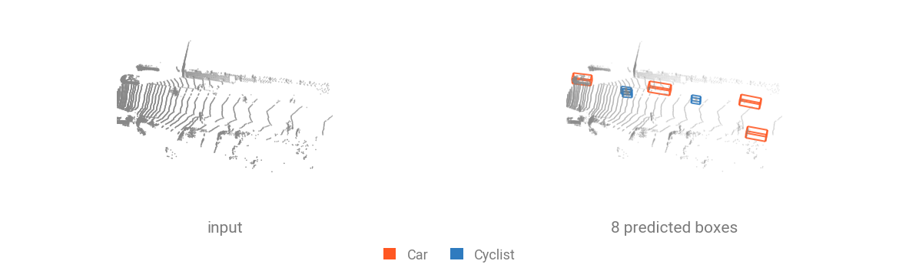

# Object Detection

Object detection predicts **one oriented 3D box per object**: a center, an extent and a heading, plus a class and a score. Boxes are packed like points, $(K, 7)$ rows of $(c_x, c_y, c_z, d_x, d_y, d_z, \theta)$ with a `batch` index naming the scene each box belongs to. $\theta$ is counter-clockwise about $+z$ from $+x$, and axis-aligned detectors leave it at zero.



## Run a pretrained checkpoint

Download the [`sample_driving.ply`](../assets/data/sample_driving.ply) (264 kB) to get started. This is a KITTI lidar frame with reflectance.

```bash
curl -LO https://github.com/arthurdjn/pytorch-pointcloud/raw/main/docs/assets/data/sample_driving.ply
```

The registered transform carries the checkpoint's whole preprocessing: the reflectance it reads as `x`, and the hard voxelization into 16 cm pillars over the KITTI range. `forward` returns raw proposals and `decode` turns them into boxes. Neither filters: score thresholding and NMS belong to the evaluation protocol, so they stay in your code.

```{.python notest}
import numpy as np
import torch
from plyfile import PlyData

import torch_pointcloud as tp
from torch_pointcloud.utils.box3d import nms3d
from torch_pointcloud.utils.data import DataKeys, collate

# Load the pretrained model
model, info = tp.create_model(
    "pointpillars.kitti.openpcdet",
    task="detection",
    pretrained=True,
    return_info=True,
)
model = model.cuda().eval()

# Get associated transform
transform = info["transform"]

# Load the sample frame
ply = PlyData.read("sample_driving.ply")["vertex"]
pos = np.stack([ply["x"], ply["y"], ply["z"]], 1).astype("float32")
intensity = np.asarray(ply["intensity"]).astype("float32")[:, None]

sample = {"pos": torch.from_numpy(pos), "intensity": torch.from_numpy(intensity)}
sample = transform(sample)

# Collate the sample into a batch, keeping the pillars packed
data = collate([sample], cat_keys=[DataKeys.POS_VOXEL])
print(f"Data keys: {data.keys()}")

# Inference pass
with torch.no_grad():
    out = model(
        data["voxel"].cuda(),
        data["pos_voxel"].cuda(),
        data["voxel_num_points"].cuda(),
        data["batch_pos_voxel"].cuda(),
    )

# Decode the raw proposals into boxes
det = model.decode(out)
boxes, scores, labels, index = det["boxes"], det["scores"], det["labels"], det["batch"]
print(f"Boxes shape: {tuple(boxes.shape)}")

# Cut the low scores, then deduplicate what is left
keep = (scores > 0.1).nonzero().squeeze(-1)
keep = keep[nms3d(boxes[keep], scores[keep], 0.01, batch=index[keep], rotated=True)]
print(f"Kept boxes: {len(keep)}")

# Report the confident ones
classes = info["weights"]["classes"]
for i in keep[scores[keep] > 0.5]:
    box = boxes[i]
    print(f"{classes[int(labels[i])]:>12}  {scores[i]:.2f}  center=({box[0]:.2f}, {box[1]:.2f}, {box[2]:.2f})  yaw={box[6]:.2f}")
```

```text
Data keys: dict_keys(['pos', 'intensity', 'x', 'voxel', 'pos_voxel', 'voxel_num_points', 'batch', 'batch_pos_voxel'])
Boxes shape: (321408, 7)
Kept boxes: 17
         Car  0.94  center=(8.30, 5.00, -0.87)  yaw=3.16
         Car  0.93  center=(24.25, 5.41, -0.83)  yaw=3.11
         Car  0.89  center=(45.08, -2.77, -0.62)  yaw=6.23
     Cyclist  0.84  center=(32.00, 3.62, -0.62)  yaw=3.11
         Car  0.80  center=(42.77, 5.07, -0.73)  yaw=3.07
     Cyclist  0.77  center=(18.10, 2.97, -0.74)  yaw=3.23
         Car  0.76  center=(4.41, -2.60, -0.94)  yaw=6.29
     Cyclist  0.74  center=(17.73, 3.61, -0.81)  yaw=3.14
```

An anchor-based head scores every anchor of its grid, so `decode` returns 321 408 boxes: the score cut leaves 218, rotated NMS at IoU 0.01 collapses those to 17, and the eight most confident are the ones the figure draws. The `yaw` values are non-zero, since KITTI annotates oriented boxes.

## Inputs and outputs

Voxel-based detectors read the pillar / voxel layout their registered transform produces, one argument per tensor it writes.

| Argument           | Shape           | Description                                                      |
| ------------------ | --------------- | ---------------------------------------------------------------- |
| `voxel`            | $(V, P, C)$     | Points gathered per voxel, zero-padded to $P$ slots              |
| `pos_voxel`        | $(V, 3)$        | Integer voxel-grid coordinates                                   |
| `voxel_num_points` | $(V,)$          | How many of the $P$ slots each voxel actually fills              |
| `batch`            | $(V,)$          | Index tensor associating each voxel to its scene                 |
| **returns**        | dict of tensors | The raw head outputs, which `model.decode(...)` turns into boxes |

`decode` returns a packed dict: `boxes` $(K, 7)$, `scores` $(K,)$, `labels` $(K,)$ and a `batch` index $(K,)$ naming the scene each box came from.

Indoor detectors read points instead, which changes the call but not the output.

| Family                | Checkpoints                                           | Call                                                     |
| --------------------- | ----------------------------------------------------- | -------------------------------------------------------- |
| Point-based (indoor)  | `votenet.*`, `3detr*`, `pointrcnn.*`                  | `model(x, pos, batch)`                                   |
| Voxel-based (driving) | `pointpillars.*`, `second.*`, `voxelnext.*`, `lion-*` | `model(voxel, pos_voxel, voxel_num_points, batch_voxel)` |

## Collating a batch

`cat_keys` keeps a ragged per-scene key packed and emits a matching `batch_<key>` index. Voxel counts vary per scene, so `pos_voxel` collates that way and arrives with `batch_pos_voxel`; ground-truth boxes vary too, so `box` arrives with `batch_box`.

```{.python notest}
from torch_pointcloud.utils.data import DataKeys, PointCloudDataLoader

dataloader = PointCloudDataLoader(
    dataset,
    batch_size=4,
    num_workers=4,
    cat_keys=[DataKeys.BOX, DataKeys.POS_VOXEL],
)
```

## Evaluate on a dataset

You will find several utilities in `torch_pointcloud.utils.metrics` to score the predictions. `mean_average_precision3d` scores every class at one IoU, and `average_precision3d` gives each class its own threshold, as KITTI requires: Car at 0.7, Pedestrian and Cyclist at 0.5, over the 11-point recall grid.

```{.python notest}
import torch
import torch_pointcloud as tp
import torch_pointcloud.transforms as T
from torch_pointcloud.datasets import KITTI
from torch_pointcloud.datasets.kitti import KITTI_CLASSES
from torch_pointcloud.utils.box3d import nms3d
from torch_pointcloud.utils.data import DataKeys, PointCloudDataLoader
from torch_pointcloud.utils.metrics import average_precision3d

model, info = tp.create_model(
    "pointpillars.kitti.openpcdet",
    task="detection",
    pretrained=True,
    return_info=True,
)
model = model.cuda().eval()

# The dataset annotates every KITTI class, the checkpoint predicts three of them
classes = info["weights"]["classes"]
relabel = T.RelabelBoxes(
    keys=["box", "label"],
    mapping={KITTI_CLASSES.index(name): i for i, name in enumerate(classes)},
)

dataset = KITTI(
    root="data",
    train=True,
    split_file="val.txt",
    transform=T.Compose([relabel, info["transform"]]),
)
dataloader = PointCloudDataLoader(
    dataset,
    batch_size=4,
    num_workers=4,
    cat_keys=[DataKeys.BOX, DataKeys.POS_VOXEL],
)

preds, targets = [], []
with torch.no_grad():
    for data in dataloader:
        out = model(
            data["voxel"].cuda(),
            data["pos_voxel"].cuda(),
            data["voxel_num_points"].cuda(),
            data["batch_pos_voxel"].cuda(),
        )
        det = model.decode(out)
        boxes, scores = det["boxes"], det["scores"]
        labels, index = det["labels"], det["batch"]

        keep = (scores > 0.1).nonzero().squeeze(-1)
        keep = keep[nms3d(boxes[keep], scores[keep], 0.01, batch=index[keep], rotated=True)]
        preds.append({
            "boxes": boxes[keep].cpu(),
            "scores": scores[keep].cpu(),
            "labels": labels[keep].cpu(),
            "batch": index[keep].cpu(),
        })
        targets.append({
            "boxes": data["box"],
            "labels": data["label"],
            "batch": data["batch_box"],
        })

metrics = average_precision3d(
    preds,
    targets,
    iou_per_class={0: 0.7, 1: 0.5, 2: 0.5},
    class_names=classes,
    interpolation="r11",
)
print({name: round(value * 100, 2) for name, value in metrics.items()})
```

!!! note "The published number needs the difficulty rules too"
    KITTI scores its moderate split only: `RelabelBoxes` turns `Van` and `Person_sitting` into ignore regions and downgrades boxes past the occlusion, truncation and 2D-height limits, and predictions projecting to under 25 px are dropped. `examples/pointpillars_benchmark_kitti.py` is this loop with those rules in place.

## Train from scratch

While :pytorch-pointcloud: provides various models and utils, you still own the whole training loop. Detection targets come from transforms, and the loss rebuilds the anchor grid from the same geometry the head uses.

```{.python notest}
from tqdm.auto import tqdm

import torch
import torch_pointcloud as tp
import torch_pointcloud.transforms as T
from torch_pointcloud.datasets import KITTI
from torch_pointcloud.datasets.kitti import KITTI_CLASSES
from torch_pointcloud.losses import AnchorLoss
from torch_pointcloud.utils.data import DataKeys, PointCloudDataLoader

device = "cuda"
voxel_size = (0.16, 0.16, 4.0)
point_cloud_range = (0.0, -39.68, -3.0, 69.12, 39.68, 1.0)

# Setup the dataset and dataloader
train_dataset = KITTI(
    "data",
    train=True,
    split_file="data/KITTI/raw/ImageSets/train.txt",
    transform=T.Compose([
        T.RelabelBoxes(
            keys=["box", "label", "truncation", "occlusion", "bbox_height"],
            mapping={KITTI_CLASSES.index(name): i for i, name in enumerate(["Car", "Pedestrian", "Cyclist"])},
            ignore_fields={"occlusion": (None, 1), "truncation": (None, 0.3), "bbox_height": (25, None)},
        ),
        T.Cat(keys=["intensity"], dst_key="x", dim=1),
        T.HardVoxelize(
            pos_key="pos",
            feat_key="x",
            voxel_size=voxel_size,
            point_cloud_range=point_cloud_range,
            max_num_points=32,
            max_num_voxels=40_000,
        ),
    ]),
)
train_dataloader = PointCloudDataLoader(
    train_dataset,
    batch_size=4,
    shuffle=True,
    num_workers=8,
    cat_keys=[DataKeys.BOX, DataKeys.POS_VOXEL],
)

# Create the desired model, criterion and optimizer
model = tp.create_model("pointpillars.kitti.openpcdet", task="detection").to(device)
criterion = AnchorLoss(
    num_classes=3,
    voxel_size=voxel_size,
    point_cloud_range=point_cloud_range,
    anchor_sizes=[[3.9, 1.6, 1.56], [0.8, 0.6, 1.73], [1.76, 0.6, 1.73]],
    anchor_bottom_heights=[-1.78, -0.6, -0.6],
    feature_map_stride=2,
    matched_thresholds=[0.6, 0.5, 0.5],
    unmatched_thresholds=[0.45, 0.35, 0.35],
).to(device)
optimizer = torch.optim.AdamW(
    model.parameters(),
    lr=3e-3,
    weight_decay=0.01,
)

# Training loop
model.train()
for epoch in range(10):
    print(f"Training epoch {epoch}")
    total_loss = 0.0
    pbar = tqdm(enumerate(train_dataloader), total=len(train_dataloader), desc=f"Training epoch {epoch}")
    for i, data in pbar:
        data = {k: v.to(device) if torch.is_tensor(v) else v for k, v in data.items()}

        optimizer.zero_grad()
        out = model(data["voxel"], data["pos_voxel"], data["voxel_num_points"], data["batch_pos_voxel"])
        loss = criterion(out, data)["loss"]

        loss.backward()
        optimizer.step()
        total_loss += loss.item()
        if (i + 1) % 10 == 0:
            loss_step = loss.item()
            metrics = {"train/loss_step": f"{loss_step:.3f}"}
            pbar.set_postfix(metrics)

    loss_epoch = total_loss / len(train_dataloader)
    print(f"Loss epoch {epoch}: {loss_epoch:.3f}")
```

!!! note "Train and evaluation relabel differently"
    The training transform maps `Car`, `Pedestrian` and `Cyclist` to $0, 1, 2$ and stops there. Evaluation adds `ignore_mapping={1: 0, 4: 1}` so `Van` and `Person_sitting` become ignore regions; at training those rows would enter the anchor targets as real `Car` and `Pedestrian` ground truth.

`configs/experiment/pointpillars/kitti.yaml` is this recipe as an experiment, with the `OneCycleLR` schedule and the evaluation protocol wired in.

```bash
uv run --no-sync python train.py experiment=pointpillars/kitti
uv run --no-sync python test.py experiment=pointpillars/kitti
```
