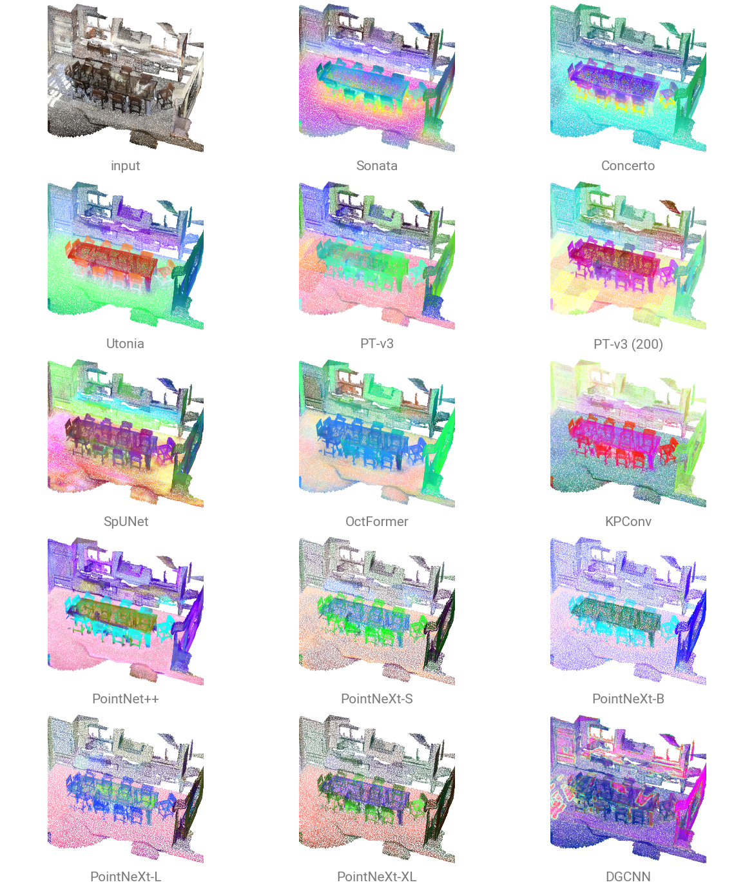
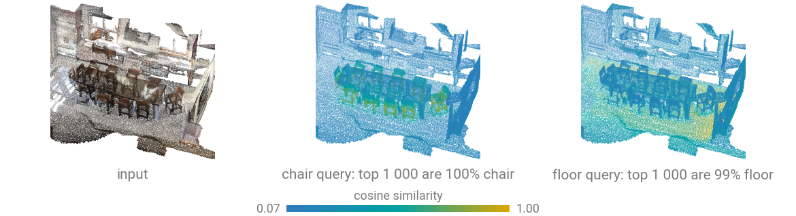
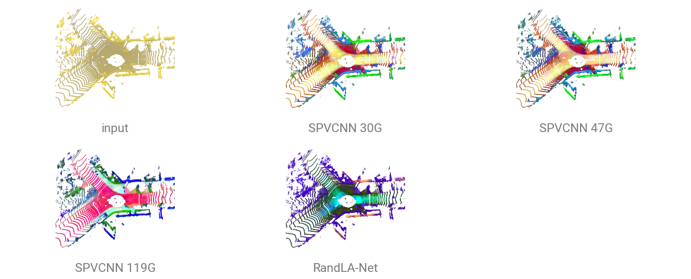
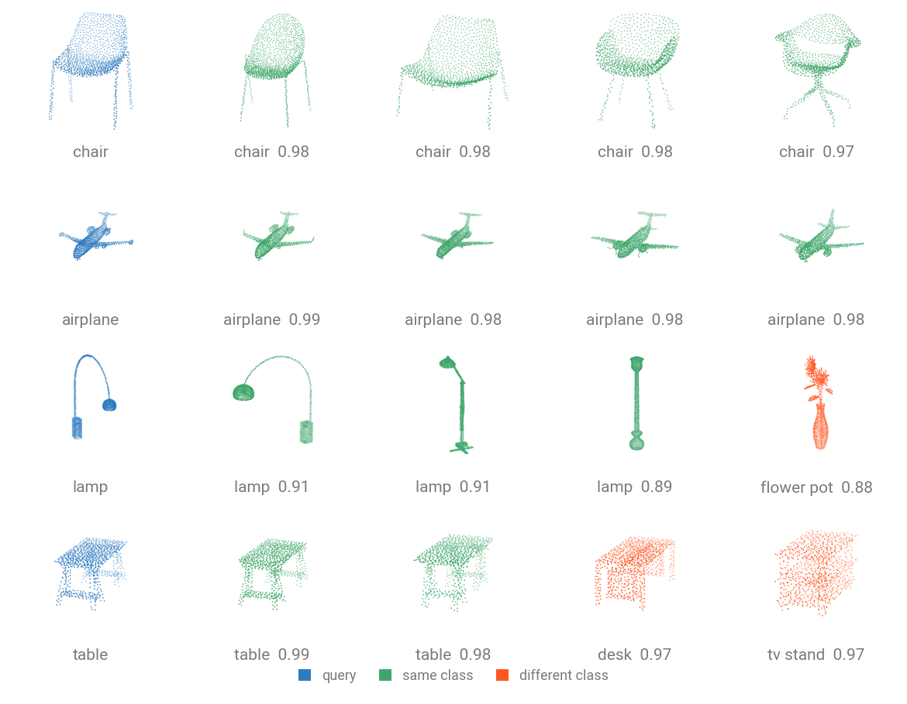

# Feature Maps

All registered models compute a representation (a.k.a. embeddings, feature maps, descriptors...) that you can use for downstream tasks such as clusterize objects, retrieval or visualize the learned representations.

Segmentation backbones will return features as a **per-point feature** $(N, C)$ tensor, and classifiers will return a **global descriptor** $(B, C)$ tensor.



## Three ways to get the tensor

=== "Drop the head"

    `num_classes=0` replaces the head with `nn.Identity`, so `forward` returns the feature. This works on every model, needs no knowledge of the architecture, and keeps the pretrained backbone.

    ```python
    import torch
    import torch_pointcloud as tp

    model = tp.create_model(
        "pointnext-sm", task="segmentation", in_channels=4, num_classes=0
    ).eval()

    pos = torch.rand(8192, 3) * 4.0
    x = torch.rand(8192, 4)
    batch = torch.arange(2).repeat_interleave(4096)

    with torch.no_grad():
        feat = model(x, pos, batch)
    print(tuple(feat.shape), type(model.head).__name__)
    ```

    ```text
    (8192, 64) Identity
    ```

    With `pretrained=True` the checkpoint's head keys are skipped with a warning and the backbone loads in full. Every panel of the gallery above is this one recipe, applied to fourteen different checkpoints.

=== "Split the forward pass"

    Models that follow the canonical layout expose the encoder and decoder separately, which also gives you the multi-scale intermediates.

    ```{.python notest}
    with torch.inference_mode():
        feat, _, _, intermediates = model.forward_features(
            x, pos_grid, batch, return_intermediates=True
        )
        feat, _, _ = model.forward_decoder(feat, intermediates)  # (N, C)
    ```

    Classifiers stop one step earlier: `forward_head(x, batch, pre_logits=True)` pools without projecting to classes. Models that implement `forward` in one piece raise `NotImplementedError` here.

=== "Hook a module"

    Any intermediate tensor is reachable with a standard PyTorch hook, including in models with no `forward_features`.

    ```{.python notest}
    captured = {}
    handle = model.head.register_forward_pre_hook(
        lambda module, args: captured.update(x=args[0])
    )

    with torch.no_grad():
        logits = model(None, pos, batch)
    handle.remove()

    print(tuple(logits.shape), tuple(captured["x"].shape))  # (1, 40) (1, 2048)
    ```

## Per-point features from a pretrained encoder

Self-supervised encoders are the interesting case: they were trained without labels, so their features are not shaped by one dataset's class list. For example, `concerto-large-lp.scannet20.pointcept` carries a frozen [Concerto](../api/models/concerto.md) encoder.

To continue, download the [`sample_scene_labeled.ply`](../assets/data/sample_scene_labeled.ply) to get started. This is a labeled ScanNet scene.

```{.python notest}
import numpy as np
import torch
from plyfile import PlyData

import torch_pointcloud as tp
import torch_pointcloud.transforms as T
from torch_pointcloud.utils.data import collate

# Load the sample scene
ply = PlyData.read("sample_scene_labeled.ply")["vertex"]
pos = np.stack([ply["x"], ply["y"], ply["z"]], 1).astype("float32")
color = np.stack([ply["red"], ply["green"], ply["blue"]], 1).astype("float32")
segment = np.asarray(ply["segment"]).astype("int64")

sample = {
    "pos": torch.from_numpy(pos),
    "color": torch.from_numpy(color),
    "segment": torch.from_numpy(segment),
}
# ...checkpoint require normals
sample = T.EstimateNormals(keys="pos")(sample)

# Load the pretrained model
model, info = tp.create_model(
    "concerto-large-lp.scannet20.pointcept",
    task="segmentation",
    pretrained=True,
    return_info=True,
)
model = model.cuda().eval()

# Preprocess the sample
transform = info["transform"]
sample = transform(sample)

batch = collate([sample])
with torch.inference_mode():
    feat, _, _, intermediates = model.forward_features(
        batch["x"].cuda(),
        batch["pos_grid"].cuda(),
        batch["batch"].cuda(),
        return_intermediates=True,
    )
    print("encoder    ", tuple(feat.shape))
    feat, _, _ = model.forward_decoder(feat, intermediates)
    print("per point  ", tuple(feat.shape))
```

```text
encoder     (964, 768)
per point   (114118, 1728)
```

The encoder pools the room down to 964 tokens; the decoder unpools them back to one feature per (voxelized) point, concatenating every scale on the way, which is why $C$ grows to 1728.

## Look at them: PCA to RGB

Project each feature onto its top principal components and read three of them as colors. Points with similar features get similar colors, with no labels involved.

```python
import torch


def pca_color(feat: torch.Tensor, brightness: float = 1.2) -> torch.Tensor:
    """Map a per-point feature (N, C) to RGB via its top components."""
    _, _, v = torch.pca_lowrank(feat, center=True, q=6, niter=5)
    proj = feat @ v
    proj = proj[:, :3] * 0.6 + proj[:, 3:6] * 0.4
    lo, hi = proj.min(0, keepdim=True)[0], proj.max(0, keepdim=True)[0]
    return ((proj - lo) / (hi - lo).clamp_min(1e-6) * brightness).clamp(0, 1)


rgb = pca_color(torch.randn(4096, 128))
print(tuple(rgb.shape), float(rgb.min()), float(rgb.max()))
```

```text
(4096, 3) 0.0 1.0
```

## Query a scene: cosine similarity

Normalize, pick one point, and dot against the rest. The whole surface or object the query sits on lights up.

```{.python notest}
import torch.nn.functional as F

feat = F.normalize(feat.float(), dim=-1)
query = 72_863                       # a point on a chair
similarity = feat[query] @ feat.t()  # (N,) in [-1, 1]

top = similarity.topk(1000).indices
print((segment[top] == segment[query]).float().mean())
```



On the sample room, the 1000 nearest neighbors of that chair point are 100% chair, and of a floor point 98.8% floor. Nothing selected those regions: the encoder never saw a label, and the object the query sits on lights up because its points share a feature. That is nearest-neighbor label transfer: annotate one point, propagate to the region.

## Outdoor LiDAR

The same recipe on a SemanticKITTI scan, with the SPVCNN compute ladder and RandLA-Net. The input panel
is colored by height, since a LiDAR scan carries intensity rather than RGB.



Road, sidewalk, vegetation and parked cars separate without a single label being read.

Panels share one frame: a backbone's own coordinate convention (voxel-grid integers, a normalized cube)
is scaled onto the scene's extent for display. PCA is fit per panel, so colors are comparable within a
panel and never across two.

## Retrieve shapes: global descriptors

A classifier with its head removed is a shape encoder. Embedding ModelNet40's test split and classifying each object by its nearest neighbor recovers most of the supervised accuracy, without ever calling the classification head.

```{.python notest}
import torch
import torch.nn.functional as F

import torch_pointcloud as tp
from torch_pointcloud.datasets import ModelNetNormalResampled
from torch_pointcloud.utils.data import PointCloudDataLoader

model, info = tp.create_model(
    "pointnet2-ssg.modelnet40.xu-yan",
    task="classification",
    pretrained=True,
    num_classes=0,
    return_info=True,
)
model = model.cuda().eval()

dataset = ModelNetNormalResampled(
    root="data", variant="40", train=False, transform=info["transform"]
)
loader = PointCloudDataLoader(dataset, batch_size=64, num_workers=6)

embeddings, labels = [], []
with torch.no_grad():
    for batch in loader:
        emb = model(
            None, batch["pos"].cuda(), batch["batch"].cuda()
        )  # (B, 1024)
        embeddings.append(F.normalize(emb, dim=-1).cpu())
        labels.append(batch["label"])
embeddings, labels = torch.cat(embeddings), torch.cat(labels)

similarity = embeddings @ embeddings.t()
similarity.fill_diagonal_(-1)
neighbours = labels[similarity.argmax(dim=1)]
print(f"1-NN retrieval accuracy: {(neighbours == labels).float().mean():.4f}")
```

```text
1-NN retrieval accuracy: 0.8825
```


