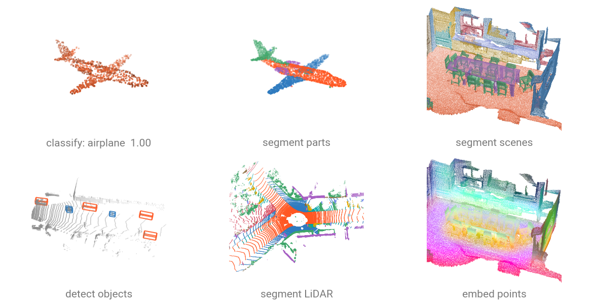

# Models

:pytorch-pointcloud-mini: `torch-pointcloud` ships 36 architectures across point cloud classification, semantic and instance segmentation, object detection, self-supervised pretraining, and generative modeling. Every model is registered with a :pytorch: timm-style factory, and make it switch between tasks or backbones and reset the head for downstream tasks (e.g. features extraction).

```{.python notest}
import torch_pointcloud as tp

model = tp.create_model(
    "pointnext-sm.scanobjectnn.openpoints", 
    task="classification",
    pretrained=True,
)
```

Browse available checkpoints with:

```python
import torch_pointcloud as tp

models = tp.list_models(task="classification")
# or task="segmentation", "detection", ...
```



## Tasks

<div class="grid cards" markdown>

-   :material-shape-outline: __[Classification](classification.md)__

    One label per cloud: run, evaluate and fine-tune a classifier.

-   :material-floor-plan: __[Semantic segmentation](segmentation.md)__

    One label per point: voxelization, full-resolution predictions, mIoU.

-   :material-puzzle-outline: __[Part segmentation](part-segmentation.md)__

    Category-conditioned part labels and the ShapeNetPart protocol.

-   :material-cube-scan: __[Object detection](detection.md)__

    Oriented boxes: decode, filter with NMS, score with mAP.

-   :material-palette-swatch: __[Feature maps](features.md)__

    The representation under the head: embeddings, retrieval, PCA.

</div>

### Classification

Best for **shape classification** (ModelNet40, ScanObjectNN, ShapeNet objects). Inputs are single object scans, outputs are scene-level class predictions.

| Model                                                             | Paper                                                                                                                                    | Benchmark                        |
| ----------------------------------------------------------------- | ---------------------------------------------------------------------------------------------------------------------------------------- | -------------------------------- |
| [**PointNet**](../api/models/pointnet.md)                         | :arxiv: [PointNet: Deep Learning on Point Sets for 3D Classification and Segmentation](https://arxiv.org/abs/1612.00593)                 | –                                |
| [**PointNet++**](../api/models/pointnet2.md)                      | :arxiv: [PointNet++: Deep Hierarchical Feature Learning on Point Sets in a Metric Space](https://arxiv.org/abs/1706.02413)               | ModelNet40<br>*OA: 92.67 / 92.8* |
| [**DGCNN**](../api/models/dgcnn.md)                               | :arxiv: [Dynamic Graph CNN for Learning on Point Clouds](https://arxiv.org/abs/1801.07829)                                               | ModelNet40<br>*OA: 92.46 / 93.6* |
| [**PointCNN**](../api/models/pointcnn.md)                         | :arxiv: [PointCNN: Convolution On $\mathcal{X}$-Transformed Points](https://arxiv.org/abs/1801.07791)                                    | –                                |
| [**PointConv**](../api/models/pointconv.md)                       | :arxiv: [PointConv: Deep Convolutional Networks on 3D Point Clouds](https://arxiv.org/abs/1811.07246)                                    | ModelNet40<br>*OA: 92.02 / 92.5* |
| [**PointMLP**](../api/models/pointmlp.md)                         | :arxiv: [Rethinking Network Design and Local Geometry in Point Cloud: A Simple Residual MLP Framework](https://arxiv.org/abs/2202.07123) | ModelNet40<br>*OA: – / 94.1*     |
| [**PointNeXt**](../api/models/pointnext.md)                       | :arxiv: [PointNeXt: Revisiting PointNet++ with Improved Training and Scaling Strategies](https://arxiv.org/abs/2206.04670)               | ModelNet40<br>*OA: 92.1 / 94.0*  |
| [**Point Transformer V1**](../api/models/point_transformer.md)    | :arxiv: [Point Transformer](https://arxiv.org/abs/2012.09164)                                                                            | –                                |
| [**Point Transformer V2**](../api/models/point_transformer_v2.md) | :arxiv: [Point Transformer V2: Grouped Vector Attention and Partition-based Pooling](https://arxiv.org/abs/2210.05666)                   | –                                |
| [**Point Transformer V3**](../api/models/point_transformer_v3.md) | :arxiv: [Point Transformer V3: Simpler, Faster, Stronger](https://arxiv.org/abs/2312.10035)                                              | –                                |
| [**PVCNN**](../api/models/pvcnn.md)                               | :arxiv: [Point-Voxel CNN for Efficient 3D Deep Learning](https://arxiv.org/abs/1907.03739)                                               | –                                |
| [**Point-Mamba**](../api/models/point_mamba.md)                   | :arxiv: [PointMamba: A Simple State Space Model for Point Cloud Analysis](https://arxiv.org/abs/2402.10739)                              | ModelNet40<br>*OA: 93.64 / 93.6* |
| [**OctFormer**](../api/models/octformer.md)                       | :arxiv: [OctFormer: Octree-based Transformers for 3D Point Clouds](https://arxiv.org/abs/2305.03045)                                     | ModelNet40<br>*OA: 89.02 / 92.7* |

### Segmentation

Best for **dense per-point labeling** (S3DIS, ScanNet, SemanticKITTI). Inputs are large scenes, outputs are per-point class predictions.

| Model                                                             | Paper                                                                                                                      | Benchmark                            |
| ----------------------------------------------------------------- | -------------------------------------------------------------------------------------------------------------------------- | ------------------------------------ |
| [**PointNet++**](../api/models/pointnet2.md)                      | :arxiv: [PointNet++: Deep Hierarchical Feature Learning on Point Sets in a Metric Space](https://arxiv.org/abs/1706.02413) | S3DIS-A5<br>*mIoU: 63.59 / 63.6*     |
| [**DGCNN**](../api/models/dgcnn.md)                               | :arxiv: [Dynamic Graph CNN for Learning on Point Clouds](https://arxiv.org/abs/1801.07829)                                 | ScanNet20<br>*mIoU: 50.58 / 49.6*    |
| [**KPConv**](../api/models/kpconv.md)                             | :arxiv: [KPConv: Flexible and Deformable Convolution for Point Clouds](https://arxiv.org/abs/1904.08889)                   | S3DIS-A5<br>*mIoU: 65.66 / 67.3*     |
| [**PointNeXt**](../api/models/pointnext.md)                       | :arxiv: [PointNeXt: Revisiting PointNet++ with Improved Training and Scaling Strategies](https://arxiv.org/abs/2206.04670) | S3DIS-A5<br>*mIoU: 63.01 / 63.4*     |
| [**Point Transformer V3**](../api/models/point_transformer_v3.md) | :arxiv: [Point Transformer V3: Simpler, Faster, Stronger](https://arxiv.org/abs/2312.10035)                                | ScanNet20<br>*mIoU: 76.04 / 77.6*    |
| [**RandLA-Net**](../api/models/randlanet.md)                      | :arxiv: [RandLA-Net: Efficient Semantic Segmentation of Large-Scale Point Clouds](https://arxiv.org/abs/1911.11236)        | SemanticKITTI<br>*mIoU: – / 53.1*    |
| [**SPVCNN**](../api/models/spvcnn.md)                             | :arxiv: [Searching Efficient 3D Architectures with Sparse Point-Voxel Convolution](https://arxiv.org/abs/2007.16100)       | SemanticKITTI<br>*mIoU: 62.4 / 63.8* |
| [**SPUNet**](../api/models/spunet.md)                             | :arxiv: [4D Spatio-Temporal ConvNets: Minkowski Convolutional Neural Networks](https://arxiv.org/abs/1904.08755)           | ScanNet20<br>*mIoU: 70.02 / 75.67*   |
| [**OctFormer**](../api/models/octformer.md)                       | :arxiv: [OctFormer: Octree-based Transformers for 3D Point Clouds](https://arxiv.org/abs/2305.03045)                       | ScanNet20<br>*mIoU: 74.78 / 74.8*    |
| [**SphereFormer**](../api/models/sphereformer.md)                 | :arxiv: [Spherical Transformer for LiDAR-based 3D Recognition](https://arxiv.org/abs/2303.12766)                           | SemanticKITTI<br>*mIoU: – / 67.8*    |
| [**PVCNN / PVCNN++**](../api/models/pvcnn2.md)                    | :arxiv: [Point-Voxel CNN for Efficient 3D Deep Learning](https://arxiv.org/abs/1907.03739)                                 | S3DIS-A5<br>*mIoU: 57.51 / 56.64*    |

### Instance segmentation

Predict **per-point instance masks** on top of semantics (ScanNet, S3DIS).

| Model                                               | Paper                                                                                                         | Benchmark                        |
| --------------------------------------------------- | ------------------------------------------------------------------------------------------------------------- | -------------------------------- |
| [**OneFormer3D**](../api/models/oneformer3d.md)     | :arxiv: [OneFormer3D: One Transformer for Unified Point Cloud Segmentation](https://arxiv.org/abs/2311.14405) | ScanNet20<br>*mIoU: 76.5 / 76.4* |
| [**SPFormer-UNet**](../api/models/spformer_unet.md) | :arxiv: [Superpoint Transformer for 3D Scene Instance Segmentation](https://arxiv.org/abs/2211.15766)         | –                                |

### Detection

Predict **3D bounding boxes** for indoor scenes (ScanNet, SUN RGB-D) or driving scenes (KITTI, nuScenes, Waymo).

| Model                                             | Paper                                                                                                                            | Benchmark                          |
| ------------------------------------------------- | -------------------------------------------------------------------------------------------------------------------------------- | ---------------------------------- |
| [**VoteNet**](../api/models/votenet.md)           | :arxiv: [Deep Hough Voting for 3D Object Detection in Point Clouds](https://arxiv.org/abs/1904.09664)                            | ScanNet<br>*mAP@25: 58.35 / 58.6*  |
| [**3DETR**](../api/models/detr3d.md)              | :arxiv: [An End-to-End Transformer Model for 3D Object Detection](https://arxiv.org/abs/2109.08141)                              | SunRGBD<br>*mAP@25: 58.20 / 58.0*  |
| [**PointPillars**](../api/models/pointpillars.md) | :arxiv: [PointPillars: Fast Encoders for Object Detection from Point Clouds](https://arxiv.org/abs/1812.05784)                   | KITTI<br>*mod. mAP: 62.86 / 64.08* |
| [**SECOND**](../api/models/second.md)             | :arxiv: [SECOND: Sparsely Embedded Convolutional Detection](https://www.mdpi.com/1424-8220/18/10/3337)                           | KITTI<br>*mod. mAP: 66.11 / 66.25* |
| [**PointRCNN**](../api/models/pointrcnn.md)       | :arxiv: [PointRCNN: 3D Object Proposal Generation and Detection from Point Cloud](https://arxiv.org/abs/1812.04244)              | KITTI<br>*mod. mAP: 63.56 / 68.41* |
| [**VoxelNeXt**](../api/models/voxelnext.md)       | :arxiv: [VoxelNeXt: Fully Sparse VoxelNet for 3D Object Detection and Tracking](https://arxiv.org/abs/2303.11301)                | nuScenes<br>*mAP: – / 60.5*        |
| [**Voxel-Mamba**](../api/models/voxel_mamba.md)   | :arxiv: [Voxel Mamba: Group-Free State Space Models for Point Cloud based 3D Object Detection](https://arxiv.org/abs/2406.10700) | –                                  |
| [**LION**](../api/models/lion.md)                 | :arxiv: [LION: Linear Group RNN for 3D Object Detection in Point Clouds](https://arxiv.org/abs/2407.18232)                       | nuScenes<br>*mAP: – / 68.0*        |

### Self-supervised pretraining

Backbones pretrained without labels, registered with `task="base"`; the fine-tuned classification / segmentation heads are registered under their downstream task.

| Model                                          | Paper                                                                                                                             | Benchmark                              |
| ---------------------------------------------- | --------------------------------------------------------------------------------------------------------------------------------- | -------------------------------------- |
| [**Point-MAE**](../api/models/point_mae.md)    | :arxiv: [Masked Autoencoders for Point Cloud Self-supervised Learning](https://arxiv.org/abs/2203.06604)                          | ModelNet40<br>*OA: 93.35 / 94.04*      |
| [**Point-BERT**](../api/models/point_bert.md)  | :arxiv: [Point-BERT: Pre-training 3D Point Cloud Transformers with Masked Point Modeling](https://arxiv.org/abs/2111.14819)       | ModelNet40<br>*OA: 93.07 / 93.19*      |
| [**Point-M2AE**](../api/models/point_m2ae.md)  | :arxiv: [Point-M2AE: Multi-scale Masked Autoencoders for Hierarchical Point Cloud Pre-training](https://arxiv.org/abs/2205.14401) | ModelNet40<br>*OA: 92.87 / 93.43*      |
| [**PointGPT**](../api/models/pointgpt.md)      | :arxiv: [PointGPT: Auto-regressively Generative Pre-training from Point Clouds](https://arxiv.org/abs/2305.11487)                 | ModelNet40<br>*OA: 94.37 / 94.4*       |
| [**PointMamba**](../api/models/point_mamba.md) | :arxiv: [PointMamba: A Simple State Space Model for Point Cloud Analysis](https://arxiv.org/abs/2402.10739)                       | ModelNet40<br>*OA: 93.64 / 93.6*       |
| [**Sonata**](../api/models/sonata.md)          | :arxiv: [Sonata: Self-Supervised Learning of Reliable Point Representations](https://arxiv.org/abs/2503.16429)                    | ScanNet20<br>*lin. mIoU: 71.93 / 72.5* |
| [**Concerto**](../api/models/concerto.md)      | :arxiv: [Concerto: Joint 2D-3D Self-Supervised Learning Emerges Spatial Representations](https://arxiv.org/abs/2510.23607)        | ScanNet20<br>*lin. mIoU: 77.68 / –*    |
| [**Utonia**](../api/models/utonia.md)          | :arxiv: [Utonia: Toward One Encoder for All Point Clouds](https://arxiv.org/abs/2603.03283)                                       | ScanNet20<br>*lin. mIoU: 71.11 / –*    |
