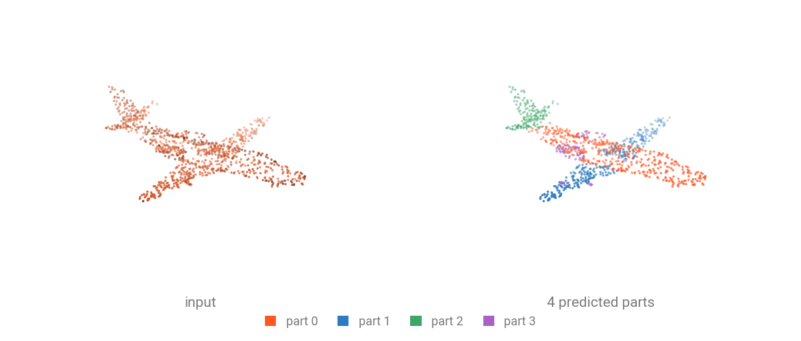

# Part Segmentation

Part segmentation labels **every point of a single object** with one of its parts: a chair's legs, back and seat. Models read a packed batch and the object category, and return per-point logits $(N, 50)$, aligned row for row with the points they were given.



ShapeNetPart, the standard benchmark, spreads **50 part ids over 16 categories**. Airplane owns ids $0 \ldots 3$, Table owns $47 \ldots 49$, so one head with 50 outputs covers every category at once and the category tells it which ids to look at.

## Run a pretrained checkpoint

Download the [`sample.ply`](../assets/data/sample.ply) (90 kB) to get started. This is a ShapeNetPart airplane with normals.

```bash
curl -LO https://github.com/arthurdjn/pytorch-pointcloud/raw/main/docs/assets/data/sample.ply
```

The registered transform carries the checkpoint's whole preprocessing: rescaling, farthest point sampling down to 2048 points, and the one-hot encoding of the object category.

```{.python notest}
import numpy as np
import torch
from plyfile import PlyData

import torch_pointcloud as tp
from torch_pointcloud.datasets import ShapeNetPart
from torch_pointcloud.utils.data import collate

# Load the pretrained model
model, info = tp.create_model(
    "dgcnn.shapenetpart.an-tao",
    task="segmentation",
    pretrained=True,
    return_info=True,
)
model = model.eval()

# Get associated transform
transform = info["transform"]

# Load the sample point cloud
ply = PlyData.read("sample.ply")["vertex"]
pos = np.stack([ply["x"], ply["y"], ply["z"]], 1).astype("float32")
normal = np.stack([ply["nx"], ply["ny"], ply["nz"]], 1).astype("float32")

sample = {
    "pos": torch.from_numpy(pos),
    "normal": torch.from_numpy(normal),
    "category": torch.tensor(list(ShapeNetPart.category_ids).index("Airplane")),
    "segment": torch.zeros(len(pos), dtype=torch.long),  # placeholder, subsampled along
}
sample = transform(sample)

# Collate the sample into a batch
data = collate([sample])
print(f"Data keys: {data.keys()}")

# Inference pass, the category enters as a fourth argument
with torch.no_grad():
    logits = model(data.get("x"), data["pos"], data["batch"], data["category"])

# Get predictions inside the category's own part ids
part_ids = ShapeNetPart.seg_ids["Airplane"]
preds = logits[:, part_ids].argmax(dim=-1)
print(f"Logits shape: {tuple(logits.shape)}")
print(f"Predicted parts: {preds.unique(return_counts=True)}")
```

```text
Data keys: dict_keys(['pos', 'normal', 'category', 'segment', 'batch'])
Logits shape: (2048, 50)
Predicted parts: (tensor([0, 1, 2, 3]), tensor([ 446,  323,  163, 1116]))
```

The head scores all 50 part ids at once. The reporting protocol argmaxes inside the four ids the airplane owns, so `preds` counts its body, wing, tail and engine points rather than indexing the global 50.

!!! note "Pass a placeholder `segment`"
    The transform subsamples the part labels alongside the points, so it expects a `segment` key even at inference. Any tensor of the right length does.

## Inputs and outputs

| Argument    | Shape              | Description                                        |
| ----------- | ------------------ | -------------------------------------------------- |
| `x`         | $(N, C)$ or `None` | Per-point features usually normals, height.        |
| `pos`       | $(N, 3)$           | Coordinates, all objects in the batch concatenated |
| `batch`     | $(N,)$             | Index tensor associating each point to its object  |
| `category`  | $(B, 16)$          | One-hot object category, one row per object        |
| **returns** | $(N, 50)$          | Per-point logits over the 50 part ids              |

`category` is per object, not per point: `collate` stacks it to $(B, 16)$ while `pos` is concatenated to $(N, 3)$.

## Category ids and part ids

```python
from torch_pointcloud.datasets import ShapeNetPart

print(len(ShapeNetPart.category_ids), list(ShapeNetPart.category_ids)[:4])
print(ShapeNetPart.seg_ids["Chair"], ShapeNetPart.seg_ids["Table"])
```

```text
16 ['Airplane', 'Bag', 'Cap', 'Car']
[12, 13, 14, 15] [47, 48, 49]
```

`category_ids` is ordered, so `list(ShapeNetPart.category_ids).index(name)` is the integer the one-hot encodes, and `seg_ids[name]` is the slice of the 50 outputs that category owns.

## Evaluate on a dataset

The benchmark metric is **instance mIoU**: per object, the mean IoU over its own parts, averaged over objects. A part absent from both the prediction and the target counts as 1.0. **Class mIoU** averages per category first.

You will find several utilities in `torch_pointcloud.utils.metrics` to score the predictions.

```{.python notest}
from collections import defaultdict

import numpy as np
import torch
import torch_pointcloud as tp
from torch_pointcloud.datasets import ShapeNetPart
from torch_pointcloud.utils.data import PointCloudDataLoader
from torch_pointcloud.utils.metrics import compute_intersection_union
from torch_pointcloud.utils.ops import safe_divide

model, info = tp.create_model(
    "dgcnn.shapenetpart.an-tao",
    task="segmentation",
    pretrained=True,
    return_info=True,
)
model = model.cuda().eval()

dataset = ShapeNetPart(root="data", split="test", transform=info["transform"])
dataloader = PointCloudDataLoader(dataset, batch_size=16, num_workers=6)

names = list(ShapeNetPart.category_ids)
shape_ious = defaultdict(list)

with torch.no_grad():
    for data in dataloader:
        category = data["category"].cuda()
        batch = data["batch"].cuda()
        logits = model(None, data["pos"].cuda(), batch, category)
        preds = logits.argmax(dim=-1)

        intersection, union = compute_intersection_union(
            preds, data["segment"].cuda(), 50, batch=batch
        )
        for b in range(intersection.shape[0]):
            name = names[int(category[b].argmax())]
            part_ids = ShapeNetPart.seg_ids[name]
            iou = safe_divide(intersection[b, part_ids], union[b, part_ids], default=1.0)
            shape_ious[name].append(iou.mean().item())

instance_miou = np.mean([iou for ious in shape_ious.values() for iou in ious])
class_miou = np.mean([np.mean(ious) for ious in shape_ious.values()])
print(f"instance mIoU {instance_miou:.4f} | class mIoU {class_miou:.4f}")
```

```text
instance mIoU 0.8523 | class mIoU 0.8092
```

For more details, check out the `examples/dgcnn_benchmark_shapenetpart.py` script.

## Train from scratch

While :pytorch-pointcloud: provides various models and utils, you still own the whole training loop.

```{.python notest}
from tqdm.auto import tqdm
from torch.nn import functional as F

import torch
import torch_pointcloud as tp
import torch_pointcloud.transforms as T
from torch_pointcloud.datasets import ShapeNetPart
from torch_pointcloud.utils.data import PointCloudDataLoader

device = "cuda"

# Setup the dataset and dataloader
train_dataset = ShapeNetPart(
    "data",
    split="train",
    transform=T.Compose([
        T.FarthestPointSample(keys=["pos", "normal", "segment"], pos_key="pos", num_samples=2048),
        T.Rescale(keys="pos", method="centroid"),
        T.Cat(keys=["pos", "normal"], dst_key="x"),
        T.OneHot(keys="category", num_classes=16),
    ]),
)
train_dataloader = PointCloudDataLoader(
    train_dataset,
    batch_size=16,
    shuffle=True,
    num_workers=4,
)

# Create the desired model and optimizer
model = tp.create_model(
    "pointnext-sm.shapenetpart.openpoints",
    task="segmentation",
    in_channels=6,
    num_classes=50,
    num_categories=16,
).to(device)
optimizer = torch.optim.AdamW(
    model.parameters(),
    lr=1e-3,
    weight_decay=1e-4,
)

# Training loop
model.train()
for epoch in range(10):
    print(f"Training epoch {epoch}")
    total_loss = 0.0
    pbar = tqdm(enumerate(train_dataloader), total=len(train_dataloader), desc=f"Training epoch {epoch}")
    for i, data in pbar:
        x = data["x"].to(device)
        pos = data["pos"].to(device)
        target = data["segment"].to(device)
        batch = data["batch"].to(device)
        category = data["category"].to(device)

        optimizer.zero_grad()
        logits = model(x, pos, batch, category)
        loss = F.cross_entropy(logits, target)

        loss.backward()
        optimizer.step()
        total_loss += loss.item()
        if (i + 1) % 10 == 0:
            loss_step = loss.item()
            metrics = {"train/loss_step": f"{loss_step:.3f}"}
            pbar.set_postfix(metrics)

    loss_epoch = total_loss / len(train_dataloader)
    print(f"Loss epoch {epoch}: {loss_epoch:.3f}")
```

For more details, check out the `examples/pointnext_segmentation.py` script.
