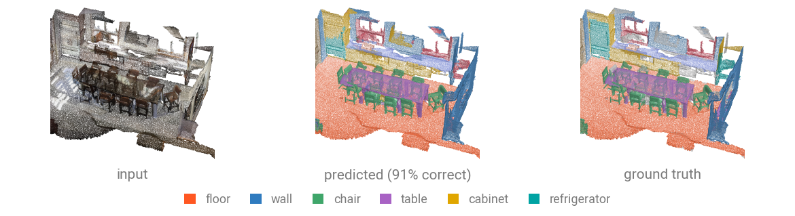
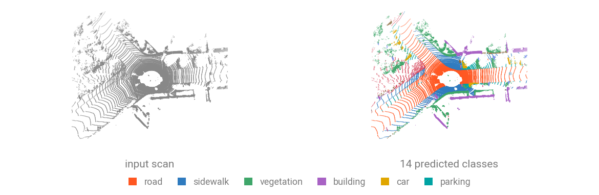

# Semantic Segmentation

Semantic segmentation labels **every point** of a scene. Models read a packed batch and return per-point logits $(N, \text{num\_classes})$, aligned row for row with the points they were given.



## Run a pretrained checkpoint

Download the [`sample_scene_labeled.ply`](../assets/data/sample_scene_labeled.ply) (2.9 MB) to get started. This is a ScanNet room with RGB and NYU40 labels.

```bash
curl -LO https://github.com/arthurdjn/pytorch-pointcloud/raw/main/docs/assets/data/sample_scene_labeled.ply
```

The registered transform carries the checkpoint's whole preprocessing: centering, color scaling, voxelization, and the label remap it was trained under.

```{.python notest}
import numpy as np
import torch
from plyfile import PlyData

import torch_pointcloud as tp
import torch_pointcloud.transforms as T
from torch_pointcloud.utils.data import collate

ply = PlyData.read("sample_scene_labeled.ply")["vertex"]
pos = np.stack([ply["x"], ply["y"], ply["z"]], 1).astype("float32")
color = np.stack([ply["red"], ply["green"], ply["blue"]], 1).astype("float32")
segment = np.asarray(ply["segment"]).astype("int64")

sample = {
    "pos": torch.from_numpy(pos),
    "color": torch.from_numpy(color),
    "segment": torch.from_numpy(segment),
}
# the checkpoint reads color + normals
sample = T.EstimateNormals(keys="pos")(sample)

# Load the pretrained model
model, info = tp.create_model(
    "spunet-v1m1.scannet20.pointcept",
    task="segmentation",
    pretrained=True,
    return_info=True,
)
model = model.cuda().eval()

# Get associated transform
transform = info["transform"]

# Apply the transform to the scene
sample = transform(sample)
data = collate([sample])
print(f"Data keys: {data.keys()}")

with torch.no_grad():
    x = data["x"].cuda()
    pos_grid = data["pos_grid"].cuda()
    batch = data["batch"].cuda()
    inverse = data["inverse"].cuda()
    logits = model(x, pos_grid, batch)

# Get predictions at full resolution
preds = logits[inverse].argmax(dim=-1).cpu()
print(f"Logits shape: {tuple(logits.shape)}")
print(f"Predictions shape: {tuple(preds.shape)}")
```

```text
Data keys: dict_keys(['x', 'pos_grid', 'batch', 'inverse'])
Logits shape: (114118, 20)
Predictions shape: (127410,)
```

Because the pipeline voxelizes the input scene, the model sees one point per 2 cm voxel.
The `inverse` tensor is used to map the predictions back to the original points.

## Inputs and outputs

| Argument           | Shape                      | Description                                                                  |
| ------------------ | -------------------------- | ---------------------------------------------------------------------------- |
| `x`                | $(N, C)$ or `None`         | Per-point features usually color, normals, height.                           |
| `pos` / `pos_grid` | $(N, 3)$                   | Coordinates (float) or integer voxel-grid coordinates (depends on the model) |
| `batch`            | $(N,)$                     | Index tensor associating each point to its point cloud                       |
| **returns**        | $(N, \text{num\_classes})$ | Per-point logits                                                             |

## Full-resolution predictions

Voxelization is part of the checkpoint, so raw logits are per voxel. Pipelines that record the mapping expose it under `inverse`, and `logits[inverse]` scatters predictions back to every original point.

```{.python notest}
import torch
import torch_pointcloud.transforms as T

torch.manual_seed(0)

transform = T.Compose([
    T.Shift(keys="pos", method="min"),
    T.Voxelize(
        pos_key="pos",
        pos_reduce="grid",
        size=0.02,
        keys=["color", "segment"],
        dst_inverse_key="inverse",
    ),
])

sample = {
    "pos": torch.rand(20_000, 3) * 4.0,
    "color": torch.rand(20_000, 3) * 255,
    "segment": torch.randint(0, 20, (20_000,)),
}
sample = transform(sample)
print(f"Sample keys: {sample.keys()}")
print(f"Pos shape: {tuple(sample['pos'].shape)}")
print(f"Inverse shape: {tuple(sample['inverse'].shape)}")
```

```text
Sample keys: dict_keys(['pos', 'color', 'segment', 'inverse'])
Pos shape: (19975, 3)
Inverse shape: (20000,)
```

For rooms too large for one forward pass, an [inferer](../inferers/overview.md) tiles or sub-samples the scene and stitches the partial predictions back into one $(N, C)$ output.

## Evaluate on a scene

You will find several utilities in `torch_pointcloud.utils.metrics` to score the predictions.

```{.python notest}
from torch_pointcloud.utils.metrics import confusion_matrix

cm = confusion_matrix(
    preds, 
    data["segment"], 
    num_classes=model.num_classes,
    ignore_index=-1,
)
intersection = cm.diag().float()
union = cm.sum(0).float() + cm.sum(1).float() - intersection
present = cm.sum(1) > 0

print(f"accuracy {cm.diag().sum() / cm.sum():.4f}")
print(f"mIoU     {(intersection[present] / union[present]).mean():.4f}")
```

```text
accuracy 0.8437
mIoU     0.6734
```

!!! note "Ignore the unlabeled points"
    `ignore_index=-1` drops the unlabeled points from the confusion matrix.

## Train from scratch

While :pytorch-pointcloud: provides various models and utils, you still own the whole training loop.

```{.python notest}
from tqdm.auto import tqdm
from torch.nn import functional as F
from torch.utils.data import DataLoader

import torch
import torch_pointcloud as tp
import torch_pointcloud.transforms as T
from torch_pointcloud.datasets import ShapeNetPart
from torch_pointcloud.utils.data import collate

# Setup the dataset and dataloader
train_dataset = ShapeNetPart(
    "data",
    split="train",
    categories="Airplane",
    transform=T.Rescale(keys="pos"),
)
train_dataloader = DataLoader(
    train_dataset,
    batch_size=16,
    shuffle=True,
    num_workers=4,
    collate_fn=collate,
)

# Create the desired model and optimizer
model = tp.create_model(
    "pointnext-sm",
    task="segmentation",
    in_channels=4,
    num_classes=13,
)
optimizer = torch.optim.AdamW(
    model.parameters(),
    lr=1e-3,
    weight_decay=1e-4,
)

# Training loop
model.train()
for epoch in range(10):
    print(f"Training epoch {epoch}")
    total_loss = 0.0
    pbar = tqdm(enumerate(train_dataloader), total=len(train_dataloader), desc=f"Training epoch {epoch}")
    for i, data in pbar:
        pos = data["pos"].to(device)
        target = data["segment"].to(device)
        batch = data["batch"].to(device)

        optimizer.zero_grad()
        logits = model(None, pos, batch)
        logits = F.log_softmax(logits, dim=1)
        loss = F.nll_loss(logits, target)

        loss.backward()
        optimizer.step()
        total_loss += loss.item()
        if (i + 1) % 10 == 0:
            loss_step = loss.item()
            metrics = {"train/loss_step": f"{loss_step:.3f}"}
            pbar.set_postfix(metrics)

    loss_epoch = total_loss / len(dataloader)
    print(f"Loss epoch {epoch}: {loss_epoch:.3f}")
```

For more details, check out the `examples/pointnext_segmentation.py` script.

## Outdoor LiDAR

Similarly to the above example, you can run a LiDAR segmentation model on a sample scan. The `spvcnn-119gmacs.semantickitti.mit-han-lab` model
takes `intensity` rather than color and voxelizes at 5 cm.



Download the [`sample_lidar_a.ply`](../assets/data/sample_lidar_a.ply) (2.3 MB) to get started. This is a SemanticKITTI scan with intensity and ground truth labels.

```bash
curl -LO https://github.com/arthurdjn/pytorch-pointcloud/raw/main/docs/assets/data/sample_lidar_a.ply
```
