# Augmentation

Random geometric augmentations for training pipelines; each takes a probability `p` and an optional `generator` for reproducibility. Most act on one sample and are shown on a single object and a real ScanNet room, with the **Object** / **Scene** tabs switching together across the page. The [multi-scene mixes](#multi-scene-mixing) at the end are the exception: they merge two samples, so their figures show both inputs and the result.

| Transform                                                                                                                   | Purpose                                                      |
| --------------------------------------------------------------------------------------------------------------------------- | ------------------------------------------------------------ |
| [`RandomRotate`](../api/transforms/transforms.md#torch_pointcloud.transforms.transforms.RandomRotate)                       | Rotate around an axis by a random angle                      |
| [`RandomRotateChoice`](../api/transforms/transforms.md#torch_pointcloud.transforms.transforms.RandomRotateChoice)           | Rotate by a random choice from fixed angles                  |
| [`RandomFlip`](../api/transforms/transforms.md#torch_pointcloud.transforms.transforms.RandomFlip)                           | Mirror across one or more axes                               |
| [`RandomJitter`](../api/transforms/transforms.md#torch_pointcloud.transforms.transforms.RandomJitter)                       | Add clipped Gaussian noise per point                         |
| [`RandomScale`](../api/transforms/transforms.md#torch_pointcloud.transforms.transforms.RandomScale)                         | Scale by a random factor (isotropic or anisotropic)          |
| [`RandomShift`](../api/transforms/transforms.md#torch_pointcloud.transforms.transforms.RandomShift)                         | Translate by a random offset                                 |
| [`RandomDropout`](../api/transforms/transforms.md#torch_pointcloud.transforms.transforms.RandomDropout)                     | Drop a random fraction of points                             |
| [`RandomElasticDistortion`](../api/transforms/transforms.md#torch_pointcloud.transforms.transforms.RandomElasticDistortion) | Smooth random warp of the coordinates                        |
| [`ShufflePoint`](../api/transforms/transforms.md#torch_pointcloud.transforms.transforms.ShufflePoint)                       | Randomly permute point order                                 |
| [`Mix3D`](../api/transforms/transforms.md#torch_pointcloud.transforms.transforms.Mix3D)                                     | Concatenate two scenes, offsetting the second's instance ids |
| [`LaserMix`](../api/transforms/transforms.md#torch_pointcloud.transforms.transforms.LaserMix)                               | Swap alternating inclination bands between two scans         |
| [`PolarMix`](../api/transforms/transforms.md#torch_pointcloud.transforms.transforms.PolarMix)                               | Swap an azimuth sector and rotate-paste instance points      |

For color augmentations, see [Color](color.md).

## RandomRotate

Rotates by a uniformly random angle around `axis`; every listed key (e.g. `pos` and `normal`) gets the same rotation.

=== "Object"

    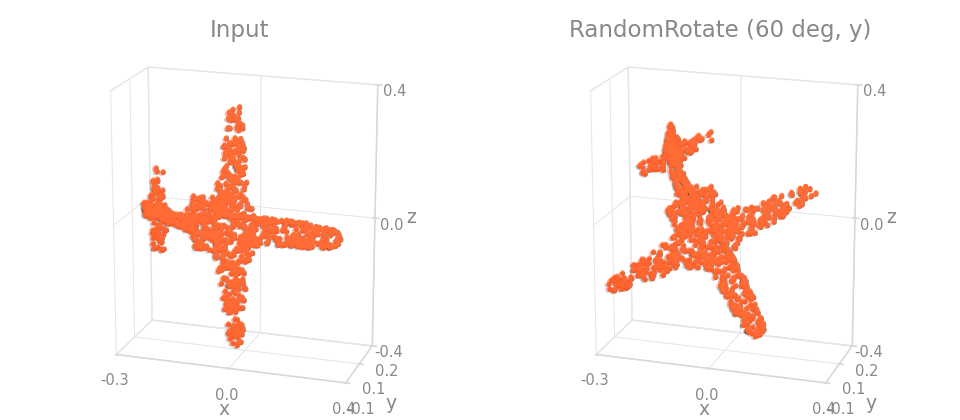

=== "Scene"

    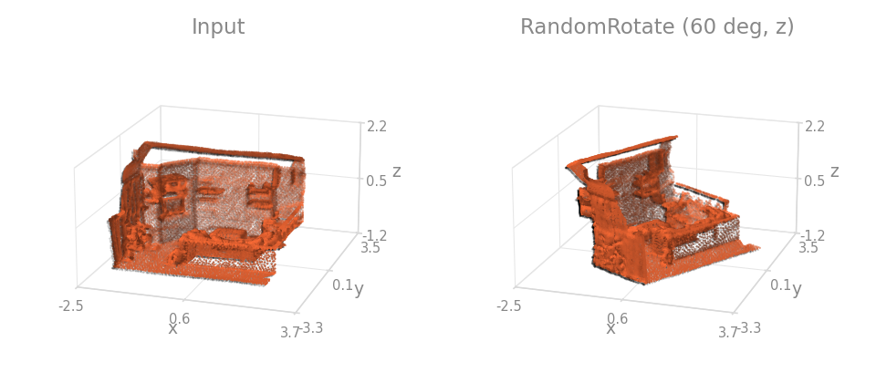

```python
import torch_pointcloud.transforms as T

T.RandomRotate(keys=("pos", "normal"), angle_range=(-180.0, 180.0), axis=2)
```

`angle_range` is in degrees. See [Rotation axes](geometric.md#rotation-axes) for the axis convention.

## RandomRotateChoice

Picks one angle uniformly from a discrete `angles` list instead of drawing from a continuous range, once per call and shared by every listed key. The four panels show the input and three draws from `angles=[0, 90, 180, 270]`, the usual ModelNet / ScanObjectNN setting.

=== "Object"

    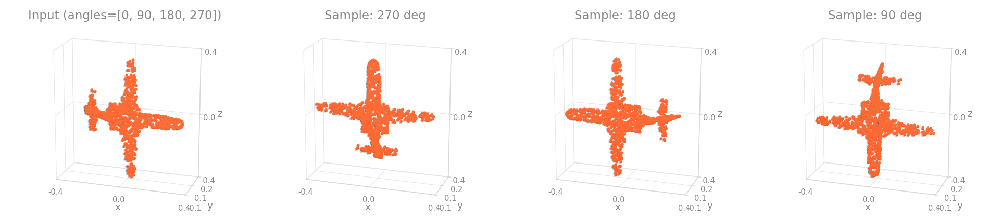

=== "Scene"

    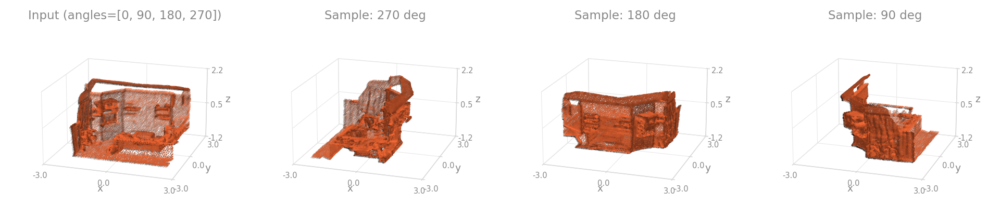

```{.python continuation}
T.RandomRotateChoice(keys="pos", angles=[0.0, 90.0, 180.0, 270.0], axis=2)
```

Angles are in degrees, and a quarter-turn set around the gravity axis keeps an indoor scene upright.

## RandomFlip

Mirrors across each axis in `axes` with probability `p`, sampled once per call so all keys stay consistent.

=== "Object"

    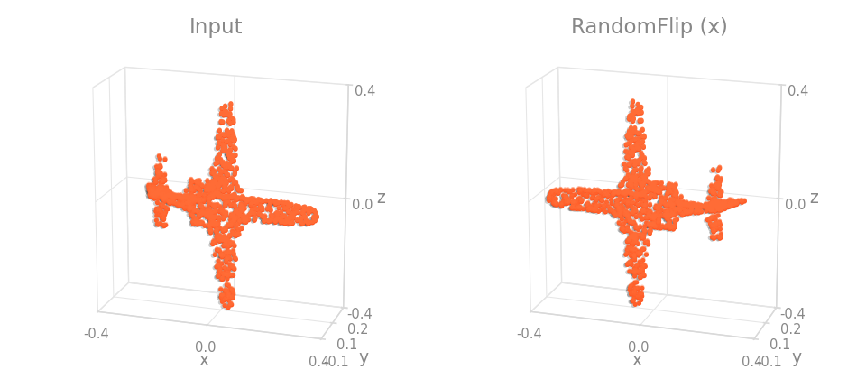

=== "Scene"

    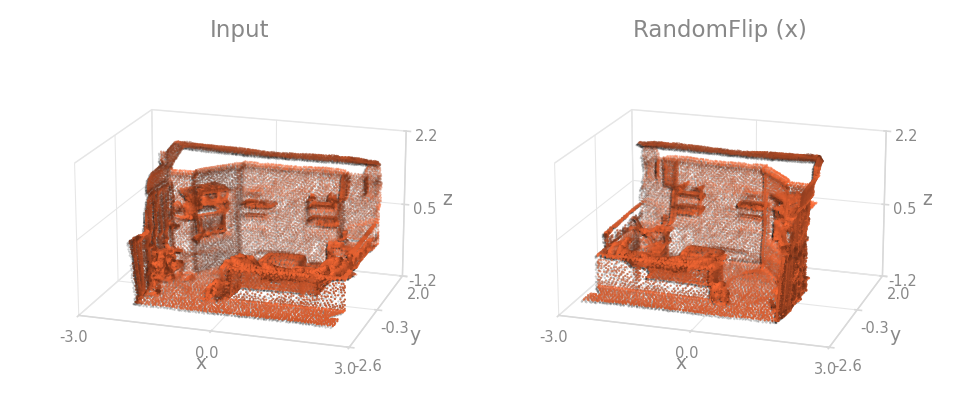

```{.python continuation}
T.RandomFlip(keys="pos", axes=(0, 1), p=0.5)
```

See [Flip axes](geometric.md#flip-axes) for what each axis does.

## RandomJitter

Adds clipped Gaussian noise to every point.

=== "Object"

    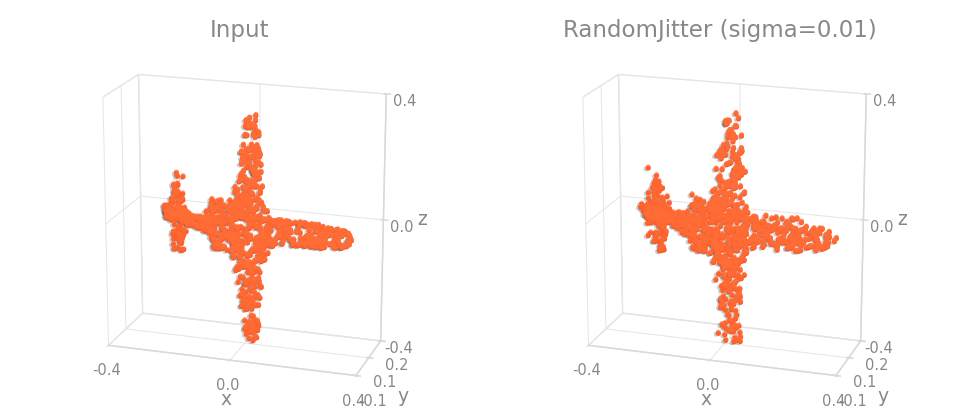

=== "Scene"

    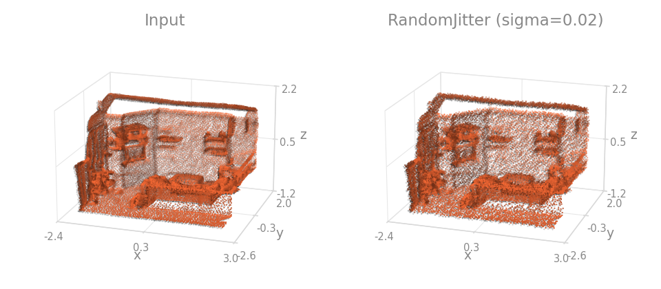

```{.python continuation}
T.RandomJitter(keys="pos", sigma=0.01, clip=0.05)
```

## RandomScale

Scales by a random factor: one global factor, or per-axis with `anisotropic=True`.

=== "Object"

    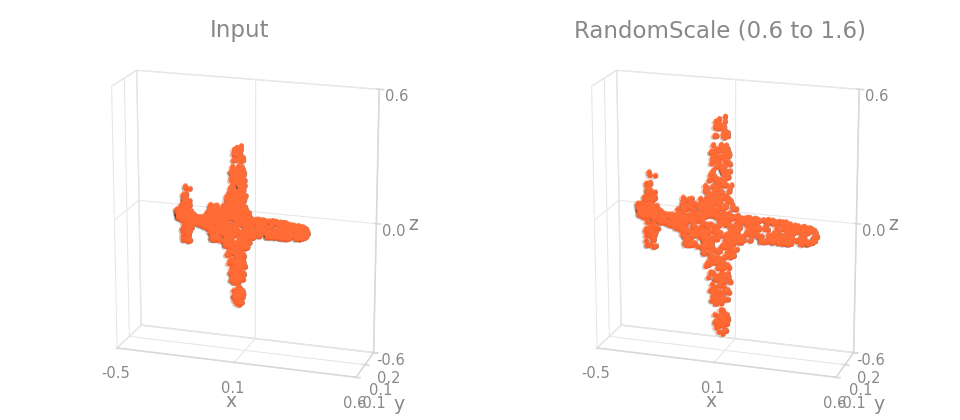

=== "Scene"

    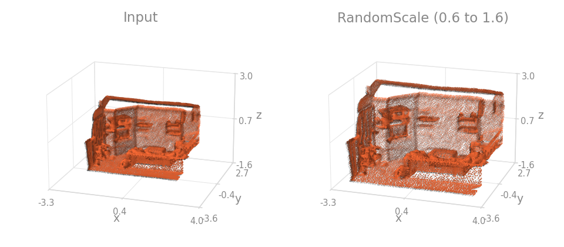

```{.python continuation}
T.RandomScale(keys="pos", scale_range=(0.8, 1.25))
```

## RandomShift

Translates by one random vector shared across all listed keys.

=== "Object"

    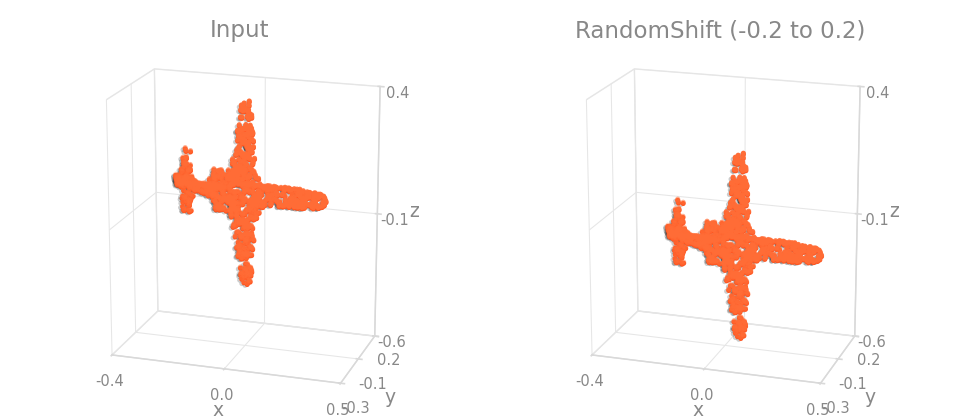

=== "Scene"

    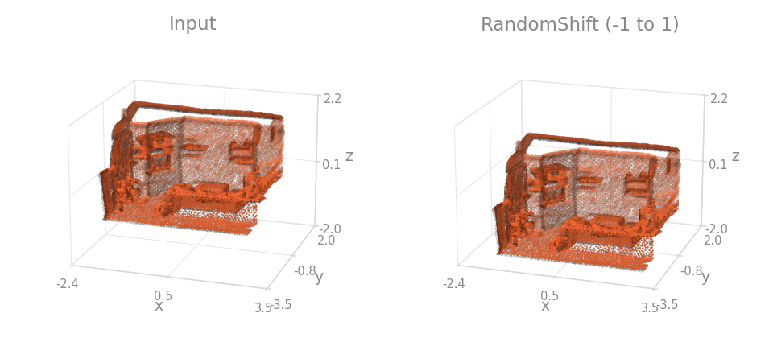

```{.python continuation}
T.RandomShift(keys="pos", shift_range=(-0.2, 0.2))
```

## RandomDropout

Drops a random fraction of points, with one shared keep-mask across all listed keys.

=== "Object"

    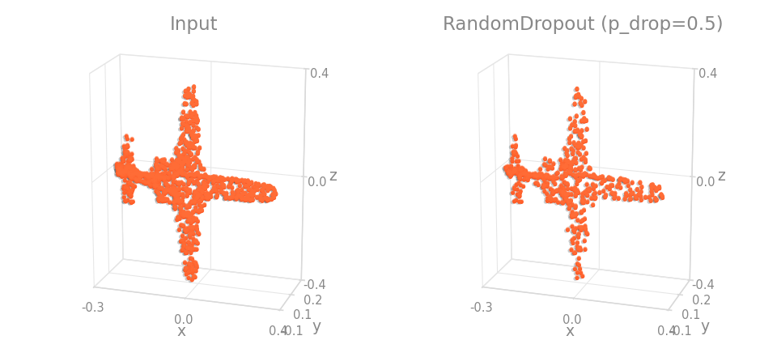

=== "Scene"

    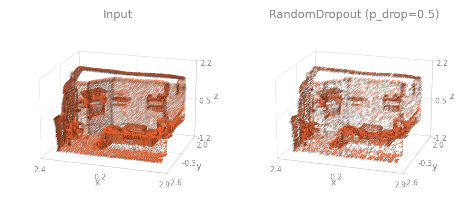

```{.python continuation}
T.RandomDropout(keys=("pos", "color"), p_drop=0.1)
```

## RandomElasticDistortion

Warps coordinates with a smooth random displacement field (the SparseConvNet-style indoor recipe). Compose two with different `granularity` for multi-scale distortion.

=== "Object"

    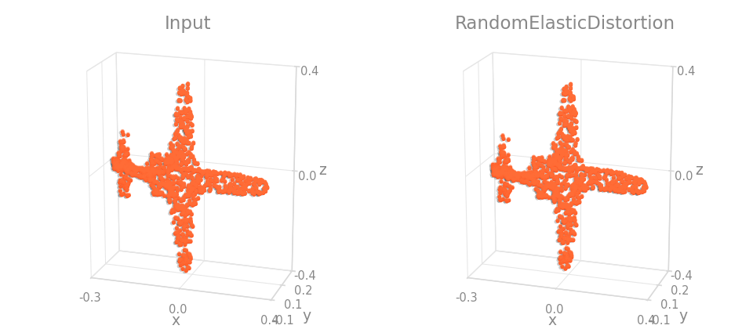

=== "Scene"

    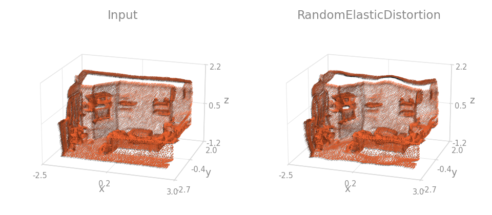

```{.python continuation}
T.Compose([
    T.RandomElasticDistortion(keys="pos", granularity=0.2, magnitude=0.4),
    T.RandomElasticDistortion(keys="pos", granularity=0.8, magnitude=1.6),
])
```

## Multi-scene mixing

The three mixes below are the only transforms on this page that are not single-sample: they take **two** samples and merge them, so they are called as `mix(data, other)` and cannot go inside a `Compose`. The usual driver is `MixDataset`, which draws the partner sample at a random index:

```{.python notest}
from torch_pointcloud.datasets import MixDataset

train = MixDataset(train_dataset, mix=T.Mix3D(keys=("pos", "color", "segment"), instance_key="instance"))
```

Each mix takes its own `p`, which decides how often the merge actually happens; below `p` the first sample is returned unchanged. Every figure here is scene-only: the first two panels are the two input samples, the third is the merged result colored by which sample each point came from.

### Mix3D

The out-of-context mix of :arxiv: [Mix3D](https://arxiv.org/abs/2110.02210). Both scenes are concatenated along the point dimension, so the result keeps all points of both and holds roughly twice as many as either input. When `instance_key` is present in both, the second scene's instance ids are shifted past the first scene's maximum so the merged instances stay disjoint; points labelled `ignore_index` keep that label.

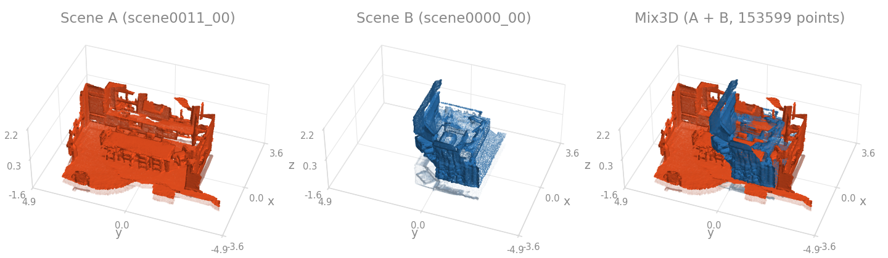

```{.python continuation}
T.Mix3D(keys=("pos", "color", "segment"), instance_key="instance")
```

### LaserMix

The LiDAR mix of :arxiv: [LaserMix](https://arxiv.org/abs/2207.00026). Both scans are partitioned into `num_areas` inclination (pitch) bands and alternating bands are taken from each, so the mixed scan still tiles the full field of view. One band count is drawn per call from the candidates, and every key is masked with the same per-scan selection.

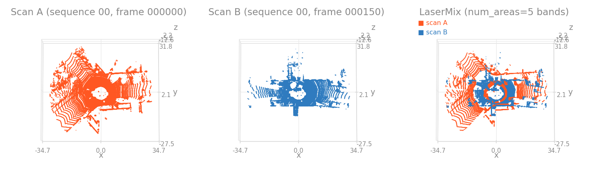

```{.python continuation}
T.LaserMix(keys=("pos", "segment"), num_areas=(3, 4, 5, 6), pitch_range=(-25.0, 3.0))
```

### PolarMix

The LiDAR mix of :arxiv: [PolarMix](https://arxiv.org/abs/2208.00223), which runs two independent sub-augmentations. With probability `swap_ratio` a random azimuth half-sector of the first scan is replaced by the same sector of the second. With probability `rotate_paste_ratio` the second scan's points whose label is in `instance_classes` are rotated by a random angle about the up axis and appended; only `pos_key` is rotated for those points, the other keys are copied as they are.

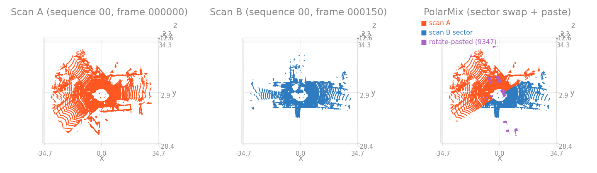

```{.python continuation}
T.PolarMix(keys=("pos", "segment"), instance_classes=(1, 2, 3), swap_ratio=0.5)
```
