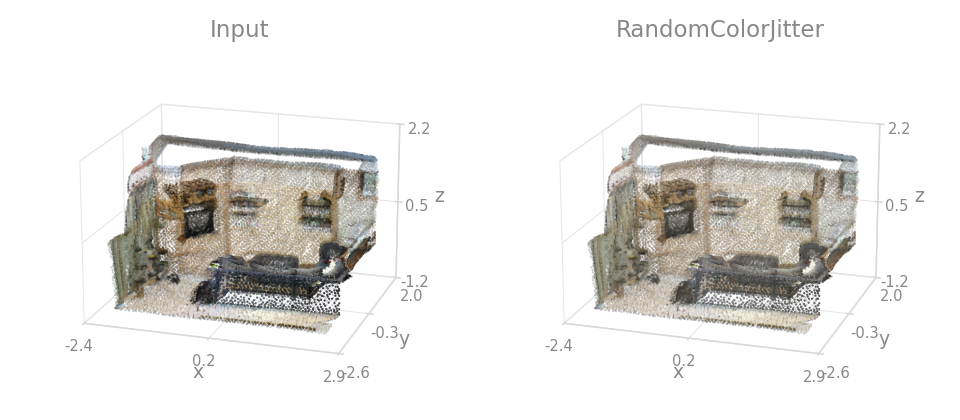
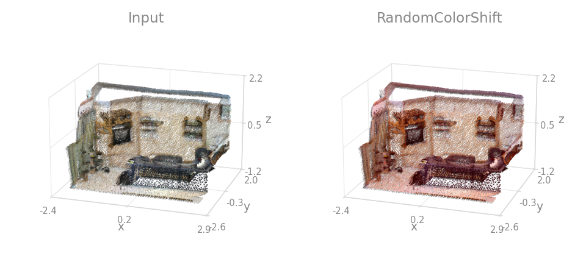
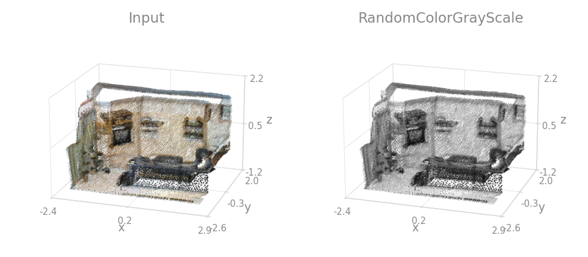
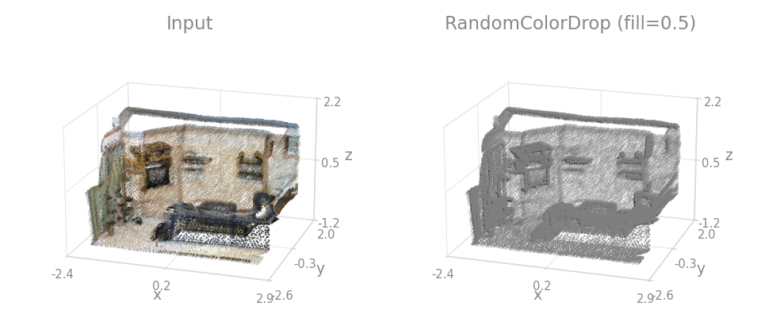
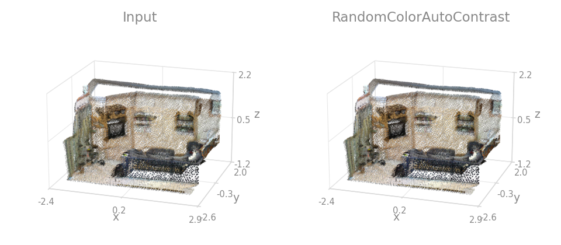

# Color

Indoor checkpoints read RGB, and RGB changes with the lighting of the room and with each sensor's white balance. Color augmentations keep the model from relying on it. They act on the `color` key only.

## Which one to use

| You want the model invariant to     | Use                        |
| ------------------------------------ | -------------------------- |
| Lighting and camera response         | `RandomColorJitter`        |
| A global color cast                  | `RandomColorShift`         |
| Color being available at all         | `RandomColorGrayScale`     |
| Color being available at all, harder | `RandomColorDrop`          |
| A washed-out or over-saturated scan  | `RandomColorAutoContrast`  |

Parameters for each are in the [API reference](../api/transforms/transforms.md).

!!! warning "Check the range first"
    These default to colors in $[0, 1]$. `S3DIS`, `ScanNet`, `Toronto3D` and `Semantic3D` hand you uint8 in $[0, 255]$, so pass `int_color=True` or divide first, or a `shift_range` of $\pm 0.05$ becomes a change you cannot see. See [Segmentation datasets](../datasets/segmentation.md) for which loader is which.

The figures below use the ScanNet room with its true per-point RGB, at exaggerated strengths. The object samples carry no color, so this page has no Object tab.

## Vary lighting and white balance

`RandomColorJitter` perturbs brightness, contrast and saturation by independent random strengths, and is usually the only color augmentation needed.



```python
import torch_pointcloud.transforms as T

T.RandomColorJitter(keys="color", brightness=0.4, contrast=0.4, saturation=0.2)
```

`RandomColorShift` adds one offset per channel, clamped back into range. The whole cloud shifts by the same amount.



```{.python continuation}
T.RandomColorShift(keys="color", shift_range=(-0.05, 0.05))
```

## Force the model off color

A model that relies on color fails on a scan that has none. `RandomColorGrayScale` converts to BT.601 luminance with probability `p` and keeps the shading. `RandomColorDrop` replaces every color with a constant fill, leaving geometry only.



```{.python continuation}
T.RandomColorGrayScale(keys="color", p=0.2)
```



```{.python continuation}
T.RandomColorDrop(keys="color", fill=0.5, p=0.2)
```

Keep `p` low. At a high `p`, many training samples carry no usable color.

## Normalize the exposure

`RandomColorAutoContrast` stretches the per-cloud color range to its full extent, blended with the input by `blend`. It brings a dim or washed-out scan to the same range as the rest of the set.



```{.python continuation}
T.RandomColorAutoContrast(keys="color", blend=0.5, p=0.2)
```

Apply the color augmentations before any [`Normalize`](geometric.md#standardize-colors). Standardized colors are no longer in a color range, so a brightness multiply on them has no meaning.
