# Cropping

Cropping transforms select spatial regions: masks compute a boolean per point, crops drop the points outside. Each transform is shown on a single object and a real ScanNet room; the **Object** / **Scene** tabs switch together, and the left panel outlines the selected region.

| Transform                                                                                                     | Functional           | Geometry                                                  |
| ------------------------------------------------------------------------------------------------------------- | -------------------- | --------------------------------------------------------- |
| [`BoxMask`](../api/transforms/transforms.md#torch_pointcloud.transforms.transforms.BoxMask)                   | `box_mask`           | Axis-aligned bounding box (AABB)                          |
| [`CubeMask`](../api/transforms/transforms.md#torch_pointcloud.transforms.transforms.CubeMask)                 | `cube_mask`          | L∞ / Chebyshev ball (hypercube)                           |
| [`SphereMask`](../api/transforms/transforms.md#torch_pointcloud.transforms.transforms.SphereMask)             | `sphere_mask`        | L2 / Euclidean ball                                       |
| [`ApplyMask`](../api/transforms/transforms.md#torch_pointcloud.transforms.transforms.ApplyMask)               | `apply_mask`         | Apply any precomputed mask to one or more keys            |
| [`SphereCrop`](../api/transforms/transforms.md#torch_pointcloud.transforms.transforms.SphereCrop)             | `sphere_mask`        | Crop to a ball around a center, with an optional node cap |
| [`RemoveNearOrigin`](../api/transforms/transforms.md#torch_pointcloud.transforms.transforms.RemoveNearOrigin) | `remove_near_origin` | One-shot L2 filter around origin                          |
| [`Clamp`](../api/transforms/transforms.md#torch_pointcloud.transforms.transforms.Clamp)                       | (`torch.clamp`)      | Clamp values to `[min, max]`                              |

## BoxMask

Computes a boolean mask of the points inside an axis-aligned box, stored under `dst_keys`. Pair with `ApplyMask` to filter other keys.

=== "Object"

    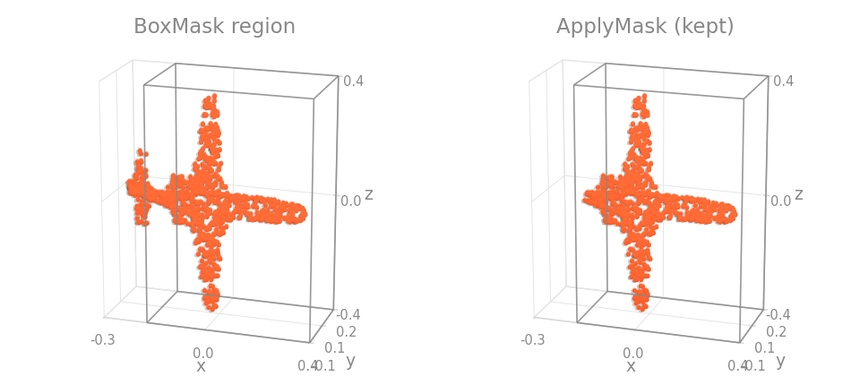

=== "Scene"

    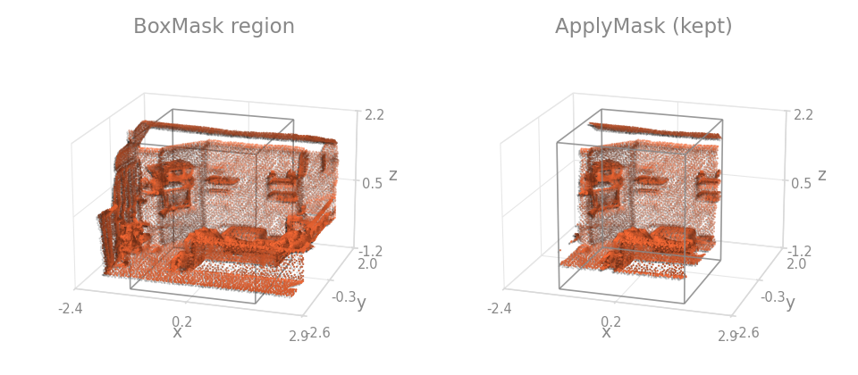

```python
import torch_pointcloud.transforms as T

T.Compose([
    # bbox is a flat (*min, *max) tuple
    T.BoxMask(keys="pos", bbox=(-1.0, -1.0, -1.0, 1.0, 1.0, 1.0), dst_keys="mask"),
    T.ApplyMask(keys=("pos", "color"), mask_key="mask"),
])
```

## CubeMask

Same, but membership is an L∞ ball: within `radius` of `center` along every axis.

=== "Object"

    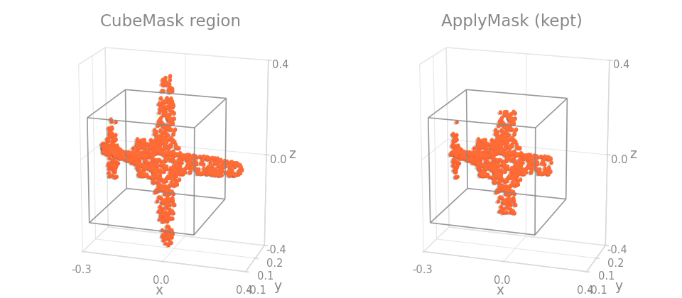

=== "Scene"

    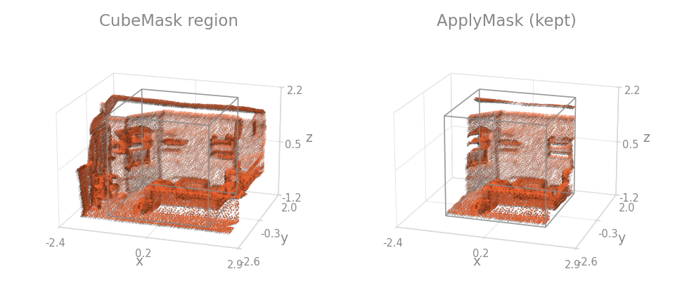

```{.python continuation}
T.CubeMask(keys="pos", center=(0.0, 0.0, 0.0), radius=1.0, dst_keys="mask")
```

## SphereMask

Membership is a Euclidean ball, $\lVert x - c \rVert_2 \le r$.

=== "Object"

    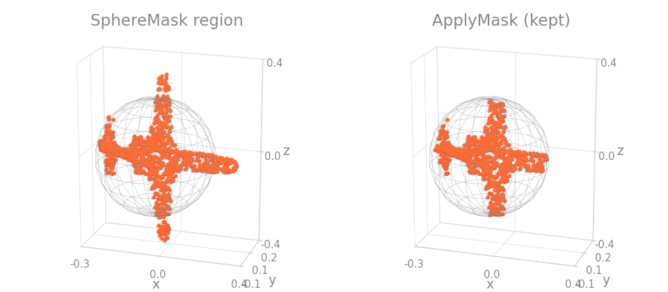

=== "Scene"

    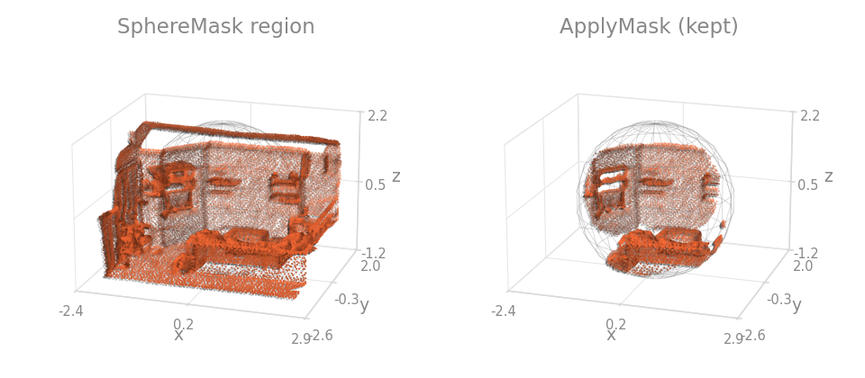

```{.python continuation}
T.SphereMask(keys="pos", center=(0.0, 0.0, 0.0), radius=1.0, dst_keys="mask")
```

## ApplyMask

Indexes every listed key with a boolean mask already stored in the dict, so the three mask transforms above stay pure and this one does the filtering. All listed keys must share the leading dimension the mask was computed on; `dst_keys` writes the filtered tensors elsewhere instead of overwriting.

=== "Object"

    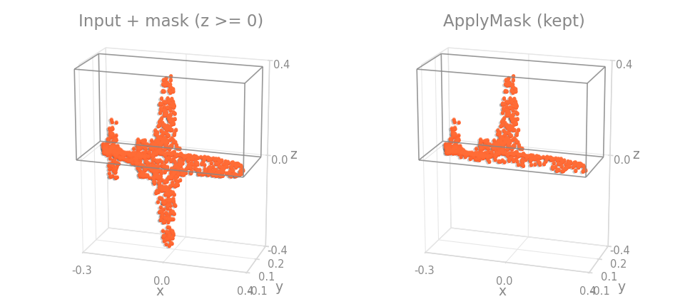

=== "Scene"

    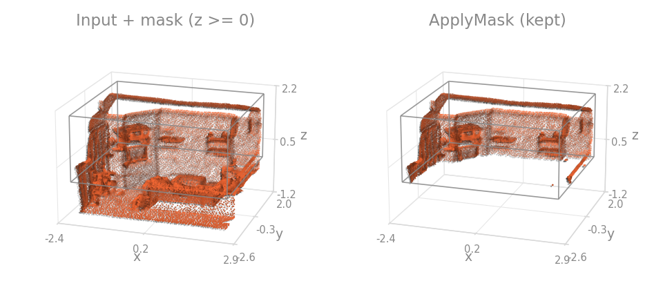

```{.python continuation}
T.Compose([
    T.BoxMask(keys="pos", bbox=(-0.32, -0.1, 0.0, 0.38, 0.17, 0.38), dst_keys="mask"),
    T.ApplyMask(keys=("pos", "color", "segment"), mask_key="mask"),
])
```

The mask is a plain boolean tensor, so anything can produce it, not only the mask transforms on this page.

## SphereCrop

The one-shot crop variant of `SphereMask`: keeps only the points inside the ball, filtering every listed key. With `max_nodes` set, only the `max_nodes` points nearest the center survive (the Pointcept-style `point_max` crop), which bounds memory on large scenes.

=== "Object"

    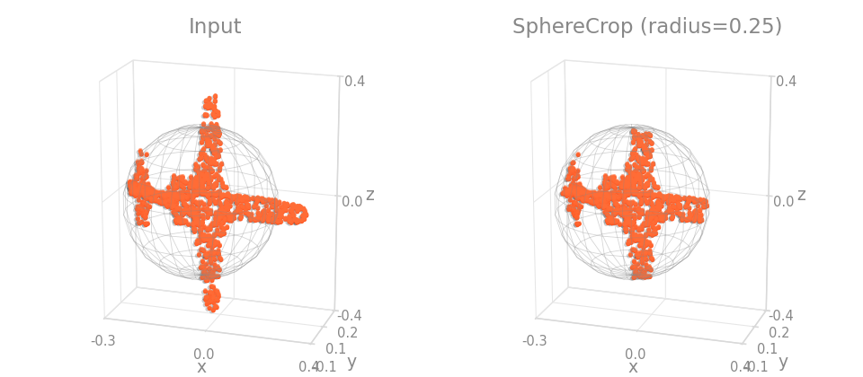

=== "Scene"

    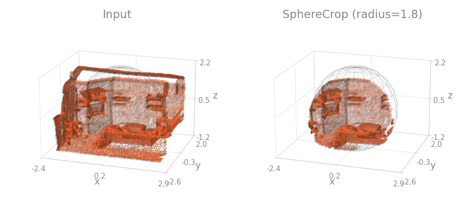

```{.python continuation}
T.SphereCrop(pos_key="pos", radius=2.0, max_nodes=100_000, keys=("color", "segment"))
```

`center` accepts `"centroid"` (default), `"random_point"`, or an explicit 3-vector.

## RemoveNearOrigin

Drops points within `radius` of the origin in one shot, typical for stripping LiDAR ego-vehicle returns.

=== "Object"

    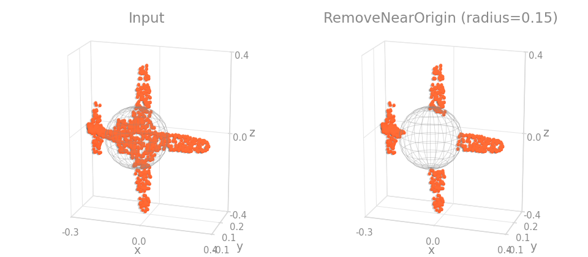

=== "Scene"

    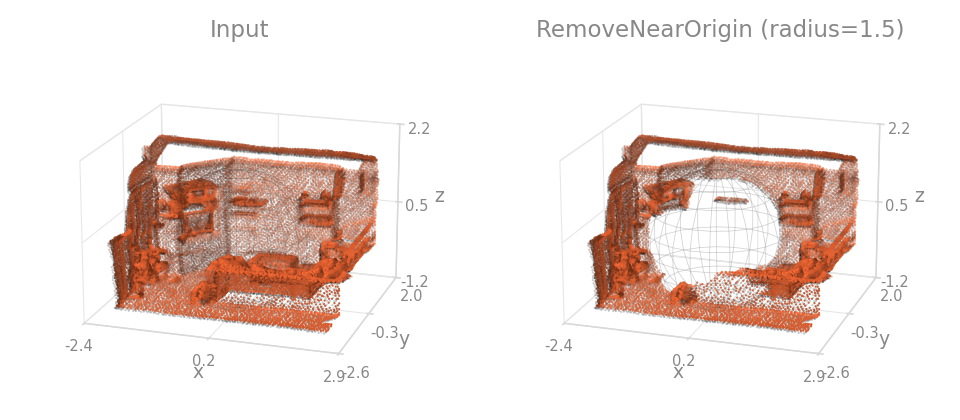

```{.python continuation}
T.RemoveNearOrigin(pos_key="pos", keys=("intensity",), radius=1.5)
```

## Clamp

Clamps values to `[min, max]`; a thin wrapper over `torch.clamp`. Points are moved onto the boundary, not dropped.

=== "Object"

    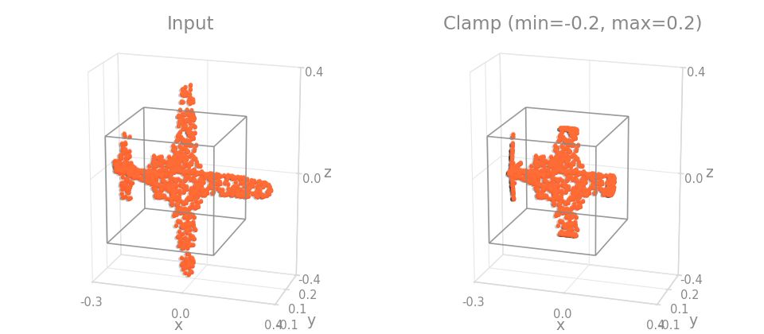

=== "Scene"

    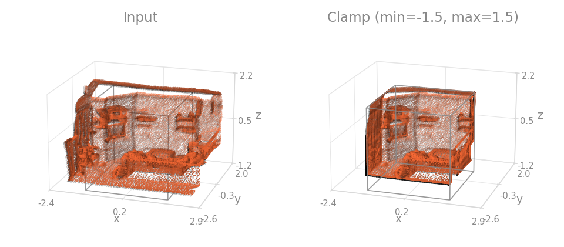

```{.python continuation}
T.Clamp(keys="pos", min=-1.0, max=1.0)
```
