# Geometric

These transforms put the cloud in the frame the model expects: the unit sphere for an object checkpoint, positive coordinates for a sparse model before it quantizes. They are deterministic. The [augmentations](augmentation.md) add randomness on top.

## Which one to use

| You need                                                     | Use                           |
| ------------------------------------------------------------ | ----------------------------- |
| The cloud centered on the origin                             | `Shift`                       |
| The cloud centered *and* scaled to a unit size               | `Rescale`                     |
| One axis resting on zero, the others untouched               | `AlignAxis`                   |
| A height-above-floor feature, positions left alone           | `AxisMinOffset`               |
| Colors standardized with dataset statistics                  | `Normalize`                   |
| A fixed multiply or divide (unit conversion)                 | `Scale`, `Divide`             |
| To subtract an offset the dataset stored alongside the cloud | `BBoxCenter`, `SubtractKey`   |

Parameters for each are in the [API reference](../api/transforms/transforms.md).

## Center a cloud

`Shift` subtracts a computed offset, moving a reference point onto the origin. The arrow in each figure is that offset.

=== "Object"

    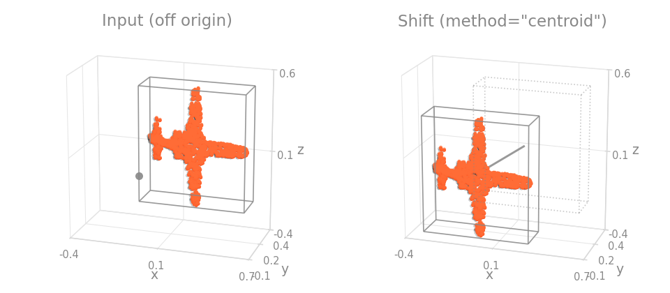

=== "Scene"

    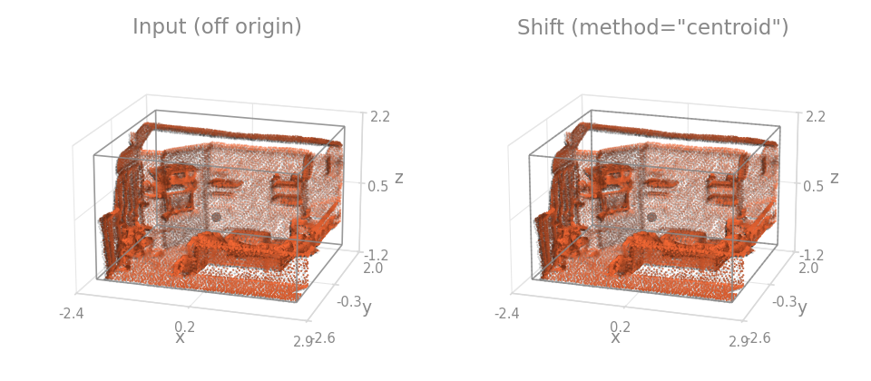

`method="centroid"` subtracts the mean, so the centroid lands on the origin. It follows the mass of the cloud, and suits objects.

=== "Object"

    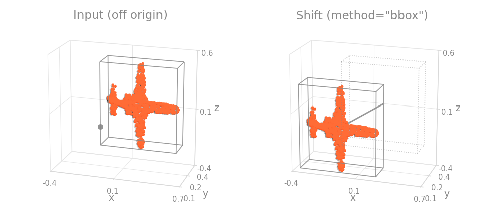

=== "Scene"

    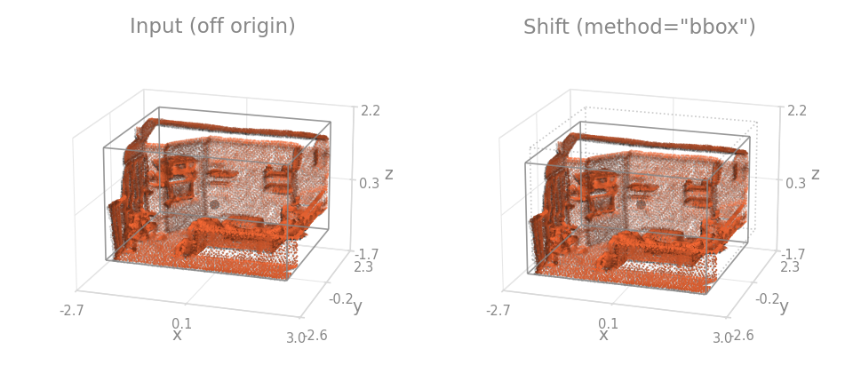

`method="bbox"` subtracts the bounding-box midrange $(\min + \max) / 2$. It ignores how the points are distributed, so a densely-scanned wall does not drag the center toward itself.

=== "Object"

    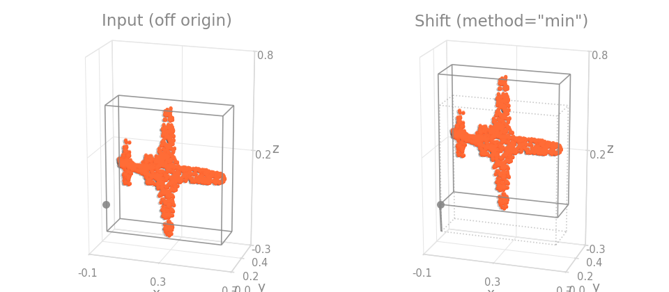

=== "Scene"

    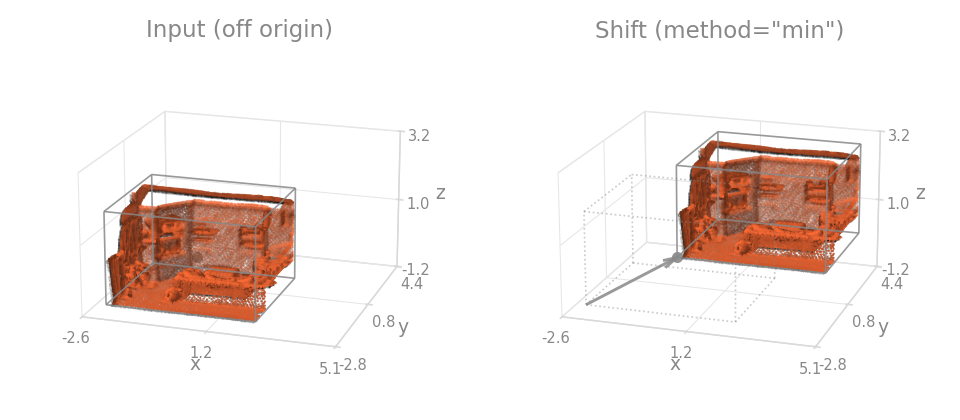

`method="min"` subtracts the per-axis minimum, putting the cloud's corner on the origin and every coordinate above zero. Use it before `Voxelize` or `Quantize`, which expect non-negative coordinates.

```python
import torch_pointcloud.transforms as T

T.Shift(keys="pos", method="min")
```

### Center some axes and not others

`axes` limits the recentering to a subset, leaving the rest where they are.

=== "Object"

    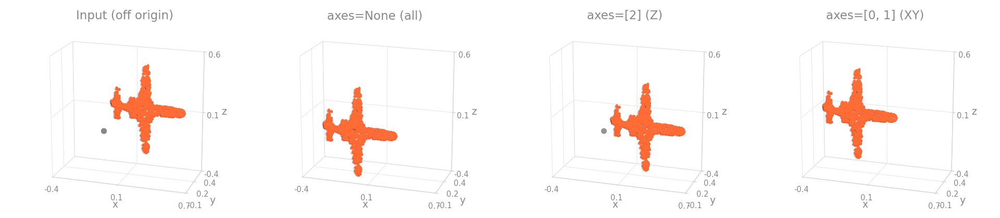

=== "Scene"

    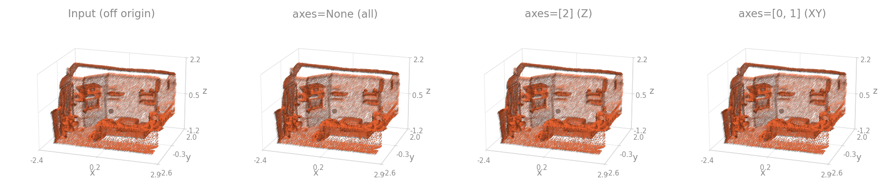

Two `Shift` calls on different axes can mix methods. Centering a room in XY and keeping the floor at $z = 0$ is the usual indoor recipe:

```{.python continuation}
T.Compose([
    T.Shift(keys="pos", method="bbox", axes=[0, 1]),  # XY: bbox midrange
    T.Shift(keys="pos", method="min",  axes=[2]),     # Z:  min
])
```

`AlignAxis` is the same thing for a single axis, kept as a preset: `T.AlignAxis(keys="pos", dim=2)` computes the same offset as `T.Shift(keys="pos", method="min", axes=[2])`.

=== "Object"

    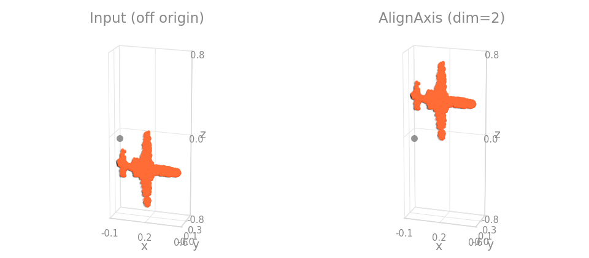

=== "Scene"

    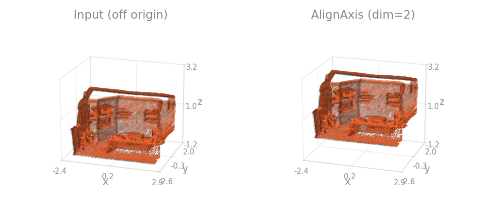

## Normalize an object to a unit size

`Rescale` centers and scales in one step, as object checkpoints expect. The three methods differ in what ends up equal to 1.

=== "Object"

    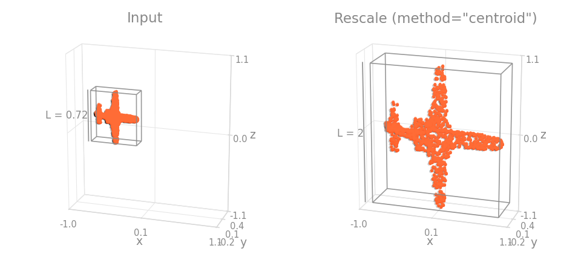

=== "Scene"

    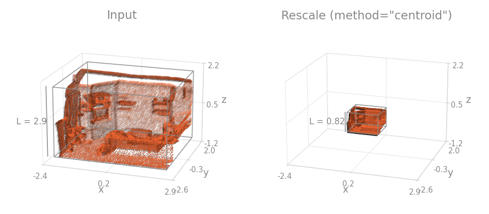

`method="centroid"` divides by the max distance to the centroid, so the cloud fits the unit sphere. This is the ModelNet convention and the one most classification checkpoints were trained under.

=== "Object"

    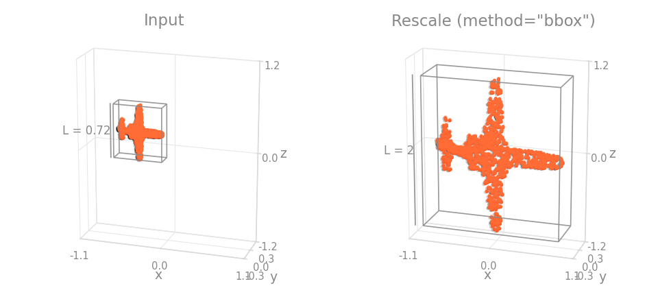

=== "Scene"

    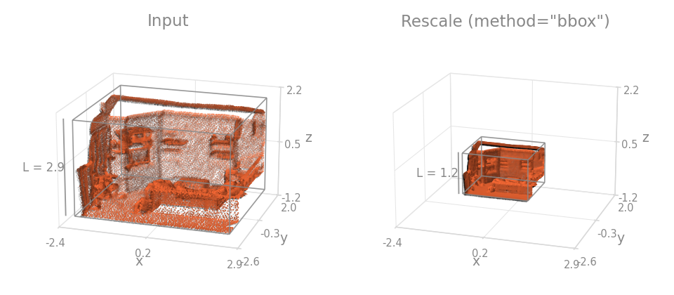

`method="bbox"` divides by half the longest extent, so the longest axis spans $[-1, 1]$.

=== "Object"

    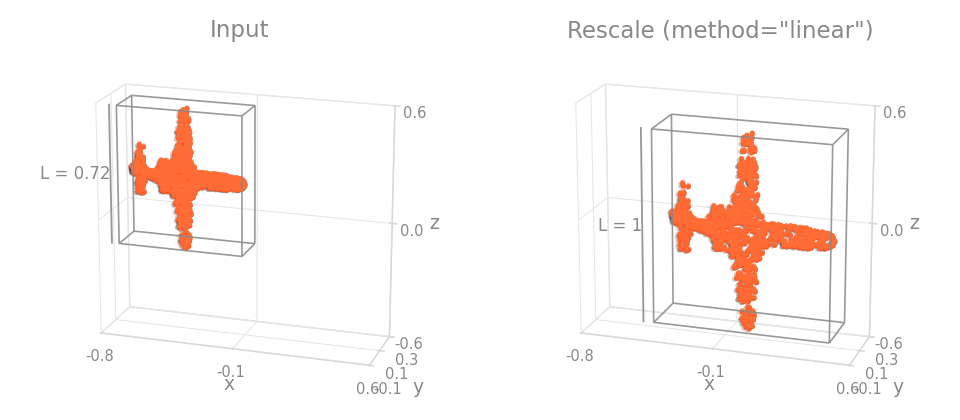

=== "Scene"

    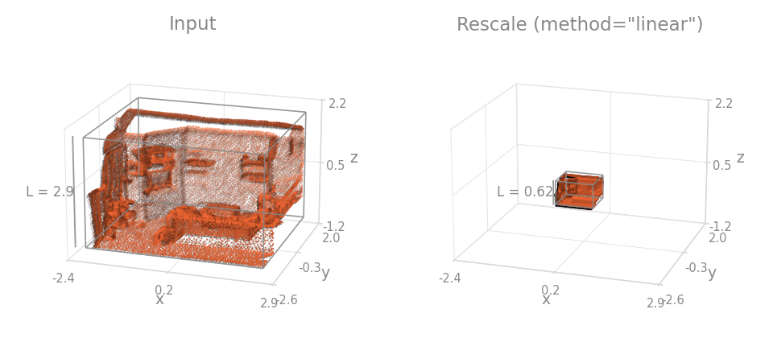

`method="linear"` divides by the longest axis extent, so the longest axis has length 1.

```{.python continuation}
T.Rescale(keys="pos", method="centroid")
```

!!! tip "Let the checkpoint decide"
    A pretrained checkpoint carries its own `Rescale` in `info["transform"]`, set to the method it was trained with. Use these directly for your own pipeline.

## Add a height feature

Indoor detectors and some segmentation models read a height channel alongside the coordinates. `AxisMinOffset` writes one without moving the cloud: each point's offset above the minimum along `axis`. A $(N, 3)$ input gives a $(N, 1)$ output, so it pairs with `Cat`.

=== "Object"

    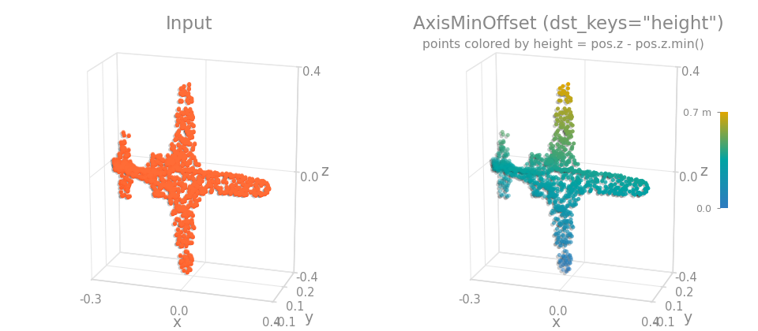

=== "Scene"

    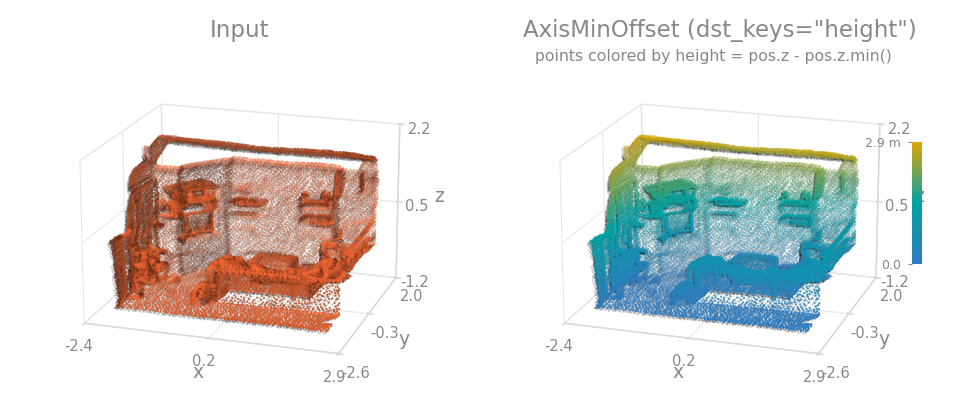

```{.python continuation}
T.Compose([
    T.AxisMinOffset(keys="pos", dst_keys="height", axis=2, quantile=0.0099),
    T.Cat(keys=["height"], dst_key="x", dim=1),
])
```

`quantile` replaces the strict minimum with an empirical quantile. Without it, one stray point below the floor shifts every height in the scene. `quantile=0.0099` reproduces VoteNet's height feature.

## Standardize colors

`Normalize` applies per-channel $x' = (x - \mu) / \max(\sigma, \epsilon)$, with `mean` and `std` broadcast against the last dimension. The usual target is `color` with dataset statistics.

=== "Scene"

    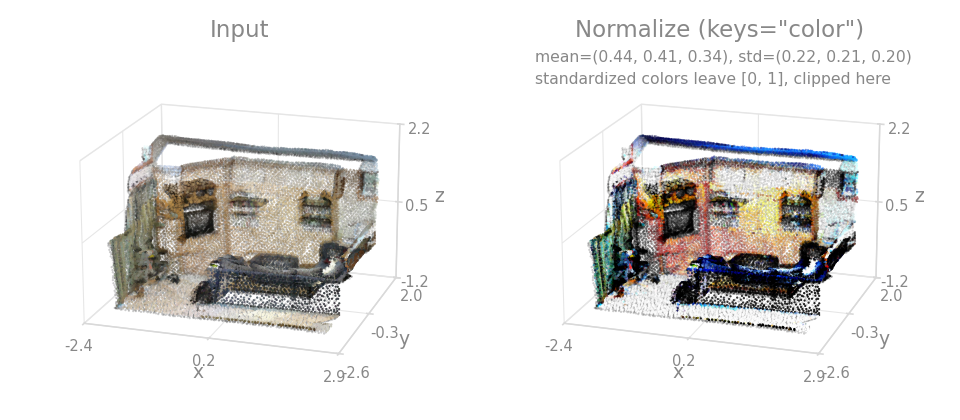

```{.python continuation}
T.Normalize(keys="color", mean=(0.44, 0.41, 0.34), std=(0.22, 0.21, 0.20))
```

!!! note "Standardized colors are no longer RGB"
    The values leave $[0, 1]$, so a normalized `color` cannot be displayed as a color any more; the figure clips it back into range to render it. Normalize last, after any transform that expects a real color range.

## Convert units

`Scale` multiplies and `Divide` divides by a fixed value, for example when a dataset stores millimetres and the model reads metres. Both take one value broadcast to every key, or one value per key.

=== "Object"

    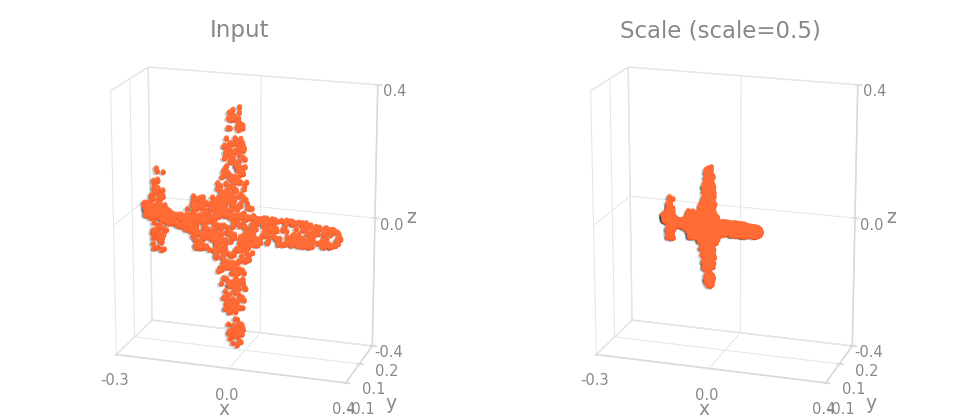

=== "Scene"

    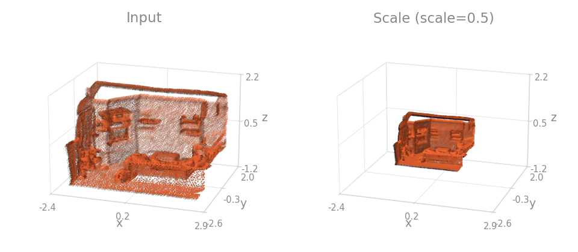

```{.python continuation}
T.Scale(keys="pos", scale=0.5)
```

=== "Object"

    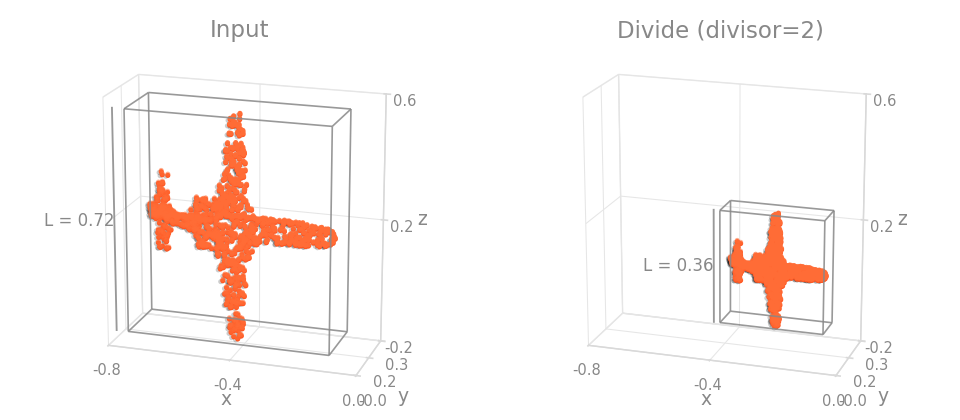

=== "Scene"

    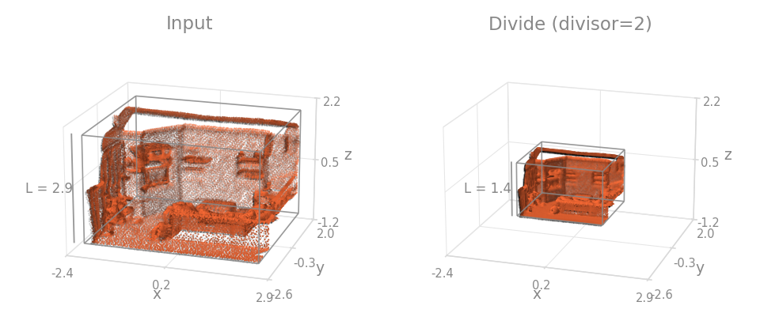

```{.python continuation}
T.Divide(keys="pos", divisor=2.0)
```

Both scale about the origin, not about the centroid, so the cloud also moves. Center first if that matters. For a divisor that lives in the data rather than the arguments, use [`DivideKey`](utilities.md#rearrange-the-dict).

`Abs` folds every axis onto its positive side, putting the whole cloud in the positive octant.

=== "Object"

    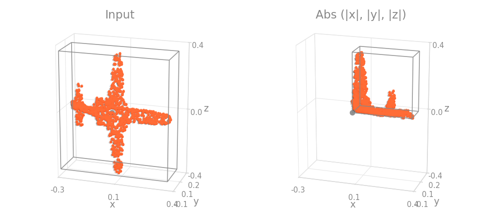

=== "Scene"

    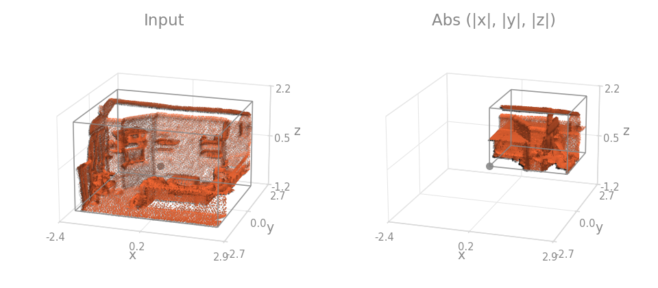

## Subtract an offset stored in the data

Block-based pipelines store a per-block center next to the block, so the offset comes from the dict instead of from the transform's arguments. `SubtractKey` reads it, and `axes` restricts it to a subset of components (XY only, keeping Z absolute).

=== "Object"

    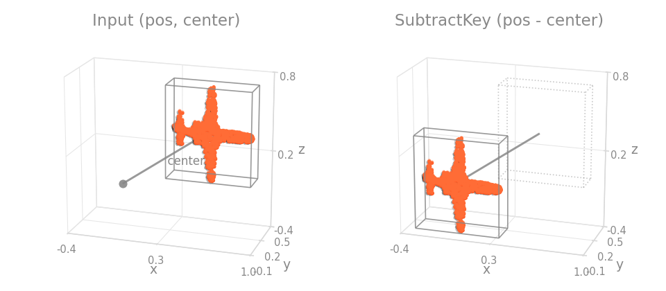

=== "Scene"

    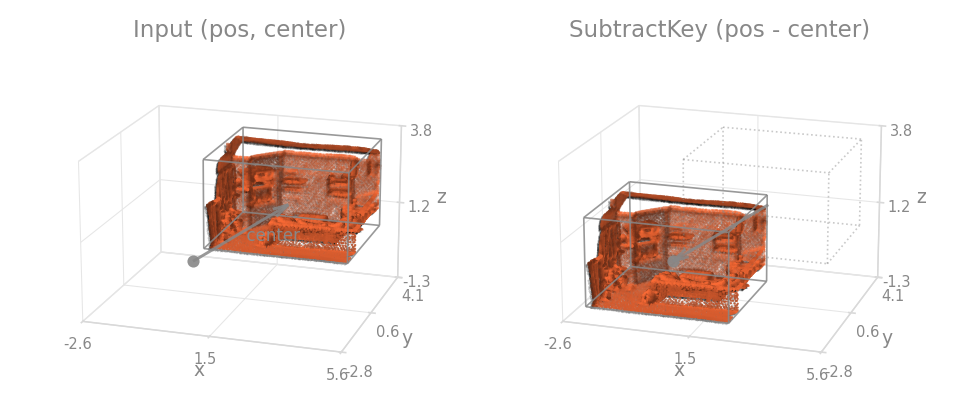

```{.python continuation}
T.SubtractKey(keys="pos", sub_keys="center")
```

When the dataset stores a flat bbox instead of a center, `BBoxCenter` derives one: it reads $(2D,)$ laid out as $[\min_0, \ldots, \min_{D-1}, \max_0, \ldots, \max_{D-1}]$ and writes the per-axis midpoint $(D,)$. The two together recenter a block on the bbox its dataset shipped.

=== "Object"

    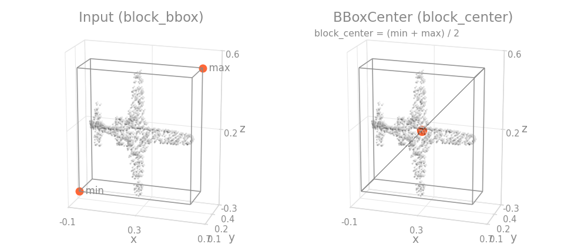

=== "Scene"

    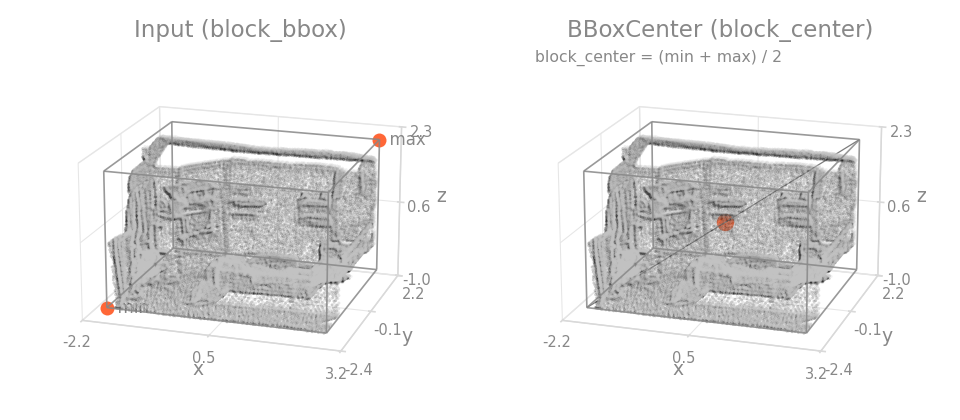

```{.python continuation}
T.Compose([
    T.BBoxCenter(keys="block_bbox", dst_keys="block_center"),
    T.SubtractKey(keys="pos", sub_keys="block_center"),
])
```

## Rotate or flip by hand

Rotation is always around a single coordinate axis (`0`=X, `1`=Y, `2`=Z). Z is the gravity axis in the indoor convention. The augmentations use the same convention.

=== "Object"

    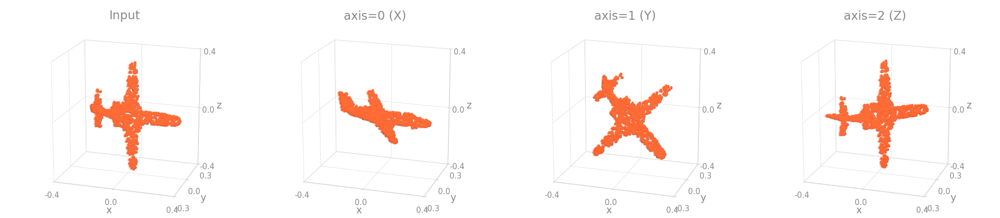

=== "Scene"

    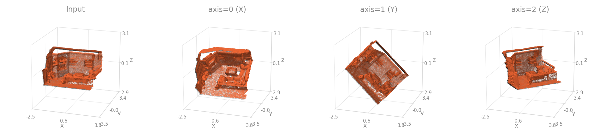

Flipping negates one coordinate, mirroring the cloud across the plane orthogonal to that axis.

=== "Object"

    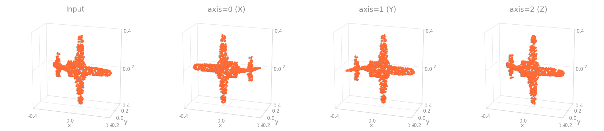

=== "Scene"

    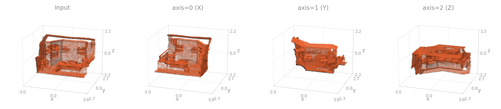

For a one-off rotation on tensors, use the functional layer:

```{.python continuation}
import math

import torch
import torch_pointcloud.transforms.functional as F

pos = torch.randn(2048, 3)
R = F.rotation_matrix(math.radians(45.0), axis=2)  # 45 degrees around Z
pos = F.rotate_vectors(pos, R)
pos = F.flip_vectors(pos, axis=0)  # mirror across X
```

In a training pipeline, use [`RandomRotate`](augmentation.md#rotate) and [`RandomFlip`](augmentation.md#flip) instead: they draw the angle and carry the boxes and normals along.
