# Transforms

Transforms adopt a dict-based API heavily inspired by :monai: MONAI's API.

A transform takes one sample dict and returns a new one. `Compose` chains them, and a dataset applies the chain to every sample it loads. The API follows :monai: MONAI's dict transforms and :pyg: PyTorch Geometric's `Data` conventions.

!!! question "Why a dict-based API?"
    The dict-based API allows for flexible composition of transforms and what the inputs/outputs.

    :pyg: PyTorch Geometric transforms, in contrast, require a `Data` object as input. This can be limiting if we want to forward more keys (intensity, color, etc.) and make it easier to compose when we don't want to forward all these values (using a `Data` object will required each transform to take care of all the attributes it carries, and defaults to `None` if we don't have them).

    Transforms are designed to manipulate specific keys of the input data, which makes the operations explicit and easier to compose.

```python
import torch
import torch_pointcloud.transforms as T

pos = torch.randn(2048, 3)
color = torch.rand(2048, 3)

pipeline = T.Compose([
    T.Rescale(keys="pos", method="centroid"),
    T.Shift(keys="pos", method="bbox", axes=[0, 1]),
    T.RandomSample(keys=("pos", "color"), num_samples=1024),
])

scene = pipeline({"pos": pos, "color": color})
```

!!! tip "Atomic operations"
    Each transform is designed as an atomic operation to make it easier to compose and reuse.

!!! note "Pretrained checkpoints"
    A pretrained checkpoint carries its own preprocessing in `info["transform"]` used for inference on the specified dataset.

## Sampling and downsampling

|                                                                                     | Transform                                                                                                                     | Description                                              |
| ----------------------------------------------------------------------------------- | ----------------------------------------------------------------------------------------------------------------------------- | -------------------------------------------------------- |
| 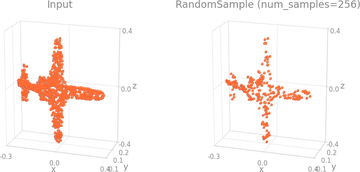               | [`RandomSample`](../api/transforms/transforms.md#torch_pointcloud.transforms.transforms.RandomSample)                         | Uniform random subsample with shared indices across keys |
| 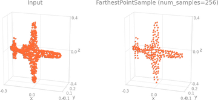       | [`FarthestPointSample`](../api/transforms/transforms.md#torch_pointcloud.transforms.transforms.FarthestPointSample)           | FPS subsample (well-distributed)                         |
| 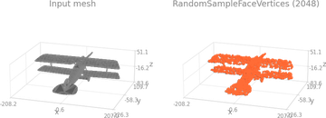 | [`RandomSampleFaceVertices`](../api/transforms/transforms.md#torch_pointcloud.transforms.transforms.RandomSampleFaceVertices) | Sample points on a mesh's faces                          |
| 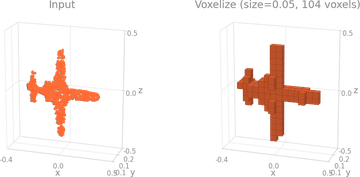                    | [`Voxelize`](../api/transforms/transforms.md#torch_pointcloud.transforms.transforms.Voxelize)                                 | Voxel-grid downsample with per-voxel reduction           |

### Sampling keys

Any transform that changes the number of points keeps `pos`, `x`, `segment` and `batch` aligned at the new resolution and records how to get back:

| Key              | Shape                       | Emitted by                                                                                                          | Meaning                                                                    |
| ---------------- | --------------------------- | ------------------------------------------------------------------------------------------------------------------- | -------------------------------------------------------------------------- |
| `origin_pos`     | $(N_\text{origin}, 3)$      | a `CopyItems` step in every registered pipeline                                                                     | the source cloud, in the same frame as `pos`                               |
| `origin_segment` | $(N_\text{origin},)$        | the same step, when the pipeline carries labels                                                                     | the source labels, in the model's label space                              |
| `inverse`        | $(N_\text{origin},)$        | `Voxelize`, `DivisiblePad`                                                                                          | source row to predictor row: `preds[inverse]` scores at full resolution    |
| `index`          | $(N,)$                      | `FarthestPointSample`, `RandomSample`, `SphereCrop`, `RemoveNearOrigin`, `RandomDropout`, `ShufflePoint`, `ApplyMask`, `Slice` | predictor row to source row: `origin_pos[index]` is `pos`                  |

Chained steps compose these maps, so they always address the outermost source. Pass `dst_inverse_key=None` or `dst_index_key=None` to a sampler to opt out.

## Geometry / shifting

|                                                                         | Transform                                                                                               | Description                                               |
| ----------------------------------------------------------------------- | ------------------------------------------------------------------------------------------------------- | --------------------------------------------------------- |
| 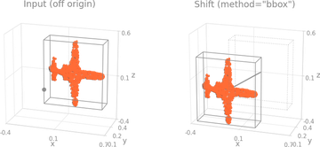           | [`Shift`](../api/transforms/transforms.md#torch_pointcloud.transforms.transforms.Shift)                 | Subtract a computed offset (`bbox`, `centroid`, or `min`) |
| 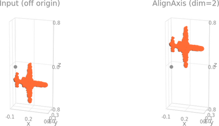      | [`AlignAxis`](../api/transforms/transforms.md#torch_pointcloud.transforms.transforms.AlignAxis)         | Shift one axis so its min is zero                         |
| 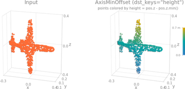 | [`AxisMinOffset`](../api/transforms/transforms.md#torch_pointcloud.transforms.transforms.AxisMinOffset) | Per-point offset from axis minimum (height feature)       |

## Scaling / normalization

|                                                                   | Transform                                                                                       | Description                                                        |
| ----------------------------------------------------------------- | ----------------------------------------------------------------------------------------------- | ------------------------------------------------------------------ |
| 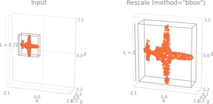   | [`Rescale`](../api/transforms/transforms.md#torch_pointcloud.transforms.transforms.Rescale)     | Center and rescale to unit extent (`centroid` / `bbox` / `linear`) |
| 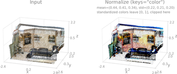 | [`Normalize`](../api/transforms/transforms.md#torch_pointcloud.transforms.transforms.Normalize) | Per-channel $(x - \mu) / \sigma$ standardization                   |
| 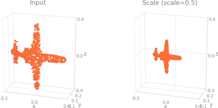     | [`Scale`](../api/transforms/transforms.md#torch_pointcloud.transforms.transforms.Scale)         | Multiply by a scalar                                               |
| 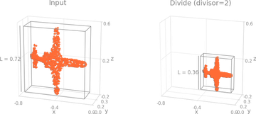    | [`Divide`](../api/transforms/transforms.md#torch_pointcloud.transforms.transforms.Divide)       | Divide by a scalar                                                 |

## Masking and filtering

|                                                                            | Transform                                                                                                     | Geometry                                       |
| -------------------------------------------------------------------------- | ------------------------------------------------------------------------------------------------------------- | ---------------------------------------------- |
| 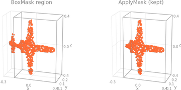           | [`BoxMask`](../api/transforms/transforms.md#torch_pointcloud.transforms.transforms.BoxMask)                   | Axis-aligned bounding box (AABB)               |
| 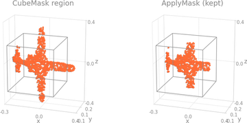          | [`CubeMask`](../api/transforms/transforms.md#torch_pointcloud.transforms.transforms.CubeMask)                 | L∞ / Chebyshev ball (hypercube)                |
| 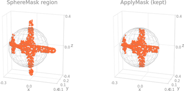        | [`SphereMask`](../api/transforms/transforms.md#torch_pointcloud.transforms.transforms.SphereMask)             | L2 / Euclidean ball                            |
| 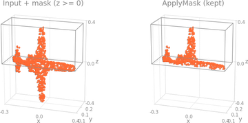         | [`ApplyMask`](../api/transforms/transforms.md#torch_pointcloud.transforms.transforms.ApplyMask)               | Apply any precomputed mask to one or more keys |
| 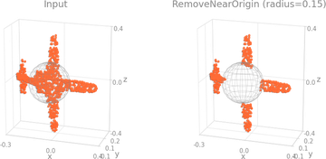 | [`RemoveNearOrigin`](../api/transforms/transforms.md#torch_pointcloud.transforms.transforms.RemoveNearOrigin) | One-shot L2 filter around origin               |

## Key / dict manipulation

|                                                                      | Transform                                                                                           | Description                                            |
| -------------------------------------------------------------------- | --------------------------------------------------------------------------------------------------- | ------------------------------------------------------ |
| 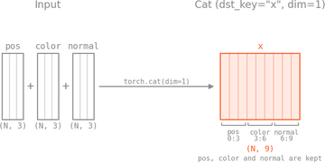          | [`Cat`](../api/transforms/transforms.md#torch_pointcloud.transforms.transforms.Cat)                 | Concatenate multiple keys' tensors along a dim         |
| 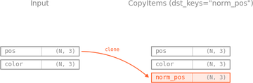   | [`CopyItems`](../api/transforms/transforms.md#torch_pointcloud.transforms.transforms.CopyItems)     | Clone a key's value under a new name                   |
| 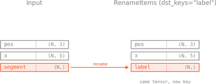 | [`RenameItems`](../api/transforms/transforms.md#torch_pointcloud.transforms.transforms.RenameItems) | Move a key to a new name                               |
| 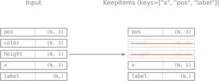   | [`KeepItems`](../api/transforms/transforms.md#torch_pointcloud.transforms.transforms.KeepItems)     | Drop everything not in a whitelist                     |
| 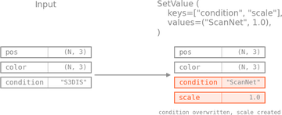    | [`SetValue`](../api/transforms/transforms.md#torch_pointcloud.transforms.transforms.SetValue)       | Set keys to literal values                             |
| 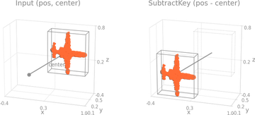 | [`SubtractKey`](../api/transforms/transforms.md#torch_pointcloud.transforms.transforms.SubtractKey) | `data[k] - data[sub_k]` element-wise                   |
| 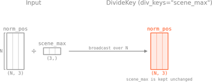   | [`DivideKey`](../api/transforms/transforms.md#torch_pointcloud.transforms.transforms.DivideKey)     | `data[k] / data[div_k]` element-wise                   |
| 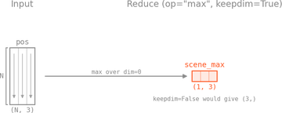       | [`Reduce`](../api/transforms/transforms.md#torch_pointcloud.transforms.transforms.Reduce)           | Reduce a tensor along a dim (`min`/`max`/`mean`/`sum`) |
| 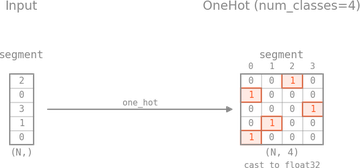      | [`OneHot`](../api/transforms/transforms.md#torch_pointcloud.transforms.transforms.OneHot)           | One-hot encode integer labels                          |
| 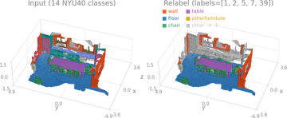      | [`Relabel`](../api/transforms/transforms.md#torch_pointcloud.transforms.transforms.Relabel)         | Remap integer labels via a lookup table                |
| 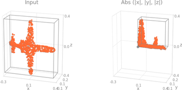          | [`Abs`](../api/transforms/transforms.md#torch_pointcloud.transforms.transforms.Abs)                 | Element-wise absolute value                            |

## Type / device

|                                                                   | Transform                                                                                     | Description                                      |
| ----------------------------------------------------------------- | --------------------------------------------------------------------------------------------- | ------------------------------------------------ |
| 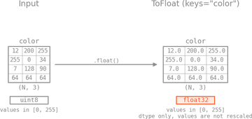  | [`ToFloat`](../api/transforms/transforms.md#torch_pointcloud.transforms.transforms.ToFloat)   | Cast tensors to float32                          |
| 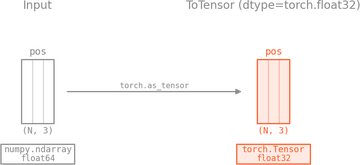 | [`ToTensor`](../api/transforms/transforms.md#torch_pointcloud.transforms.transforms.ToTensor) | Convert lists / arrays to tensors                |
| 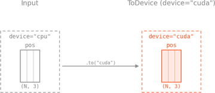 | [`ToDevice`](../api/transforms/transforms.md#torch_pointcloud.transforms.transforms.ToDevice) | Move to a device                                 |
| 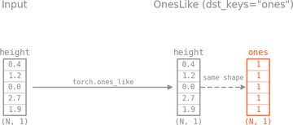 | [`OnesLike`](../api/transforms/transforms.md#torch_pointcloud.transforms.transforms.OnesLike) | Add a key whose tensor is `torch.ones_like(...)` |

## Octree (optional, requires `ocnn`)

|                                                                         | Transform                                                                                                 | Description                              |
| ----------------------------------------------------------------------- | --------------------------------------------------------------------------------------------------------- | ---------------------------------------- |
|     | [`BuildOctree`](../api/transforms/transforms.md#torch_pointcloud.transforms.transforms.BuildOctree)       | Build an octree from positions           |
| 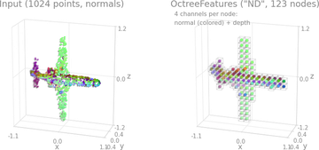 | [`OctreeFeatures`](../api/transforms/transforms.md#torch_pointcloud.transforms.transforms.OctreeFeatures) | Extract per-node features from an octree |
