# Sampling

Models want a point budget, and your data rarely arrives with one. A ModelNet mesh has no points at all, a ScanNet room has 700 000 of them, and a grid detector wants a fixed voxel stack. Sampling transforms are how you get from what you have to what the model reads.

## Which one to reach for

| You need                                                  | Reach for                                          |
| --------------------------------------------------------- | -------------------------------------------------- |
| A fixed point count, as fast as possible                  | `RandomSample`                                     |
| A fixed point count, evenly spread over the shape         | `FarthestPointSample`                              |
| One point per voxel, at a resolution you choose           | `Voxelize`                                         |
| Every point kept, each tagged with its grid coordinate    | `Quantize`                                         |
| The fixed-capacity voxel stack a grid detector reads      | `HardVoxelize`                                     |
| Points at all, starting from a triangle mesh              | `RandomSampleFaceVertices`                         |
| The input order broken before an order-dependent step     | `ShufflePoint`                                     |
| Points dropped at random, as a training augmentation      | [`RandomDropout`](augmentation.md#vary-the-density)   |

Parameters for each are in the [API reference](../api/transforms/transforms.md); this page is about which to pick.

## Give an object model its point budget

Object models train on a fixed count, usually 1024 or 2048. `RandomSample` is the cheap way to get there and `FarthestPointSample` the well-distributed one: FPS repeatedly picks the point farthest from those already chosen, which is the convention inside PointNet++ and PointNeXt. Both share their indices across every key you list, so `color` and `segment` stay aligned with `pos`.

=== "Object"

    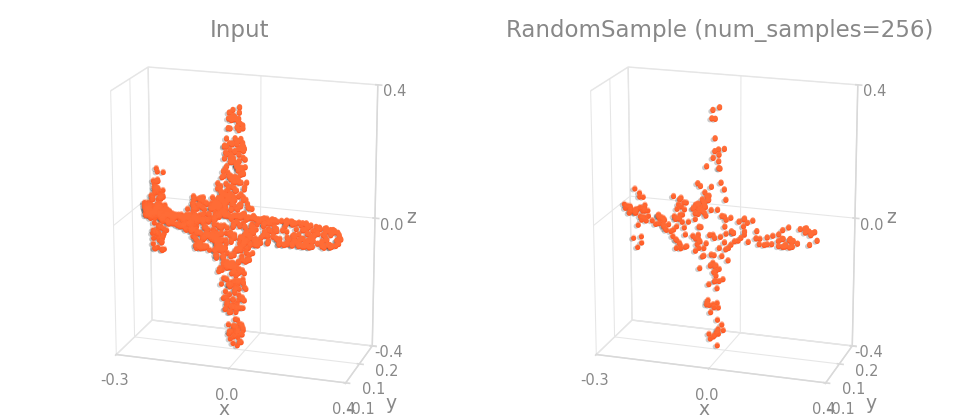

=== "Scene"

    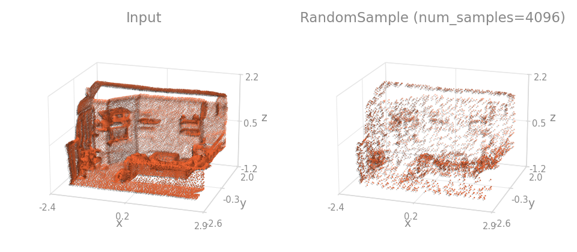

```python
import torch_pointcloud.transforms as T

fast = T.RandomSample(keys=("pos", "color"), num_samples=1024)
even = T.FarthestPointSample(pos_key="pos", keys=("color",), num_samples=1024)
```

=== "Object"

    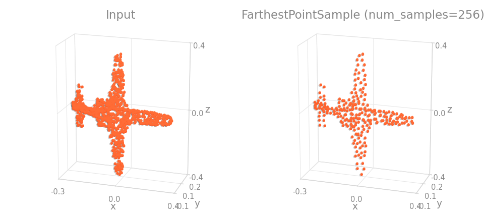

=== "Scene"

    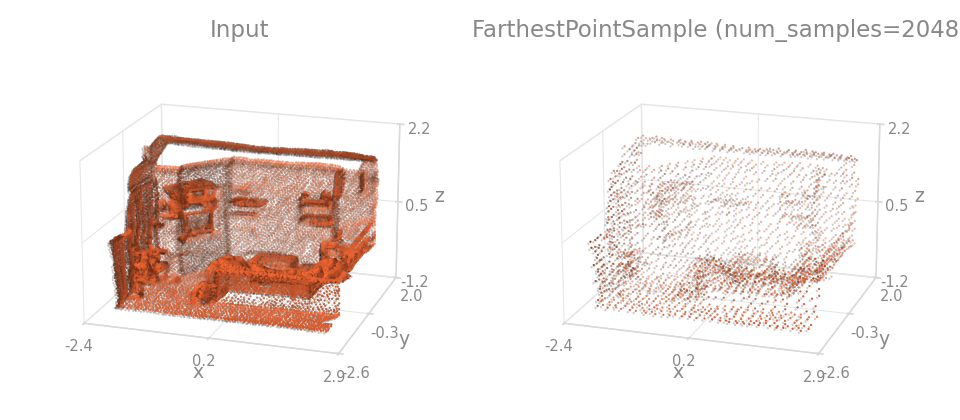

Reach for FPS when coverage matters and you can afford it, which is most classification and part-segmentation checkpoints. Reach for `RandomSample` inside a training loop over large scenes, where you are sampling a fresh subset every epoch anyway.

## Feed a sparse-convolution scene model

Scene models work on a voxel grid, so downsample by resolution rather than by count. `Voxelize` bins the points and keeps one representative per occupied voxel, reducing each key the way that key needs: `mean` for color, `first` for a label.

=== "Object"

    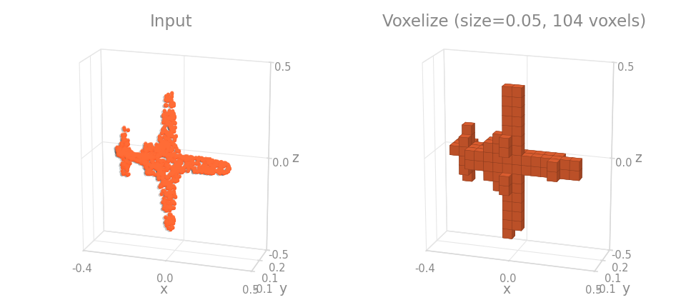

=== "Scene"

    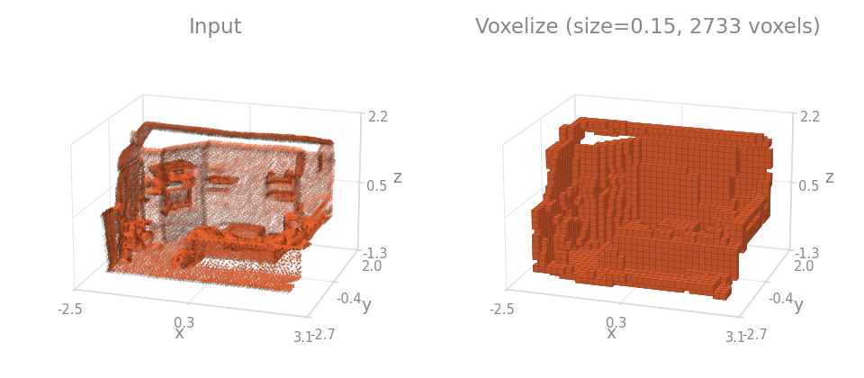

```{.python continuation}
T.Compose([
    T.Shift(keys="pos", method="min"),
    T.Voxelize(
        pos_key="pos", pos_reduce="grid", size=0.04,
        keys=["color", "segment"], reduce=["mean", "first"],
        dst_inverse_key="inverse",
    ),
])
```

Ask for `dst_inverse_key` whenever you intend to score the result: it stores the map back to full resolution, so `preds_full = preds_voxel[inverse]` puts one prediction on every original point. Forgetting it is the usual reason a scene pipeline cannot be evaluated at the end.

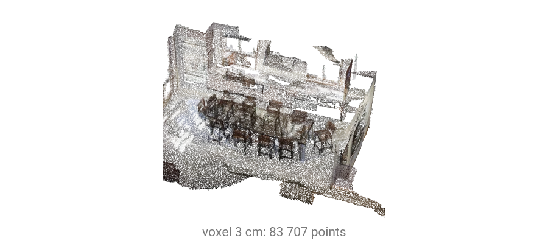

Voxel size is the resolution knob of the whole pipeline. 2-4 cm keeps furniture legible, and every doubling divides the point count by roughly eight, so it is also the memory knob.

## Keep every point but give it a grid coordinate

`Quantize` writes the integer grid coordinate $\lfloor p / s \rfloor$ of every point, shifted so the per-axis minimum is $0$, and reduces nothing. Points sharing a voxel keep their own rows and get identical coordinates.

=== "Object"

    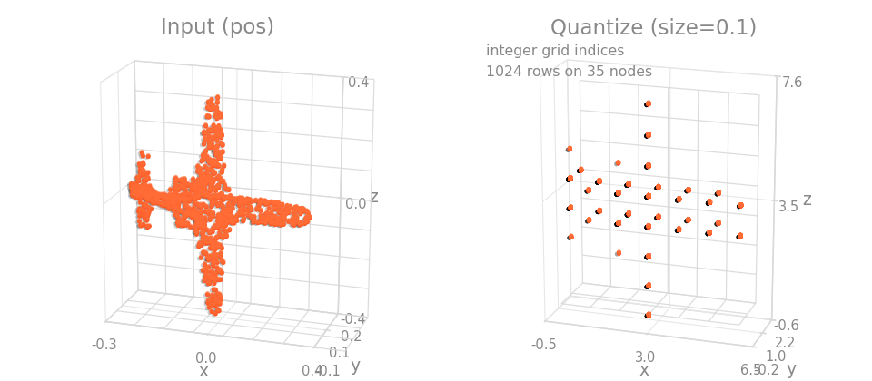

=== "Scene"

    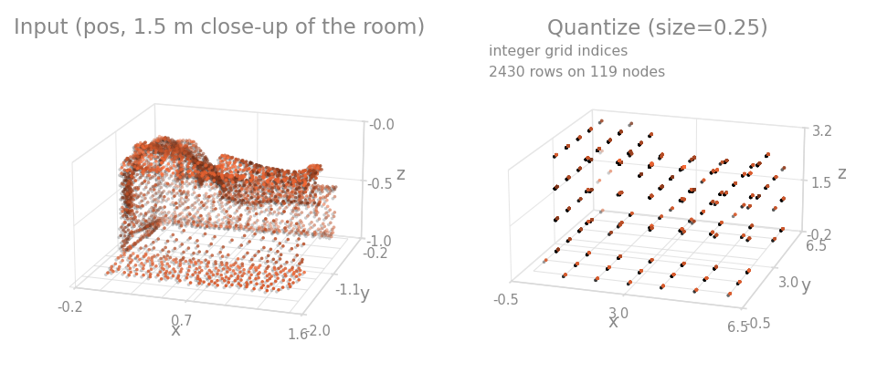

```{.python continuation}
T.Quantize(keys="pos", size=0.02, dst_keys="pos_grid")
```

This is what you want when a sparse model must see every raw point, as in a voxel-partition evaluation, or when a test-time view has to recompute grid coordinates after rotating or scaling the positions. Use `Voxelize` instead when one point per voxel is what you are after.

## Prepare a driving frame for a grid detector

`HardVoxelize` builds the fixed-capacity voxel stack PointPillars and SECOND consume, which keeps that step in the pipeline instead of the model. Points are binned over `point_cloud_range`, at most `max_num_points` survive per voxel and at most `max_num_voxels` per scene.

=== "Object"

    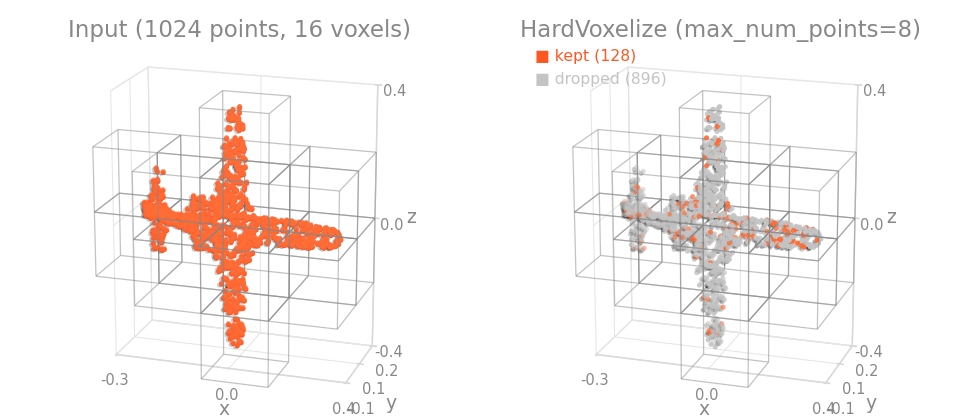

=== "Scene"

    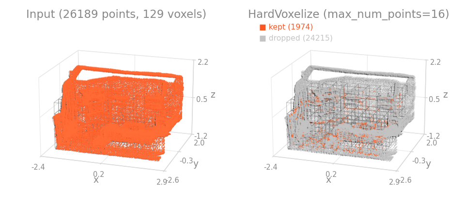

```{.python continuation}
T.HardVoxelize(
    pos_key="pos",
    feat_key="x",
    voxel_size=(0.16, 0.16, 4.0),
    point_cloud_range=(0.0, -39.68, -3.0, 69.12, 39.68, 1.0),
    max_num_points=32,
    max_num_voxels=40000,
)
```

It keeps `pos` and `x` and adds three keys: the per-voxel point stack $(V, \text{max\_num\_points}, 3 + C)$ at `voxel_key`, the integer grid indices $(V, 3)$ in $(z, y, x)$ order at `pos_voxel_key`, and the per-voxel point counts $(V,)$ at `num_points_key`. Those are the four tensors a voxel detector's forward takes, in that order.

## Turn a mesh into a point cloud

`ModelNet10` and `ModelNet40` ship triangle meshes, so there is nothing to sample until you make points. `RandomSampleFaceVertices` samples them on the faces and stores the surface normals under `normal_key`.

=== "Object"

    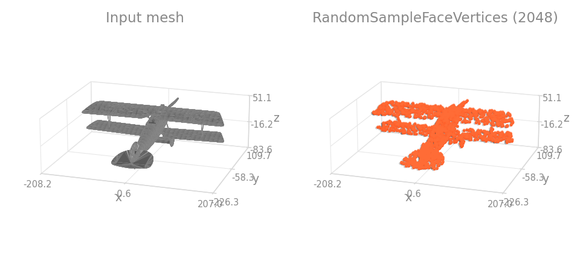

```{.python continuation}
T.RandomSampleFaceVertices(keys="pos", face_key="face", num_samples=2048)
```

Because this step is random, two runs give different clouds and a published score is hard to reproduce exactly. That is what the preprocessed `ModelNetNormalResampled` release is for; see [Classification datasets](../datasets/classification.md).

## Break an ordering you did not intend to rely on

`ShufflePoint` permutes the point order, applying the same permutation to every listed key so correspondence survives.

=== "Object"

    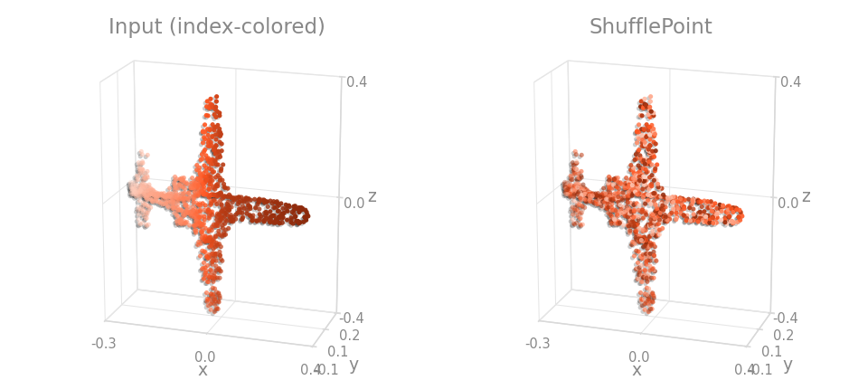

=== "Scene"

    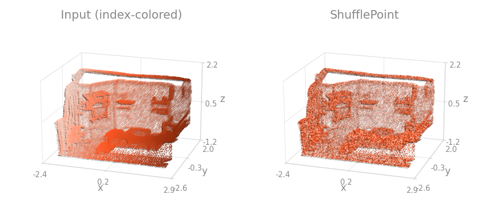

```{.python continuation}
T.ShufflePoint(keys=("pos", "color"), p=1.0)
```

Use it before anything whose result depends on row order, such as `Slice` or the `first` reduction of `Voxelize`. A file that happens to be sorted by scan line will otherwise leak that ordering into your labels.
