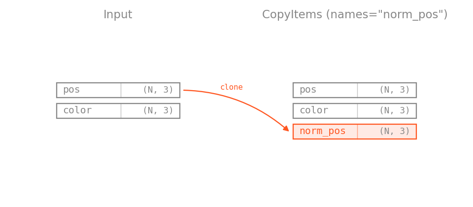
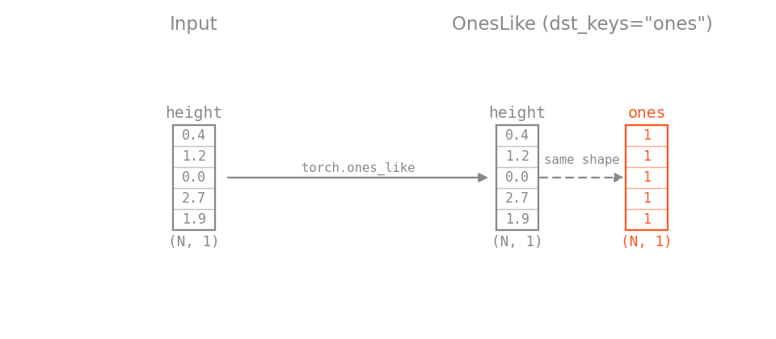
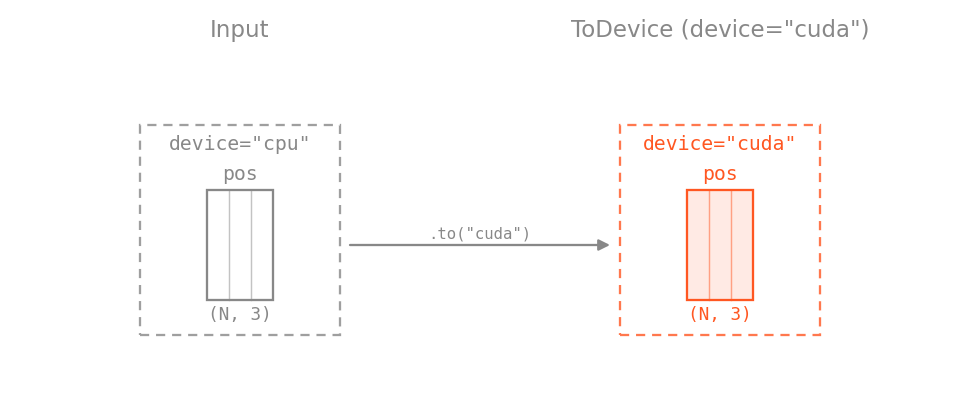

# Utilities

Utility transforms do the data plumbing around the geometric work: remap labels, assemble feature tensors, cast and move data, and encode training targets.

Two kinds of figure appear on this page. Transforms that touch points are rendered on a single object and a real ScanNet room, with the **Object** / **Scene** tabs switching together. Transforms that only rearrange dict keys, dtypes, and tensor layout show nothing in a 3D scatter, so they are drawn as schematic block diagrams of the tensors involved: the accent color marks what the transform creates or changes, and everything it leaves alone stays gray.

| Transform                                                                                                   | Purpose                                                |
| ----------------------------------------------------------------------------------------------------------- | ------------------------------------------------------ |
| [`EstimateNormals`](../api/transforms/transforms.md#torch_pointcloud.transforms.transforms.EstimateNormals) | Estimate unit normals by local PCA over $k$ neighbours |
| [`DivisiblePad`](../api/transforms/transforms.md#torch_pointcloud.transforms.transforms.DivisiblePad)       | Pad the point count to a multiple of a chunk size      |
| [`Relabel`](../api/transforms/transforms.md#torch_pointcloud.transforms.transforms.Relabel)                 | Remap integer labels via a lookup table                |
| [`Cat`](../api/transforms/transforms.md#torch_pointcloud.transforms.transforms.Cat)                         | Concatenate multiple keys' tensors along a dim         |
| [`Slice`](../api/transforms/transforms.md#torch_pointcloud.transforms.transforms.Slice)                     | Slice rows or channels, optionally into a new key      |
| [`Reduce`](../api/transforms/transforms.md#torch_pointcloud.transforms.transforms.Reduce)                   | Reduce a tensor along a dim (`min`/`max`/`mean`/`sum`) |
| [`OneHot`](../api/transforms/transforms.md#torch_pointcloud.transforms.transforms.OneHot)                   | One-hot encode integer labels                          |
| [`KeepItems`](../api/transforms/transforms.md#torch_pointcloud.transforms.transforms.KeepItems)             | Drop everything not in a whitelist                     |
| [`RenameItems`](../api/transforms/transforms.md#torch_pointcloud.transforms.transforms.RenameItems)         | Move a key to a new name                               |
| [`CopyItems`](../api/transforms/transforms.md#torch_pointcloud.transforms.transforms.CopyItems)             | Clone a key's value under a new name                   |
| [`SetValue`](../api/transforms/transforms.md#torch_pointcloud.transforms.transforms.SetValue)               | Set keys to literal values                             |
| [`DivideKey`](../api/transforms/transforms.md#torch_pointcloud.transforms.transforms.DivideKey)             | `data[k] / data[div_k]` element-wise                   |
| [`OnesLike`](../api/transforms/transforms.md#torch_pointcloud.transforms.transforms.OnesLike)               | Add a key whose tensor is `torch.ones_like(...)`       |
| [`ToTensor`](../api/transforms/transforms.md#torch_pointcloud.transforms.transforms.ToTensor)               | Convert lists / arrays to tensors                      |
| [`ToFloat`](../api/transforms/transforms.md#torch_pointcloud.transforms.transforms.ToFloat)                 | Cast tensors to float32                                |
| [`ToDevice`](../api/transforms/transforms.md#torch_pointcloud.transforms.transforms.ToDevice)               | Move to a device                                       |
| [`BuildOctree`](../api/transforms/transforms.md#torch_pointcloud.transforms.transforms.BuildOctree)         | Build an octree from positions                         |
| [`OctreeFeatures`](../api/transforms/transforms.md#torch_pointcloud.transforms.transforms.OctreeFeatures)   | Extract per-node features from an octree               |

## Point-level utilities

### EstimateNormals

Estimates unit surface normals via local PCA over each point's `k` nearest neighbours, for clouds that ship without them (e.g. S3DIS): each normal is the least-variance direction of the neighbourhood. `orient_to_centroid=True` flips normals to face the cloud centroid, which approximates the inward-facing normals of a room scanned from inside. The result panel colors points by normal direction and draws the vectors on a subset of them.

=== "Object"

    

=== "Scene"

    

```python
import torch_pointcloud.transforms as T

T.EstimateNormals(keys="pos", k=16, orient_to_centroid=True)
```

Pass `batch_key` when the dict already holds a packed batch, so neighbours never cross a cloud boundary.

### DivisiblePad

Pads per-point tensors so the point count is divisible by `num_samples`, required before fixed-chunk inference like [sliding-window](../inferers/overview.md). Every tensor in the dict whose first dim matches the point count is re-indexed by the same gather map, so per-point correspondence is preserved. The result panel draws the duplicated rows in gray on top of the original ones.

=== "Object"

    

=== "Scene"

    

```{.python continuation}
# Pad a 5000-point block to 8192 (= 2 * 4096) before sub-chunking.
T.DivisiblePad(num_samples=4096, pad_fill="random")
```

`pad_fill` chooses which rows are duplicated (`"cycle"`, `"replicate"`, or `"random"`). `dst_inverse_key` records the map back to the source rows and composes with any inverse map already stored at that key, so the tensor always points from the outermost source space to the current one.

## Octree (optional, requires `ocnn`)

### BuildOctree

Builds an octree from the positions at `pos_key` and stores it under `octree_key`, optionally carrying normals, features, and labels into the tree. Positions are expected in the $[-1, 1]$ cube. `depth` sets the finest level: the two result panels show consecutive depths of the same cloud, with the cell count rising as the cells shrink.

=== "Object"

    

=== "Scene"

    

```{.python continuation}
T.BuildOctree(pos_key="pos", normal_key="normal", octree_key="octree", depth=6, full_depth=2)
```

### OctreeFeatures

Reads the octree back and gathers per-node input features through its `get_input_feature`. `features_type` is the feature spec (`"ND"` for normals plus depth, `"NDFP"` to add features and position), and `nempty=True` restricts the output to non-empty nodes. The result panel colors each node by the normal it carries.

=== "Object"

    

=== "Scene"

    

```{.python continuation}
T.OctreeFeatures(keys="octree", features_type="ND", nempty=True, dst_keys="x")
```

## Relabel

Remaps integer labels through a lookup table: either a 1:1 list of raw ids to keep (remapped to $0 \ldots N-1$) or an explicit N:1 dict; everything else falls back to `default`. The figure keeps five NYU40 classes and sends every other class to the ignore value.

=== "Scene"

    

```{.python continuation}
# 1:1 - keep raw NYU40 ids 1, 2, 3, 4, 5 and remap them to 0..4
T.Relabel(keys="segment", labels=[1, 2, 3, 4, 5])

# N:1 - SemanticKITTI 19-class benchmark (merges moving-* into static)
T.Relabel(
    keys="segment",
    labels={
        10: 0, 252: 0,    # car        (+ moving-car)
        11: 1,            # bicycle
        15: 2,            # motorcycle
        18: 3, 258: 3,    # truck      (+ moving-truck)
        # ...
    },
    default=255,
)
```

## Detection targets

These transforms turn per-point annotations into the label tensors a [VoteNet](../models/overview.md)-style detector trains on. Every figure here is scene-only, since the object sample carries no instances or boxes.

### InstanceToBox

Fits one axis-aligned box per distinct non-negative instance id: the center and full extents with heading $0$, written as $(K, 7)$ rows $[c_x, c_y, c_z, d_x, d_y, d_z, 0]$, plus a $(K,)$ class tensor holding each instance's most common semantic label. Negative instance ids mark unlabeled points and never form a box, and instances whose class equals `ignore_index` are dropped, so a `Relabel` upstream that maps the non-target semantics to `ignore_index` filters the boxes down to the detection classes. The gray objects in the figure are instances of an ignored class.

=== "Scene"

    

```{.python continuation}
T.InstanceToBox(instance_key="instance", semantic_key="segment", pos_key="pos", ignore_index=-1)
```

### RelabelBoxes

The box-level counterpart of `Relabel`, and the step that produces the ignore mask the 3D AP metric consumes. Boxes whose raw label is a key of `mapping` are kept as ground truth and relabelled; boxes whose raw label is a key of `ignore_mapping` are kept as ignore regions attributed to the class they excuse (drawn dashed in gray); a kept box that falls outside any range in `ignore_fields` is downgraded to an ignore region; every other box is dropped. All listed keys are filtered together so they stay row-aligned.

=== "Scene"

    

```{.python continuation}
# KITTI: raw 8-class boxes -> 3 detection classes, Van as an ignore region for Car,
# moderate difficulty (occlusion <= 1, truncation <= 0.3, height >= 25 px) as ignore.
T.RelabelBoxes(
    keys=("box", "label", "truncation", "occlusion", "bbox_height"),
    mapping={0: 0, 3: 1, 5: 2},
    ignore_mapping={1: 0, 4: 1},
    ignore_fields={
        "occlusion": (None, 1),
        "truncation": (None, 0.3),
        "bbox_height": (25, None),
    },
)
```

An ignore region suppresses a false positive of the class it is labelled with, but is never scored itself.

### GenerateVoteLabels

Writes the per-point vote offsets a voting detector regresses: each point inside a box gets the offset to that box's center, plus a mask marking the points that vote at all. A point collects the offsets of the first `gt_vote_factor` boxes containing it and repeats its first offset in the unfilled slots, so the min-over-votes loss can credit either center on overlapping objects. `oriented=True` makes the containment test yaw-aware. The figure draws the offsets of one object and fades the rest of the room out.

=== "Scene"

    

```{.python continuation}
T.GenerateVoteLabels(pos_key="pos", box_key="box", oriented=True, gt_vote_factor=3)
```

### EncodeVoteNetTargets

Encodes the $(K, 7)$ boxes and their classes into the fixed-size $(M, \ldots)$ tensors the VoteNet loss reads, with $M$ = `max_num_obj`: center, heading class and residual, size class and residual, semantic class, and the box mask that marks the real rows among the padding. Headings are binned into `num_heading_bin` classes, and the size residual is the box extent minus the class template in `mean_sizes`.

=== "Scene"

    

```{.python continuation}
import torch

mean_sizes = torch.rand(18, 3)  # (C, 3) per-class template sizes, full edge lengths

T.EncodeVoteNetTargets(mean_sizes=mean_sizes, num_heading_bin=12, max_num_obj=64)
```

The three transforms chain in annotation order:

```{.python continuation}
T.Compose([
    T.InstanceToBox(),                               # instance ids -> (K, 7) boxes
    T.GenerateVoteLabels(),                          # per-point vote offsets to box centers
    T.EncodeVoteNetTargets(mean_sizes=mean_sizes),   # padded center / heading / size labels
])
```

| Transform                                                                                                             | Purpose                                                         |
| --------------------------------------------------------------------------------------------------------------------- | --------------------------------------------------------------- |
| [`InstanceToBox`](../api/transforms/transforms.md#torch_pointcloud.transforms.transforms.InstanceToBox)               | Derive axis-aligned GT boxes from per-point instance ids        |
| [`RelabelBoxes`](../api/transforms/transforms.md#torch_pointcloud.transforms.transforms.RelabelBoxes)                 | Remap box labels with ignore rules (occlusion, truncation, ...) |
| [`GenerateVoteLabels`](../api/transforms/transforms.md#torch_pointcloud.transforms.transforms.GenerateVoteLabels)     | Per-point vote offsets to box centers                           |
| [`EncodeVoteNetTargets`](../api/transforms/transforms.md#torch_pointcloud.transforms.transforms.EncodeVoteNetTargets) | Encode boxes into padded VoteNet label tensors                  |

For the fixed-capacity voxel tensors that grid detectors consume, see [`HardVoxelize`](sampling.md#hardvoxelize).

## Dict and tensor utilities

The transforms below act on dict keys, dtypes, and tensor layout rather than on geometry, so each is illustrated by a block diagram of the tensors and dict entries involved, input on the left and result on the right.

### Cat

Concatenates the listed keys into one tensor: the standard way to assemble a model's input feature `x` from position, color, and normals. Integer inputs are cast to `float32`, mixed floating inputs promote to the widest dtype, and the source keys stay in the dict.


```{.python continuation}
T.Cat(keys=["pos", "color", "normal"], dst_key="x", dim=1)  # (N, 9)
```

### Slice

Slices each listed tensor along `dim` with standard Python slicing: the first $N$ rows of an FPS-sorted cloud with `dim=0`, or a single channel of `pos` with `dim=1`. With `dst_keys` unset the source key is replaced.


```{.python continuation}
T.Slice(keys="pos", start=2, stop=3, dim=1, dst_keys="height")  # the gravity axis as (N, 1)
```

### Reduce

Reduces a tensor along a dim (`min` / `max` / `mean` / `sum`) into a standalone key, for per-sample statistics that downstream transforms or models reference. `keepdim=True` keeps a $(1, D)$ shape, which survives the packed-batch collate as $(B, D)$; without it a $(D,)$ tensor would concatenate to $(B \cdot D,)$.


```{.python continuation}
T.Reduce(keys="pos", op="max", keepdim=True, dst_keys="scene_max")
```

### OneHot

One-hot encodes integer class indices and casts the result to float, ready to feed to a model. A $(N,)$ input becomes $(N, C)$; a scalar per-sample label becomes $(C,)$, which collates to $(B, C)$.


```{.python continuation}
T.OneHot(keys="segment", num_classes=20)
```

### KeepItems

Drops everything not in the whitelist, which frees the intermediate tensors an augmentation pipeline built along the way. The dropped entries are struck through in the diagram.


```{.python continuation}
T.KeepItems(keys=["pos", "x", "label"])
```

### RenameItems

Moves a key to a new name. The tensor itself is untouched, only the dict entry changes.


```{.python continuation}
T.RenameItems(keys="segment", names="label")
```

### CopyItems

Clones a key's value under a new name and keeps the source, so a later in-place-style transform can overwrite the copy while the original stays available.



```{.python continuation}
T.CopyItems(keys="pos", names="norm_pos")
```

### SetValue

Writes literal values into the dict, creating a key or overwriting an existing one. It never reads what is already there, so it takes no `allow_missing_keys`.


```{.python continuation}
T.SetValue(keys=["condition", "scale"], values=("ScanNet", 1.0))
```

### DivideKey

Divides the listed keys by the tensor held under another key, element-wise and broadcast against it; the divisor key is kept. Pairs with `Reduce` to normalize coordinates by a per-scene statistic.


```{.python continuation}
T.Compose([
    T.CopyItems(keys="pos", names="norm_pos"),
    T.Reduce(keys="pos", op="max", dst_keys="scene_max"),
    T.DivideKey(keys="norm_pos", div_keys="scene_max"),
])
```

### OnesLike

Adds a key whose tensor is `torch.ones_like(...)` of an existing key, the usual way to give a model a constant feature channel.



```{.python continuation}
T.OnesLike(keys="height", dst_keys="ones")
```

### ToTensor

Converts lists and arrays to tensors via `torch.as_tensor`, with an optional target `dtype` and `device` per key.


```{.python continuation}
T.ToTensor(keys="pos", dtype=torch.float32)
```

### ToFloat

Casts tensors to `float32`, needed before arithmetic transforms like `Divide` or `Normalize` when a dataset stores colors as `uint8`. It changes the dtype only: the stored values are not rescaled, so $[0, 255]$ colors stay in $[0, 255]$.


```{.python continuation}
T.Compose([
    T.ToFloat(keys="color"),
    T.Divide(keys="color", divisor=255.0),
])
```

### ToDevice

Moves tensors to a device; shape and dtype are unchanged.



```{.python continuation}
T.ToDevice(keys=("pos", "color"), device="cpu")
```

!!! warning
    Under a multi-worker `DataLoader` the workers are separate processes, so moving samples to the GPU inside the transform pipeline is usually the wrong place. Prefer transferring the collated batch in the training loop.
