# Utilities

Most of a pipeline is not geometry. It is getting the dict into the shape the model reads: assembling a feature tensor, fitting a dataset's label ids to a checkpoint's classes, filling in normals the scan never carried, and encoding the targets a detector trains against. These are the transforms that do that plumbing.

## Which one to reach for

| You need                                                     | Reach for                                                       |
| ------------------------------------------------------------- | --------------------------------------------------------------- |
| A feature tensor `x` built from several keys                 | [`Cat`](#build-the-feature-tensor-a-model-reads)                |
| A dataset's label ids mapped to a checkpoint's classes       | [`Relabel`](#fit-labels-to-a-checkpoints-classes)               |
| Normals the scan did not ship with                           | [`EstimateNormals`](#fill-in-what-the-scan-lacks)               |
| A point count divisible by a chunk size                      | [`DivisiblePad`](#fill-in-what-the-scan-lacks)                  |
| Detection targets from per-point instances                   | [`InstanceToBox` and friends](#build-detection-targets)         |
| To rename, copy, drop, cast or move keys                     | [The dict utilities](#rearrange-the-dict)                       |
| An octree for `ocnn`-based models                            | [`BuildOctree`](#build-an-octree)                               |

Parameters for each are in the [API reference](../api/transforms/transforms.md); this page is about which to pick.

Two kinds of figure appear below. Transforms that touch points are rendered on a single object and a real ScanNet room, with the **Object** / **Scene** tabs switching together. Transforms that only rearrange keys, dtypes and layout show nothing in a 3D scatter, so they are drawn as block diagrams of the tensors involved: the accent color marks what the transform creates or changes, and everything it leaves alone stays gray.

## Build the feature tensor a model reads

A model takes `x`, and `x` is whatever you decided to give it. `Cat` assembles it from the keys the dataset provides, casting integer inputs to `float32` and promoting mixed floats to the widest dtype. The source keys stay in the dict.

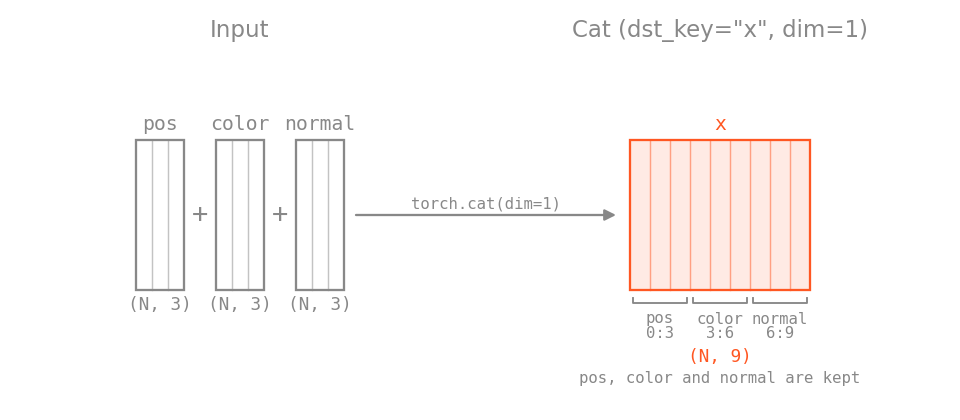

```python
import torch
import torch_pointcloud.transforms as T

T.Cat(keys=["pos", "color", "normal"], dst_key="x", dim=1)  # (N, 9)
```

Whatever you assemble has to match the `in_channels` the model was built with, and for a pretrained checkpoint it has to match exactly what its own transform builds. That is the single most common reason a checkpoint loads and then produces nonsense.

Colors usually need a cast and a divide on the way in, because most loaders hand you `uint8`:

```{.python continuation}
T.Compose([
    T.ToFloat(keys="color"),
    T.Divide(keys="color", divisor=255.0),
])
```

`ToFloat` changes the dtype only and does not rescale, so $[0, 255]$ colors stay in $[0, 255]$ until you divide.

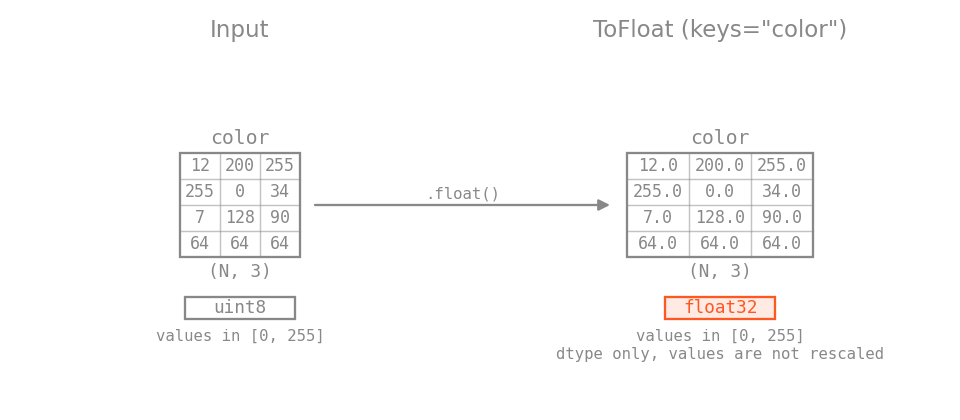

`OnesLike` adds a constant channel when a model wants one, and `OneHot` turns integer classes into the float vectors a category-conditioned head reads: a $(N,)$ input becomes $(N, C)$, and a scalar per-sample label becomes $(C,)$, which collates to $(B, C)$.

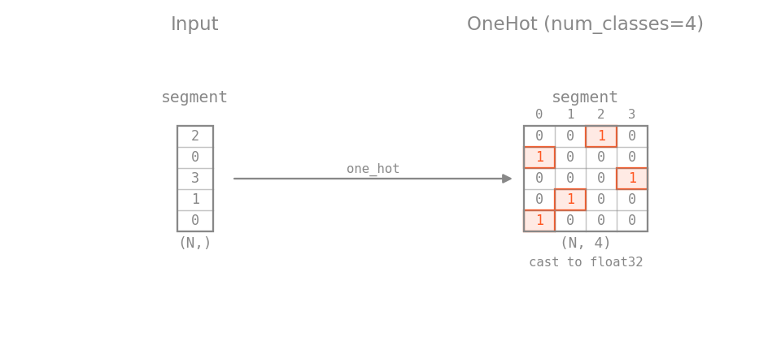

```{.python continuation}
T.OneHot(keys="category", num_classes=16)
```

`Slice` pulls one channel back out, with standard Python slicing along `dim`:

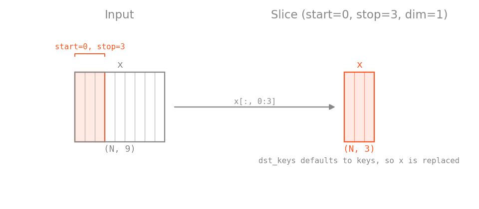

```{.python continuation}
T.Slice(keys="pos", start=2, stop=3, dim=1, dst_keys="height")
```

## Fit labels to a checkpoint's classes

A dataset ships its own label ids and a checkpoint predicts its own class list, and the two rarely agree: ScanNet stores NYU40 ids while a 20-class checkpoint wants $0 \ldots 19$, and the SemanticKITTI benchmark merges the `moving-*` classes into their static counterparts. `Relabel` is the lookup table between them.

=== "Scene"

    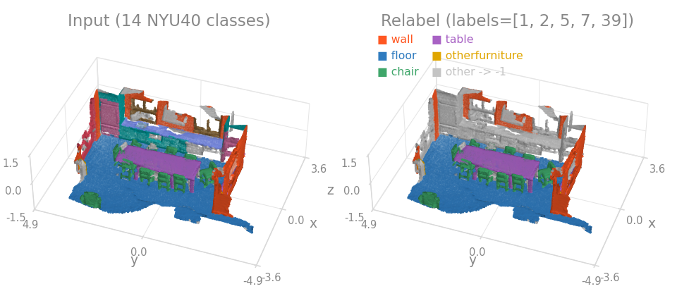

Pass a list to keep those raw ids and remap them to $0 \ldots N-1$ in order, or a dict for an explicit many-to-one merge. Everything not listed falls back to `default`.

```{.python continuation}
# 1:1 - keep raw NYU40 ids 1, 2, 3, 4, 5 and remap them to 0..4
T.Relabel(keys="segment", labels=[1, 2, 3, 4, 5])

# N:1 - SemanticKITTI 19-class benchmark (merges moving-* into static)
T.Relabel(
    keys="segment",
    labels={
        10: 0, 252: 0,    # car        (+ moving-car)
        11: 1,            # bicycle
        15: 2,            # motorcycle
        18: 3, 258: 3,    # truck      (+ moving-truck)
        # ...
    },
    default=255,
)
```

Set `default` to whatever your loss and metric take as their `ignore_index`, usually $-1$. Getting this wrong is quiet: everything runs, and the unlabeled points are scored as class 0.

## Fill in what the scan lacks

`EstimateNormals` computes unit normals by local PCA over each point's `k` nearest neighbors, for clouds that ship without them. S3DIS is the usual case, and so is the sample room in these docs. Each normal is the least-variance direction of the neighborhood, and `orient_to_centroid=True` flips them to face the cloud centroid, which approximates the inward-facing normals of a room scanned from inside.

=== "Object"

    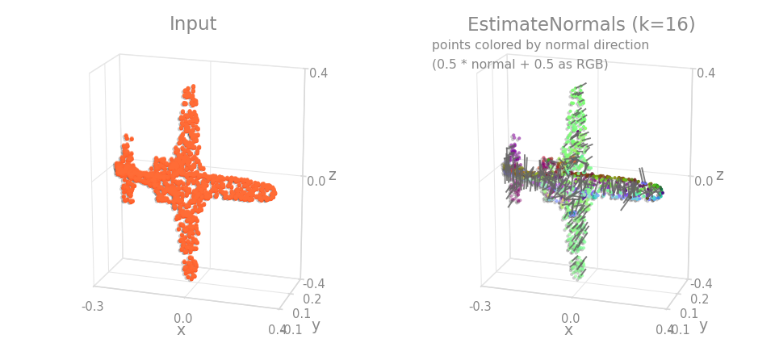

=== "Scene"

    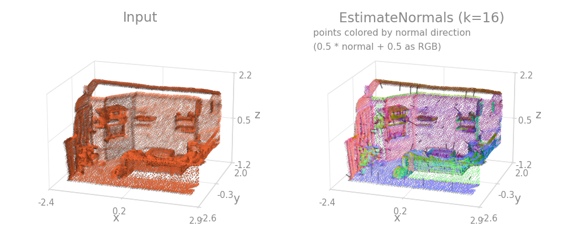

```{.python continuation}
T.EstimateNormals(keys="pos", k=16, orient_to_centroid=True)
```

Pass `batch_key` when the dict already holds a packed batch, so neighbors never cross a cloud boundary.

`DivisiblePad` pads the point count to a multiple of `num_samples`, which fixed-chunk inference such as the [sliding-window inferer](../inferers/overview.md) requires. Every tensor whose first dim matches the point count is re-indexed by the same gather map, so correspondence survives.

=== "Object"

    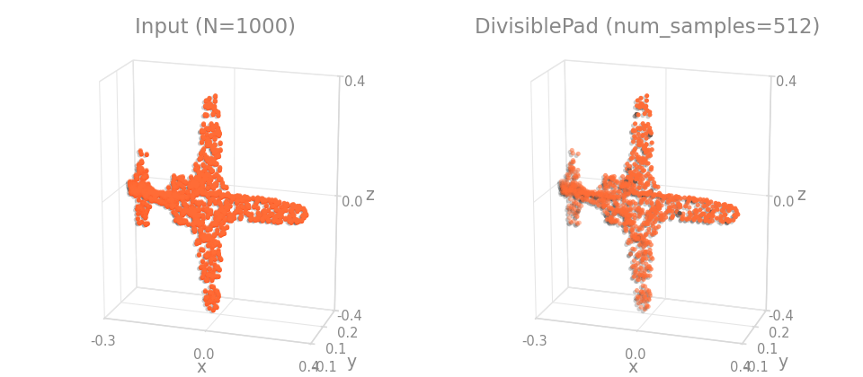

=== "Scene"

    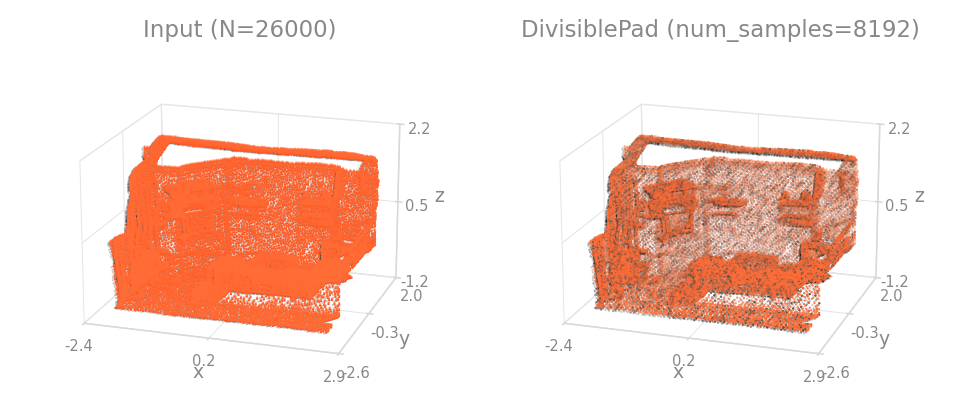

```{.python continuation}
# Pad a 5000-point block to 8192 (= 2 * 4096) before sub-chunking.
T.DivisiblePad(num_samples=4096, pad_fill="random")
```

`pad_fill` chooses which rows are duplicated (`"cycle"`, `"replicate"` or `"random"`), and `dst_inverse_key` records the map back to the source rows. That inverse composes with any inverse already stored at the key, so it always points from the outermost source space to the current one.

## Build detection targets

These turn per-point annotations into the tensors a VoteNet-style detector trains on. They chain in annotation order, each consuming what the previous one wrote:

```{.python continuation}
mean_sizes = torch.rand(18, 3)  # (C, 3) per-class template sizes, full edge lengths

T.Compose([
    T.InstanceToBox(),                              # instance ids -> (K, 7) boxes
    T.GenerateVoteLabels(),                         # per-point vote offsets to box centers
    T.EncodeVoteNetTargets(mean_sizes=mean_sizes),  # padded center / heading / size labels
])
```

Every figure in this section is scene-only, since the object sample carries no instances or boxes.

### InstanceToBox

Fits one axis-aligned box per distinct non-negative instance id: $(K, 7)$ rows $[c_x, c_y, c_z, d_x, d_y, d_z, 0]$, plus a $(K,)$ class tensor holding each instance's most common semantic label. Negative instance ids never form a box, and instances whose class equals `ignore_index` are dropped, so a `Relabel` upstream that sends the non-target semantics to `ignore_index` is what filters the boxes down to your detection classes. The gray objects in the figure are instances of an ignored class.

=== "Scene"

    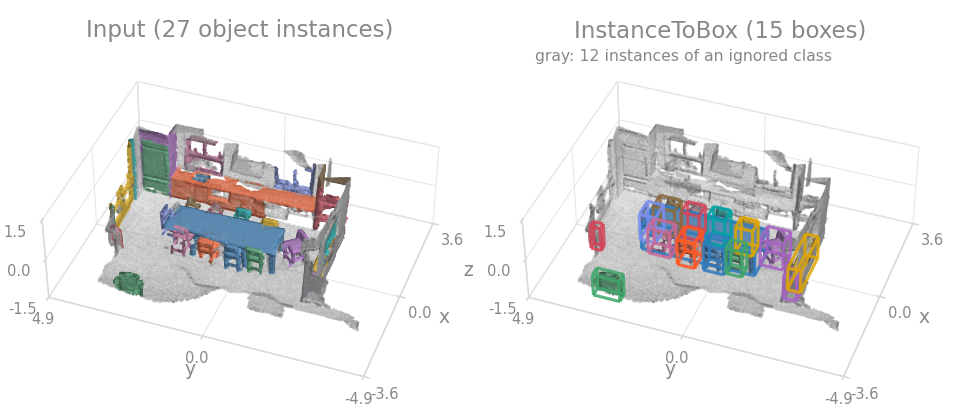

```{.python continuation}
T.InstanceToBox(
    instance_key="instance",
    semantic_key="segment",
    pos_key="pos",
    ignore_index=-1,
)
```

### RelabelBoxes

The box-level counterpart of `Relabel`, and the step that produces the ignore mask the 3D AP metric consumes. Boxes whose raw label is a key of `mapping` are kept and relabeled; boxes whose raw label is a key of `ignore_mapping` become ignore regions attributed to the class they excuse (dashed gray in the figure); a kept box outside any range in `ignore_fields` is downgraded to an ignore region; every other box is dropped. All listed keys are filtered together so they stay row-aligned.

=== "Scene"

    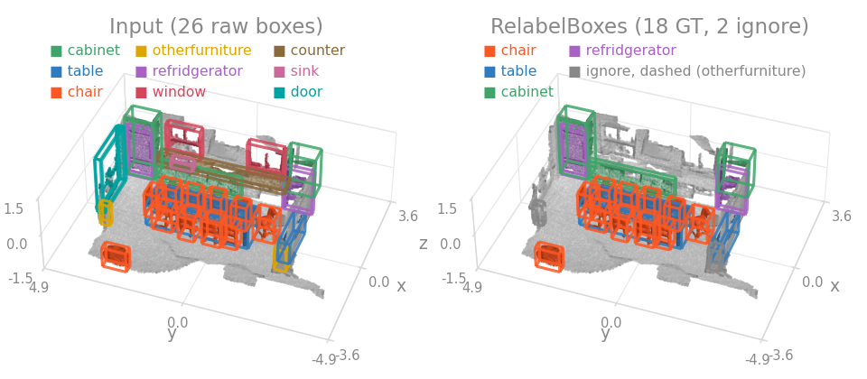

```{.python continuation}
# KITTI: raw 8-class boxes -> 3 detection classes, Van as an ignore
# region for Car, and anything past moderate difficulty (occlusion <= 1,
# truncation <= 0.3, height >= 25 px) as ignore too.
T.RelabelBoxes(
    keys=("box", "label", "truncation", "occlusion", "bbox_height"),
    mapping={0: 0, 3: 1, 5: 2},
    ignore_mapping={1: 0, 4: 1},
    ignore_fields={
        "occlusion": (None, 1),
        "truncation": (None, 0.3),
        "bbox_height": (25, None),
    },
)
```

An ignore region suppresses a false positive of the class it is labeled with, but is never scored itself. Use `ignore_mapping` at evaluation and leave it off at training, or those boxes enter the anchor targets as real ground truth.

### GenerateVoteLabels

Writes the per-point vote offsets a voting detector regresses: each point inside a box gets the offset to that box's center, plus a mask marking the points that vote at all. A point collects the offsets of the first `gt_vote_factor` boxes containing it and repeats its first offset in the unfilled slots, so the min-over-votes loss can credit either center where objects overlap. `oriented=True` makes the containment test yaw-aware.

=== "Scene"

    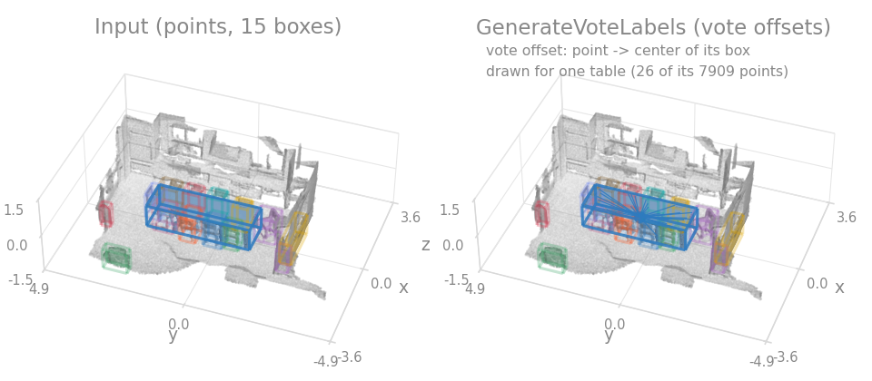

```{.python continuation}
T.GenerateVoteLabels(
    pos_key="pos", 
    box_key="box", 
    oriented=True, 
    gt_vote_factor=3,
)
```

### EncodeVoteNetTargets

Encodes the $(K, 7)$ boxes and their classes into the fixed-size $(M, \ldots)$ tensors the VoteNet loss reads, with $M$ = `max_num_obj`: center, heading class and residual, size class and residual, semantic class, and the box mask marking the real rows among the padding. Headings are binned into `num_heading_bin` classes, and the size residual is the box extent minus the class template in `mean_sizes`.

=== "Scene"

    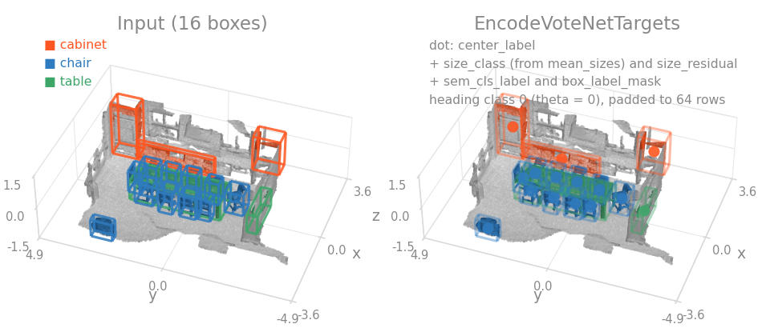

```{.python continuation}
T.EncodeVoteNetTargets(
    mean_sizes=mean_sizes, 
    num_heading_bin=12, 
    max_num_obj=64,
)
```

Because these are fixed-size per scene, they collate with `stack_keys` rather than the usual packed concatenation. For the fixed-capacity voxel tensors that grid detectors consume instead, see [`HardVoxelize`](sampling.md#prepare-a-driving-frame-for-a-grid-detector).

## Rearrange the dict

These act on keys, dtypes and layout rather than on geometry, so each is drawn as a block diagram: input on the left, result on the right.

`RenameItems` moves a key, `CopyItems` clones one and keeps the source, and `KeepItems` drops everything not in a whitelist, which frees the intermediates an augmentation pipeline built along the way.

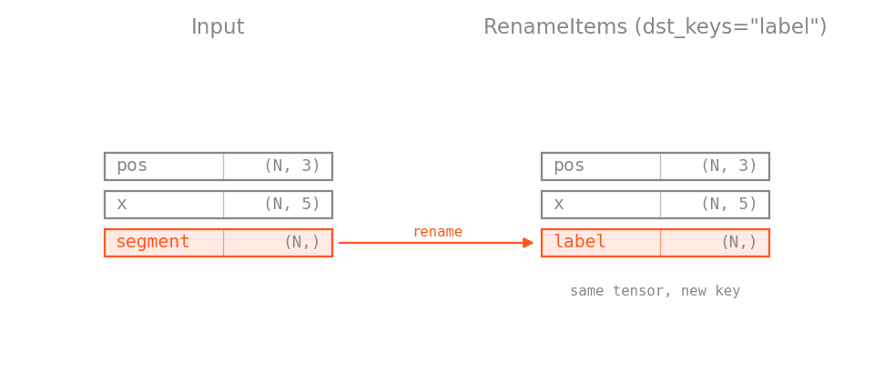

```{.python continuation}
T.Compose([
    T.RenameItems(keys="segment", names="label"),
    T.CopyItems(keys="pos", names="norm_pos"),
    T.KeepItems(keys=["norm_pos", "x", "label"]),
])
```

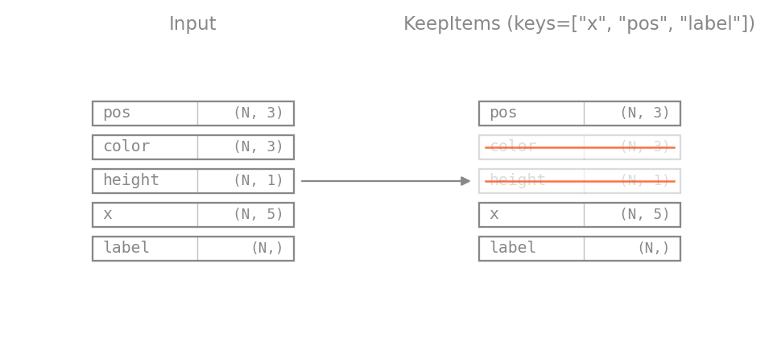

`SetValue` writes literal values, creating or overwriting a key. It never reads what is already there, so it takes no `allow_missing_keys`.

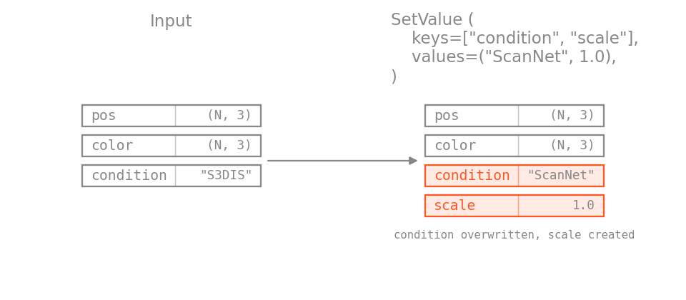

```{.python continuation}
T.SetValue(keys=["condition", "scale"], values=("ScanNet", 1.0))
```

`Reduce` and `DivideKey` pair up when you want to normalize by a statistic of the sample itself rather than by a constant. `keepdim=True` keeps a $(1, D)$ shape, which survives the packed collate as $(B, D)$; without it a $(D,)$ tensor would concatenate to $(B \cdot D,)$.

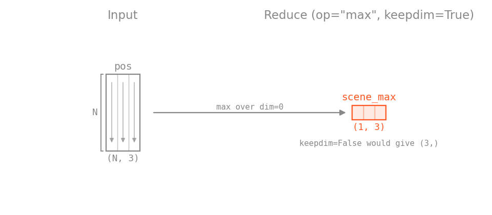

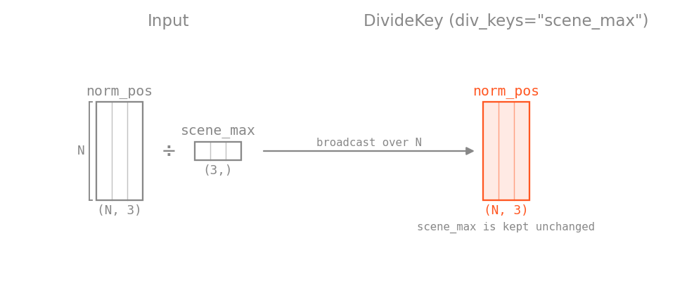

```{.python continuation}
T.Compose([
    T.CopyItems(keys="pos", names="norm_pos"),
    T.Reduce(keys="pos", op="max", keepdim=True, dst_keys="scene_max"),
    T.DivideKey(keys="norm_pos", div_keys="scene_max"),
])
```

`ToTensor` converts lists and arrays via `torch.as_tensor`, with an optional `dtype` and `device` per key, and `ToDevice` moves tensors without touching shape or dtype.

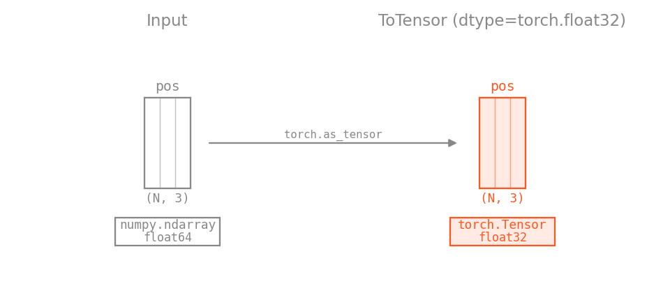

```{.python continuation}
T.ToTensor(keys="pos", dtype=torch.float32)
```

!!! warning "Do not move to the GPU inside the pipeline"
    Under a multi-worker `DataLoader` the workers are separate processes, so `ToDevice(device="cuda")` in a transform pipeline initializes CUDA once per worker and copies sample by sample. Transfer the collated batch in the training loop instead.

## Build an octree

Optional, and needs `ocnn` installed. `BuildOctree` builds an octree from the positions at `pos_key` and stores it under `octree_key`, optionally carrying normals, features and labels into the tree. Positions are expected in the $[-1, 1]$ cube, so rescale first. `depth` sets the finest level.

=== "Object"

    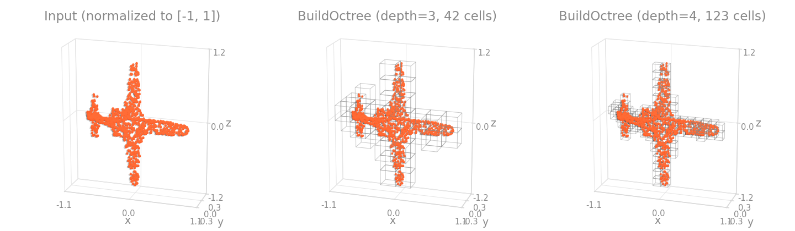

=== "Scene"

    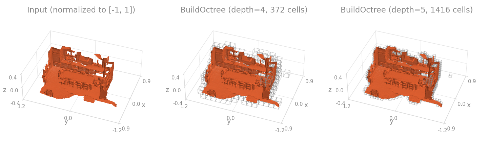

```{.python continuation}
T.BuildOctree(
    pos_key="pos",
    normal_key="normal",
    octree_key="octree",
    depth=6,
    full_depth=2,
)
```

`OctreeFeatures` reads the octree back and gathers per-node input features through its `get_input_feature`. `features_type` is the feature spec (`"ND"` for normals plus depth, `"NDFP"` to add features and position) and `nempty=True` restricts the output to non-empty nodes.

=== "Object"

    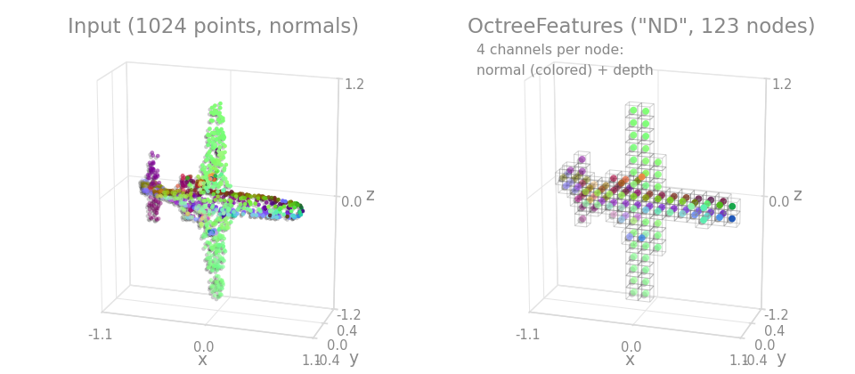

=== "Scene"

    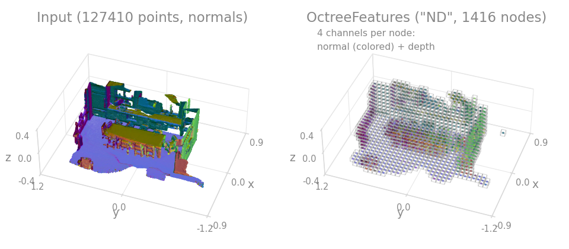

```{.python continuation}
T.OctreeFeatures(keys="octree", features_type="ND", nempty=True, dst_keys="x")
```
